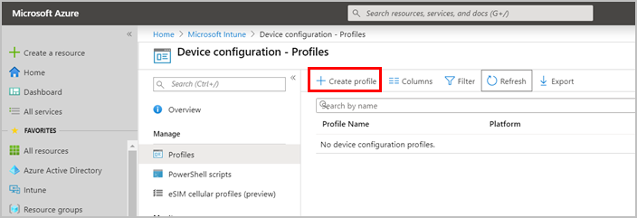
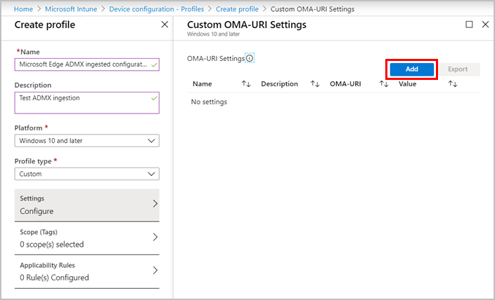
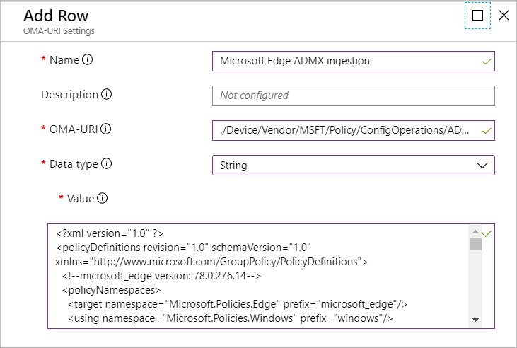
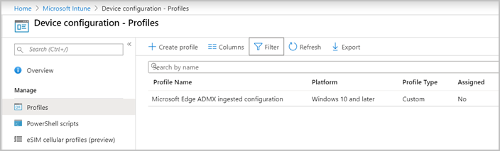
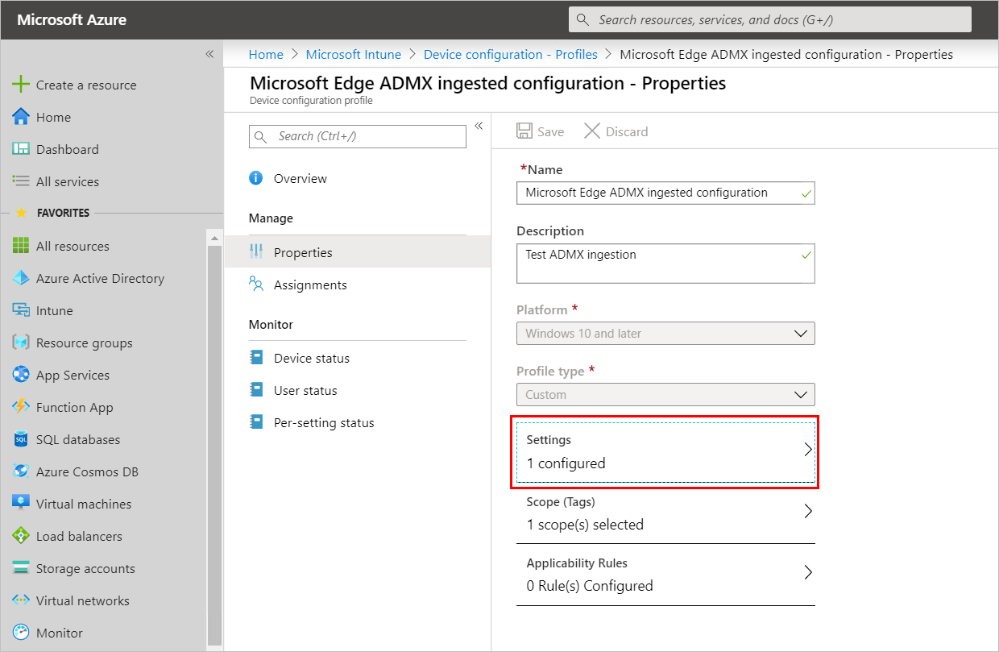
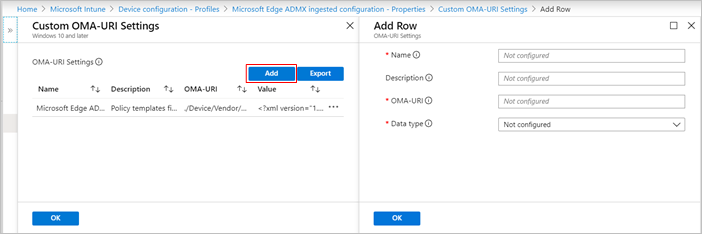
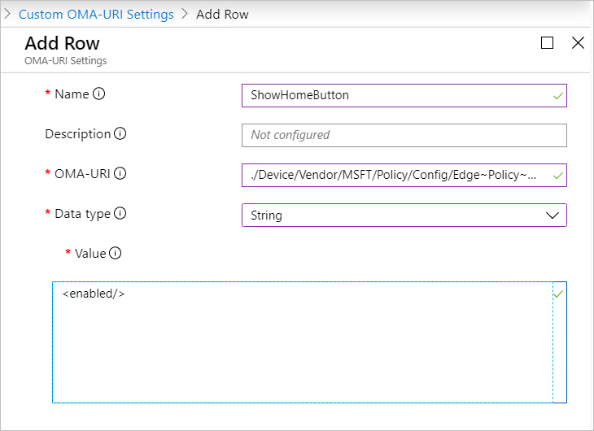

# Configure Microsoft Edge using Mobile Device Management

This article explains how to configure Microsoft Edge on Windows 10 using [Mobile Device Management (MDM)](/windows/client-management/mdm/) with [ADMX Ingestion](/windows/client-management/mdm/win32-and-centennial-app-policy-configuration). This article also describes:

- How to [create Open Mobile Alliance Uniform Resource Identifier (OMA-URI) for Microsoft Edge policies](#create-an-oma-uri-for-microsoft-edge-policies).
- How to [configure Microsoft Edge in Intune using ADMX ingestion and custom OMA-URI](#configure-microsoft-edge-in-intune-using-admx-ingestion).

> [!NOTE]
> This article applies to Microsoft Edge version 77 or later.

## Prerequisites

Windows 10, with the following minimum system requirements:

- Windows 10, version 1903 with [KB4512941](https://support.microsoft.com/help/4512941/) and [KB4517211](https://support.microsoft.com/help/4517211/) installed
- Windows 10, version 1809 with [KB4512534](https://support.microsoft.com/help/4512534/) and [KB4520062](https://support.microsoft.com/help/4520062/) installed
- Windows 10, version 1803 with [KB4512509](https://support.microsoft.com/help/4512509/) and [KB4519978](https://support.microsoft.com/help/4519978) installed
- Windows 10, version 1709 with [KB4516071](https://support.microsoft.com/help/4516071/) and [KB4520006](https://support.microsoft.com/help/4520006) installed

## Overview

You can configure Microsoft Edge on Windows 10 using MDM with your preferred Enterprise Mobility Management (EMM) or MDM provider that supports [ADMX Ingestion](/windows/client-management/mdm/win32-and-centennial-app-policy-configuration).

Configuring Microsoft Edge with MDM is a two part process:

1. Ingesting the Microsoft Edge ADMX file into your EMM or MDM provider. See your provider for instructions on how to ingest an ADMX file.

   > [!NOTE]
   > For Microsoft Intune, see [Configure Microsoft Edge in Intune using ADMX ingestion](#configure-microsoft-edge-in-intune-using-admx-ingestion).

2. [Creating an OMA-URI for a Microsoft Edge policy](#create-an-oma-uri-for-microsoft-edge-policies).

## Create an OMA-URI for Microsoft Edge policies

The following sections describe how to create the OMA-URI path and look up and define the value in XML format for mandatory and recommended browser policies.

Before you get started, download the Microsoft Edge policy templates file (MicrosoftEdgePolicyTemplates.cab) from the [Microsoft Edge Enterprise landing page](https://aka.ms/EdgeEnterprise) and extract the contents.

There are three steps for defining the OMA-URI:

1. [Create the OMA-URI path](#create-the-oma-uri-path)
2. [Specify the OMA-URI data type](#specify-the-data-type)
3. [Set the OMA-URI value](#set-the-value-for-a-browser-policy)

### Create the OMA-URI path

Use the following formula as a guide for creating the OMA-URI paths. <br/><br/>
*`./Device/Vendor/MSFT/Policy/Config/<ADMXIngestName>~Policy~<ADMXNamespace>~<ADMXCategory>/<PolicyName>`* <br/><br/>

| Parameter         | Description                                                                                   |
|-------------------|-----------------------------------------------------------------------------------------------|
| \<ADMXIngestName> | Use "Edge" or what you defined when ingesting the administrative template. For example, if you used "./Device/Vendor/MSFT/Policy/ConfigOperations/ADMXInstall/MicrosoftEdge/Policy/EdgeAdmx", then use "MicrosoftEdge".<br/><br/> The `<ADMXIngestionName>` must match what was used when you ingested the ADMX file. |
| \<ADMXNamespace>  | Either "microsoft_edge" or "microsoft_edge_recommended" depending on whether you're setting a mandatory or recommended policy. |
| \<ADMXCategory>   | The "parentCategory" of the policy is defined in the ADMX file. Omit the `<ADMXCategory>` if the policy isn't grouped (No "parentCategory" defined). |
| \<PolicyName>     | The policy name can be found in the [Browser policy reference](./microsoft-edge-policies.md) article. |

#### URI path example:

For this example, assume the `<ADMXIngestName>` node was named “Edge" and you're setting a mandatory policy. The URI path would be:<br/><br/>
*`./Device/Vendor/MSFT/Policy/Config/Edge~Policy~microsoft_edge~<ADMXCategory>/<PolicyName>`*

If the policy isn't in a group (for example, DiskCacheSize) remove "`~<ADMXCategory>`". Replace `<PolicyName>` with the name of the policy, DiskCacheSize. The URI path would be:<br/><br/>
*`./Device/Vendor/MSFT/Policy/Config/Edge~Policy~microsoft_edge/DiskCacheSize`*

If the policy is in a group, follow these steps:

1. Open **msedge.admx** with any xml editor.
2. Search for the policy name you want to set. For example, "ExtensionInstallForceList".
3. Use the value of the *ref* attribute from the *parentCategory* element. For example, "Extensions" from \<parentCategory ref=" Extensions"/>.
4. Replace `<ADMXCategory>` with the *ref* attribute value to construct the URI path. The URI path would be:<br/><br/>
*`/Device/Vendor/MSFT/Policy/Config/Edge~Policy~microsoft_edge~Extensions/ExtensionInstallForcelist`*

### Specify the data type

The OMA-URI data type is always "String".

### Set the value for a browser policy

This section describes how to set the value, in XML format, for each data type. Go to [Browser policy reference](./microsoft-edge-policies.md) to look up the data type of the policy.

> [!NOTE]
> For non-Boolean data types, the value always starts with `<enabled/>`.

#### Boolean data type

For policies that are Boolean types use `<enabled/>` or `<disabled/>`.

#### Integer data type

The value always needs to start with the `<enabled/>` element followed by `<data id="[valueName]" value="[decimal value]"/>`.

To find the value name and decimal value for a new tab page, use the following steps:

1. Open **msedge.admx** with any xml editor.
2. Search for the `<policy>` element where the name attribute matches the policy name you want to set. For "RestoreOnStartup", search for `name="RestoreOnStartup"`.
3. In the `<elements>` node, find the value you want to set.
4. Use the value in the "valueName" attribute in the `<elements>` node. For "RestoreOnStartup" the "valueName" is "RestoreOnStartup".
5. Use the value in the "value" attribute in the `<decimal>` node. For "RestoreOnStartup" to open the new tab page the value is "5".

To open the new tab page on startup use:<br>
`<enabled/> <data id="RestoreOnStartup" value="5"/>`

#### List of strings data type

The value always needs to start with the `<enabled/>` element followed by `<data id="[listID]" value="[string 1];[string 2];[string 3]"/>`.

> [!NOTE]
> The "id=" attribute name isn't the policy name, even though in most cases it matches the policy name. It's the \<list> node id attribute value, which is found in the ADMX file.

To find the listID and define the value to block a URL, follow these steps:

1. Open **msedge.admx** with any xml editor.
2. Search for the `<policy>` element where the name attribute matches the policy name you want to set. For "URLBlocklist", search for `name="URLBlocklist"`.
3. Use the value in the "id" attribute of the `<list> node for [listID]`.
4. The "value" is a list of URLs separated by a semicolon (;)

For example, to block access to `contoso.com` and `https://ssl.server.com`:<br>
`<enabled/> <data id=" URLBlocklistDesc" value="contoso.com;https://ssl.server.com"/>`

#### Dictionary or String data type

The value always needs to start with the `<enabled/>` followed by `<data id="[textID]" value="[string]"/>` .

To find the textID and define the value set the locale, follow these steps:

1. Open **msedge.admx** with any xml editor.
2. Search for the `<policy>` element where the name attribute matches the policy name you want to set. For "ApplicationLocaleValue", search for `name="ApplicationLocaleValue"`.
3. Use the value in the "id" attribute of the `<text>` node for `[textID]`.
4. Set the "value" to the culture code.

To set the locale to "es-US" with the "ApplicationLocaleValue" policy:<br>
`<enabled/> <data id="ApplicationLocaleValue" value="es-US"/>`

Dictionary data types are treated as large strings but normally need string escaping to get the value into the correct form.

For example, to set the ManagedFavorites policy the value would be:

```xml
<enabled/> <data id="ManagedFavorites" value="[{&quot;toplevel_name&quot;: &quot;My managed favorites folder&quot;}, {&quot;name&quot;: &quot;Microsoft&quot;, &quot;url&quot;: &quot;microsoft.com&quot;}, {&quot;name&quot;: &quot;Bing&quot;, &quot;url&quot;: &quot;bing.com&quot;}, {&quot;children&quot;: [{&quot;name&quot;: &quot;Microsoft Edge Insiders&quot;, &quot;url&quot;: &quot;www.microsoftedgeinsider.com&quot;}, {&quot;name&quot;: &quot;Microsoft Edge&quot;, &quot;url&quot;: &quot;www.microsoft.com/windows/microsoft-edge&quot;}], &quot;name&quot;: &quot;Microsoft Edge links&quot;}]"/>
```

### Create the OMA-URI for recommended policies

Defining the URI path for recommended policies depends on the policy you want to configure.

#### To define the URI path for a recommended policy

Use the URI path formula (*`./Device/Vendor/MSFT/Policy/Config/<ADMXIngestName>~Policy~<ADMXNamespace>~<ADMXCategory>/<PolicyName>`*) and the following steps to define the URI path:
1. Open **msedge.admx** with any xml editor.
2. If the policy you want to configure isn't in a group, skip to step 4 and remove `~<ADMXCategory>` from the path.
3. If the policy you want to configure is in a group:

   - To look up the `<ADMXCategory>`, search for the policy you want to set. When searching append "_recommended" to the policy name. For example, a search for "RegisteredProtocolHandlers_recommended” has the following result:

        ```xml
         <policy class="Both" displayName="$(string.RegisteredProtocolHandlers)" explainText="$(string.RegisteredProtocolHandlers_Explain)" key="Software\Policies\Microsoft\Edge\Recommended" name="RegisteredProtocolHandlers_recommended" presentation="$(presentation.RegisteredProtocolHandlers)">
           <parentCategory ref="ContentSettings_recommended"/>
           <supportedOn ref="SUPPORTED_WIN7_V77"/>
           <elements>
             <text id="RegisteredProtocolHandlers" maxLength="1000000" valueName="RegisteredProtocolHandlers"/>
           </elements>
         </policy>
        ```

   - Copy the value of the *ref* attribute from the `<parentCategory>` element. For "ContentSettings", copy "ContentSettings_recommended" from `<parentCategory ref=" ContentSettings_recommended"/>`.
   - Replace `<ADMXCategory>` with the *ref* attribute value to construct the URI path in the URI path formula.

4. The `<PolicyName>` is the name of the policy with "_recommended" appended to it.

#### OMA-URI path examples for recommended policies

The following table shows examples of OMA-URI paths for recommended policies.

|      Policy    |   OMA-URI  |
|-----------------------------------|------------------------------------------|
| [RegisteredProtocolHandlers](./microsoft-edge-policies.md#registeredprotocolhandlers)                       | `./Device/Vendor/MSFT/Policy/Config/Edge~Policy~microsoft_edge_recommended~ContentSettings_recommended/RegisteredProtocolHandlers_recommended`                        |
| [PasswordManagerEnabled](./microsoft-edge-policies.md#passwordmanagerenabled)                       | `./Device/Vendor/MSFT/Policy/Config/Edge~Policy~microsoft_edge_recommended~PasswordManager_recommended/PasswordManagerEnabled_recommended`                        |
| [PrintHeaderFooter](./microsoft-edge-policies.md#printheaderfooter)                       | `./Device/Vendor/MSFT/Policy/Config/Edge~Policy~microsoft_edge_recommended~Printing_recommended/PrintHeaderFooter_recommended`                        |
| [SmartScreenEnabled](./microsoft-edge-policies.md#smartscreenenabled)                       | `./Device/Vendor/MSFT/Policy/Config/Edge~Policy~microsoft_edge_recommended~SmartScreen_recommended/SmartScreenEnabled_recommended`                        |
| [HomePageLocation](./microsoft-edge-policies.md#homepagelocation)                       | `./Device/Vendor/MSFT/Policy/Config/Edge~Policy~microsoft_edge_recommended~Startup_recommended/HomepageLocation_recommended`                        |
| [ShowHomeButton](./microsoft-edge-policies.md#showhomebutton)                       | `./Device/Vendor/MSFT/Policy/Config/Edge~Policy~microsoft_edge_recommended~Startup_recommended/ShowHomeButton_recommended`                        |
| [FavoritesBarEnabled](./microsoft-edge-policies.md#favoritesbarenabled)                       | `./Device/Vendor/MSFT/Policy/Config/Edge~Policy~microsoft_edge_recommended~/FavoritesBarEnabled_recommended`                        |

### OMA-URI examples

OMA-URI examples with their URI path, type, and an example value.

#### Boolean data type examples

*[ShowHomeButton](./microsoft-edge-policies.md#showhomebutton):*

| Field   | Value                                                                                |
|---------|--------------------------------------------------------------------------------------|
| Name    | Microsoft Edge: ShowHomeButton                                                       |
| OMA-URI | `./Device/Vendor/MSFT/Policy/Config/Edge~Policy~microsoft_edge~Startup/ShowHomeButton` |
| type    | String                                                                               |
| Value   | `<enabled/>`                                                                          |

*[DefaultSearchProviderEnabled](./microsoft-edge-policies.md#defaultsearchproviderenabled):*

| Field   | Value                                                                                |
|---------|--------------------------------------------------------------------------------------|
| Name    | Microsoft Edge: DefaultSearchProviderEnabled                                         |
| OMA-URI | `./Device/Vendor/MSFT/Policy/Config/Edge~Policy~microsoft_edge~DefaultSearchProvider/DefaultSearchProviderEnabled`    |
| type    | String                                                                               |
| Value   | `<disable/>`                                                                          |

### Integer data type examples

*[AutoImportAtFirstRun](./microsoft-edge-policies.md#autoimportatfirstrun):*

| Field   | Value                                                                                |
|---------|--------------------------------------------------------------------------------------|
| Name    | Microsoft Edge: AutoImportAtFirstRun                                                 |
| OMA-URI | `./Device/Vendor/MSFT/Policy/Config/Edge~Policy~microsoft_edge/AutoImportAtFirstRun`   |
| type    | String                                                                               |
| Value   | `<enabled/><data id="AutoImportAtFirstRun" value="1"/>`                             |

*[DefaultImagesSetting](./microsoft-edge-policies.md#defaultimagessetting):*

| Field   | Value                                                                                |
|---------|--------------------------------------------------------------------------------------|
| Name    | Microsoft Edge: DefaultImagesSetting                                                 |
| OMA-URI | `./Device/Vendor/MSFT/Policy/Config/Edge~Policy~microsoft_edge~ContentSettings/DefaultImagesSetting`    |
| type    | String                                                                               |
| Value   | `<enabled/><data id="DefaultImagesSetting" value="2"/>`                             |

*[DiskCacheSize](./microsoft-edge-policies.md#diskcachesize):*

| Field   | Value                                                                                |
|---------|--------------------------------------------------------------------------------------|
| Name    | Microsoft Edge: DiskCacheSize                                                        |
| OMA-URI | `./Device/Vendor/MSFT/Policy/Config/Edge~Policy~microsoft_edge/DiskCacheSize`        |
| type    | String                                                                               |
| Value   | `<enabled/><data id="DiskCacheSize" value="1000000"/>`                               |

#### List of strings data type examples
<!--
*[NotificationsAllowedForUrls](./microsoft-edge-policies.md#NotificationsAllowedForUrls):*

| Field   | Value                                                                                |
|---------|--------------------------------------------------------------------------------------|
| Name    | Microsoft Edge: NotificationsAllowedForUrls                                          |
| OMA-URI | `./Device/Vendor/MSFT/Policy/Config/Edge~Policy~microsoft_edge~ContentSettings/NotificationsAllowedForUrls`    |
| Type    | String                                                                               |
| Value   | `<enabled/><data id="NotificationsAllowedForUrlsDesc" value="https://www.contoso.com"/>`<br>For multiple list items: `<data id="NotificationsAllowedForUrlsDesc" value="https://www.contoso.com;[*.]contoso.edu"/>`                           |
-->
*[RestoreOnStartupURLS](./microsoft-edge-policies.md#restoreonstartupurls):*

| Field   | Value                                                                                |
|---------|--------------------------------------------------------------------------------------|
| Name    | Microsoft Edge: RestoreOnStartupURLS                                                 |
| OMA-URI | `./Device/Vendor/MSFT/Policy/Config/Edge~Policy~microsoft_edge~Startup/RestoreOnStartupURLs`    |
| Type    | String                                                                               |
| Value   | `<enabled/><data id="RestoreOnStartupURLsDesc" value="1&#xF000;http://www.bing.com"/>`<br>For multiple list items: `<enabled/><data id="RestoreOnStartupURLsDesc" value="1&#xF000;http://www.bing.com&#xF000;2&#xF000;http://www.microsoft.com"/>`  |

*[ExtensionInstallForcelist](./microsoft-edge-policies.md#extensioninstallforcelist):*

| Field   | Value                                                                                |
|---------|--------------------------------------------------------------------------------------|
| Name    | Microsoft Edge: ExtensionInstallForcelist                                            |
| OMA-URI | `./Device/Vendor/MSFT/Policy/Config/Edge~Policy~microsoft_edge~Extensions/ExtensionInstallForcelist`    |
| Type    | String                                                                               |
| Value   | `<enabled/><data id="ExtensionInstallForcelistDesc" value="1&#xF000;gbchcmhmhahfdphkhkmpfmihenigjmpp;https://extensionwebstorebase.edgesv.net/v1/crx"/>`                               |

#### Dictionary and String data type examples

*[ProxyMode](./microsoft-edge-policies.md#proxymode):*

| Field   | Value      |
|---------|------------|
| Name    | Microsoft Edge: ProxyMode                                                            |
| OMA-URI | `./Device/Vendor/MSFT/Policy/Config/Edge~Policy~microsoft_edge~ProxyMode/ProxyMode`  |
| Type    | String                                                                               |
| Value   | `<enabled/><data id="ProxyMode" value="auto_detect"/>`                               |

*[ManagedFavorites](./microsoft-edge-policies.md#ManagedFavorites):*

| Field   | Value    |
|---------|----------|
| Name    | Microsoft Edge: ManagedFavorites                                                            |
| OMA-URI | `./Device/Vendor/MSFT/Policy/Config/Edge~Policy~microsoft_edge/ManagedFavorites`  |
| Type    | String                                                                               |
| Value   | `<enabled/> <data id="ManagedFavorites" value="[{&quot;toplevel_name&quot;: &quot;My managed favorites folder&quot;}, {&quot;name&quot;: &quot;Microsoft&quot;, &quot;url&quot;: &quot;microsoft.com&quot;}, {&quot;name&quot;: &quot;Bing&quot;, &quot;url&quot;: &quot;bing.com&quot;}, {&quot;children&quot;: [{&quot;name&quot;: &quot;Microsoft Edge Insiders&quot;, &quot;url&quot;: &quot;www.microsoftedgeinsider.com&quot;}, {&quot;name&quot;: &quot;Microsoft Edge&quot;, &quot;url&quot;: &quot;www.microsoft.com/windows/microsoft-edge&quot;}], &quot;name&quot;: &quot;Microsoft Edge links&quot;}]"/>`                               |

## Configure Microsoft Edge in Intune using ADMX ingestion

The recommended way to configure Microsoft Edge with Microsoft Intune is to use the Administrative Templates profile. This profile is described in [Configure Microsoft Edge policy settings with Microsoft Intune](./configure-edge-with-intune.md). If you want to evaluate a policy that's currently not available in the Microsoft Edge Administrative Templates in Intune,  you can configure Microsoft Edge using [custom settings for Windows 10 devices in Intune](/intune/configuration/custom-settings-windows-10).

This section describes how to:

1. [Ingest the Microsoft Edge ADMX file into Intune](#ingest-the-microsoft-edge-admx-file-into-intune)
2. [Set a policy using custom OMA-URI in Intune](#set-a-policy-using-custom-oma-uri-in-intune)

> [!IMPORTANT]
> As a best practice, don’t use a custom OMA-URI profile and an Administration templates profile to configure the same Microsoft Edge setting in Intune. If you deploy the same policy using both a custom OMA-URI  and an Administrative template profile, but with different values, users will get unpredictable results. We strongly recommend removing your OMA-URI profile before using an Administration templates profile.

### Ingest the Microsoft Edge ADMX file into Intune

This section describes how to ingest the Microsoft Edge administrative template (**msedge.admx** file) into Intune.

> [!WARNING]
> Don't modify the ADMX file before ingesting the file.

To ingest the ADMX file, follow these steps:

1. Download the Microsoft Edge policy templates file (MicrosoftEdgePolicyTemplates.cab) from the [Microsoft Edge Enterprise landing page](https://aka.ms/EdgeEnterprise) and extract the contents. The file that you want to ingest is **msedge.admx**.
2. Sign in to the [Microsoft Azure portal](https://portal.azure.com).
3. Select **Intune** from _All Services_, or search for Intune in the portal search box.
4. From _Microsoft Intune - Overview_, select **Device configuration** | **Profiles**.
5. On the top command bar, select **+ Create profile**.

   

6. Provide the following profile information:

   - **Name**: Enter a descriptive name. For this example, "Microsoft Edge ADMX ingested configuration".
   - **Description**: Enter an optional description for the profile.
   - **Platform**: Select "Windows 10 and later"
   - **Profile type**: Select "Custom"

7. On **Custom OMA-URI Settings**, click **Add** to add an ADMX ingestion.

   

8. On **Add Row**, provide the following information:

   - **Name**: Enter a descriptive name. For this example, use "Microsoft Edge ADMX ingestion".
   - **Description**: Enter an optional description for the setting.
   - **OMA-URI**: Enter "*./Device/Vendor/MSFT/Policy/ConfigOperations/ADMXInstall/Edge/Policy/EdgeAdmx*"
   - **Data type**: Select "String"
   - **Value**: This input area appears after you select the **Data type**. Open the msedge.admx file from the Microsoft Edge policy templates file you extracted in step 1. Copy **ALL the text** from the msedge.admx file and paste it in the **Value** text area shown in the following screenshot.

        

   - Click **OK**.

9. On **Custom OMA-URI Settings**, click **OK**.
10. On **Create profile**, click **Create**. The next screenshot shows information about the newly created profile.

    

<!--
> [!NOTE]
> You can use the preceding steps to ingest the msedgeupate.admx policy template file.
-->
### Set a policy using custom OMA-URI in Intune

> [!NOTE]
> Before using the steps in this section you must complete the steps described in [Ingest the Microsoft Edge ADMX file into Intune](#ingest-the-microsoft-edge-admx-file-into-intune).

1. Sign in to the [Microsoft Azure portal](https://portal.azure.com).
2. Select **Intune** from _All Services_, or search for Intune in the portal search box.
3. Go to **Intune**>**Device configuration**>**Profiles**.
4. Select the "Microsoft Edge ADMX ingested configuration" profile or the name you used for the profile.
5. To add Microsoft Edge policy settings, you have to open **Custom OMA-URI Settings**. Under **Manage**, click **Properties**, and then click **Settings**.

    

6. On **Custom OMA-URI Settings**, click **Add**.

    

7. On **Add Row**, provide the following information:

   - **Name**: Enter a descriptive name. We suggest using the policy name you want to configure. For this example, use "ShowHomeButton".
   - **Description** (Optional): Enter a description for the setting.
   - **OMA-URI**: Enter the OMA-URI for the policy. Using the for "ShowHomeButton" policy as an example, use this string: "*./Device/Vendor/MSFT/Policy/Config/Edge~Policy~microsoft_edge~Startup/ShowHomeButton*"
   - **Data type**: Select the policy settings data type. For the "ShowHomeButton" policy, use "String"
   - **Value**: Enter the setting that you want to configure for the policy. For "ShowHomeButton" example, enter "\<enabled/>". The following screenshot shows the settings for configuring a policy.

        

   - Click **OK**.

8. On **Custom OMA-URI Settings**, click **OK**.
9. On the "**Microsoft Edge ADMX ingested configuration - Properties**" profile (or the name you used), click **Save**.

After the profile is created and the properties set, you have to [assign the profile in Microsoft Intune](/intune/configuration/device-profile-assign).

#### Confirm that the policy was set

Use the following steps to confirm that the Microsoft Edge policy is using the profile you created. (Give Microsoft Intune time to propagate the policy to a device you assigned in the "Microsoft Edge ADMX ingested configuration" profile example.)

1. Open Microsoft Edge and go to *edge://policy*.
2. On the **Policies** page, see if the policy you set in the profile is listed.
3. If your policy isn't shown, see [Diagnose MDM failures in Windows 10](/windows/client-management/mdm/diagnose-mdm-failures-in-windows-10) or [Troubleshoot a policy setting](#troubleshoot-a-policy-setting).

#### Troubleshoot a policy setting

If a Microsoft Edge policy isn’t taking effect, try the following steps:

Open the *edge://policy* page on the target device (a device you assigned the profile to in Microsoft Intune) and search for the policy. If the policy isn’t on the *edge://policy* page, try the following:

- Check that the policy is in the registry and is correct. On the target device open the Windows 10 Registry Editor (**Windows key + r**, enter “*regedit*” and then press **Enter**.) Check that the policy is correctly defined in the *\Software\Policies\ Microsoft\Edge* path. If you don’t find the policy in the expected path, then the policy wasn’t pushed to the device correctly.
- Check that the OMA-URI path is correct, and the value is a valid XML string. If either of these are incorrect the policy won’t be pushed to the target device.

For more trouble shooting tips, see [Set up Microsoft Intune](/intune/fundamentals/setup-steps) and [Sync devices](/intune/remote-actions/device-sync).

## See also

- [Microsoft Edge Enterprise landing page](https://aka.ms/EdgeEnterprise)
- [Configure Microsoft Edge policy settings with Microsoft Intune](./configure-edge-with-intune.md)
- [Mobile device management](/windows/client-management/mdm/)
- [Use custom settings for Windows 10 devices in Intune](/intune/configuration/custom-settings-windows-10)
- [Win32 and Desktop Bridge app policy configuration](/windows/client-management/mdm/win32-and-centennial-app-policy-configuration)
- [Understanding ADMX-backed policies](/windows/client-management/mdm/understanding-admx-backed-policies)