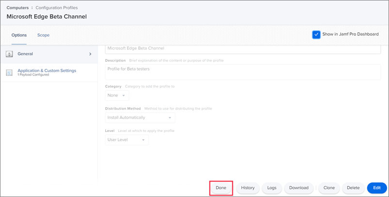

# Configure Microsoft Edge policy settings on macOS with Jamf

This article describes how to configure policy settings on macOS using a Microsoft Edge policy manifest file on Jamf Pro 10.19.

You can also configure Microsoft Edge policy settings on macOS by using a property list (.plist) file. For more information, see [Configure for macOS using a .plist](configure-microsoft-edge-on-mac.md)

## Prerequisites

The following software is required:

- Microsoft Edge Stable channel 81
- Policy Templates file, version 81.0.416.3
- Jamf Pro, Version 10.19

## About the Jamf Pro Application & Custom Settings menu

Before Jamf Pro 10.18, managing Office 365 involved manually building a .plist file. This was a time-consuming workflow that required a strong technical background. Jamf Pro 10.18 eliminated those barriers by streamlining the configuration process. However, IT Admins could only use this new user interface for specific applications and preference domains specified by Jamf.

In Jamf Pro 10.19, a user can upload a JSON manifest as a "custom schema" to target any preference domain, and the graphical user interface will be generated from this manifest. The custom schema that's created follows the JSON Schema specification.

For more information, see [Computer Configuration Profiles](https://jamf.it/computer-configuration-profiles) in the Jamf Pro Administrator's Guide.

## Get the policy manifest for a specific version of Microsoft Edge

To get the policy manifest:

- Go to the [Microsoft Edge Enterprise landing page](https://aka.ms/EdgeEnterprise).
- On the Channel/Version dropdown list, select **any channel with version 81 or later.***.
- On the Build dropdown list, select any **81 build or later.***.
- Click GET POLICY FILES to download our policy templates bundle.

  > [!NOTE]
  > Currently, the policy templates bundle is signed as a CAB file. You'll need to use a 3rd party tool, such as The Unarchiver to open the file on macOS.

After you unpack the CAB file, unpack the ZIP file and navigate to the "mac" top level directory. The manifest, which is named "policy_manifest.json", is in this directory.

This manifest will be published in every policy bundle starting with build 81.0.416.3. If you want to test policies in the Dev channel, you can take the manifest associated with each Dev release and test it in Jamf Pro.  

## Use the policy manifest in Jamf Pro

Use the following steps to upload the policy manifest to Jamf Pro and then create a policy profile for macOS.

1. Sign in to Jamf.
2. Select the **Computer** tab.
3. Under **Content Management**, select **Configuration Profiles**.
4. On the **Configuration Profiles** page, click **+ New**.

   

5. On **New macOS Configuration Profile**>**Options**, select **Application & Custom Settings**.
6. On the **Application & Custom Settings** popup window, click **Configure**.

   

7. In the **Application & Custom Settings** section, set the values shown in the following screen shot.

   

   - For **Creation Method**, pick **Configure settings**.
   - For **Source**, pick **Custom Schema**.
   - For **Preference Domain**, provide the name of your domain. This example uses *com.microsoft.Edge* as the domain.
   - For **Custom Schema**, paste the contents of the "policy_manifest.json" manifest file.
   - Click **Save**.

8. After you save the profile, Jamf displays the **General** section shown in the next screen shot.

   

   - Provide a display **Name** for the profile and a **Description**.
   - Keep the default setting for **Category**, which is **None**.
   - For **Distribution Method**, the options are **Install Automatically** or **Make Available in Self Service**.
   - For **Level**, the options are **User Level** or **Computer Level**.
   - Click **Save**.

9. After you save the General section, Jamf shows the "Microsoft Edge Beta Channel" configuration profile set up for our example. In the next screen shot, note that you can keep working the profile by clicking **Edit** or if you're finished, click **Done**.

   

   > [!NOTE]
   > You can edit this profile after it's been saved and in another Jamf session. For example, you might decide to change the Distribution Method to Make Available in Self Service.

   To do a follow up edit on the Microsoft Edge Stable Channel, or delete it, select the profile name, shown in the following Configuration Profiles screen shot.

   

After you create the new configuration profile you still have to configure the **Scope** for the profile.

### To configure the scope

1. For **Targets**, provide the following minimum settings:

   - TARGET COMPUTERS. The options are Specific Computers or All Computers.
   - TARGET USERS. The options are Specific Users or All Users.
   - Click **Save**.
2. For **Limitations**, keep the default setting: None. Click **Cancel**.
3. For **Exclusions**, keep the default setting: None. Click **Cancel**.

## See also

- [Microsoft Edge Enterprise landing page](https://aka.ms/EdgeEnterprise)
- [Configure for macOS with Intune](configure-microsoft-edge-on-mac.md)
- [Configure for Windows](configure-microsoft-edge.md)
- [Configure for Windows with Intune](configure-edge-with-intune.md)
