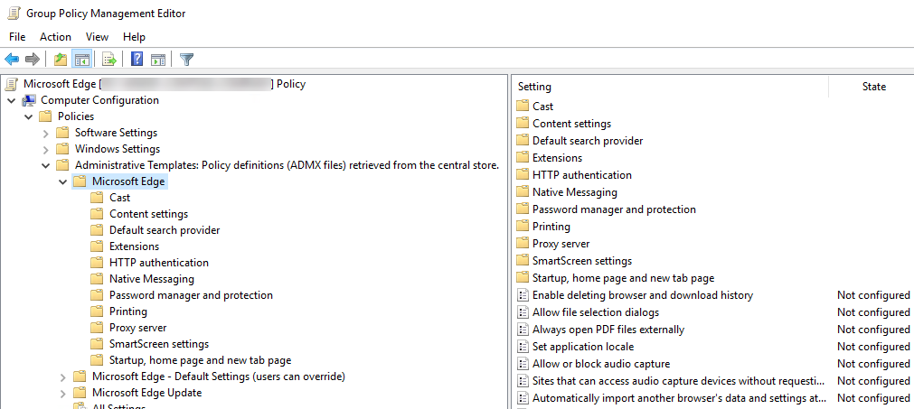
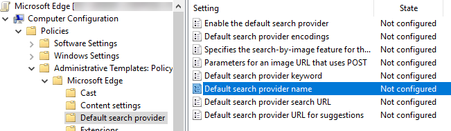
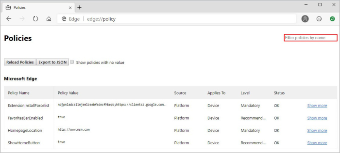

# Configure Microsoft Edge policy settings on Windows devices

Use this article as guide to configure Microsoft Edge policy settings on Windows devices. If you haven't set up Microsoft Edge, see the [Microsoft Edge setup guide](https://go.microsoft.com/fwlink/?linkid=2187484).

> [!NOTE]
> The Microsoft Edge management service, a dedicated and simplified management tool in the Microsoft 365 admin center, is rolling out now. [Learn more](/deployedge/microsoft-edge-management-service).

## Introduction to policy settings on Windows

You can use *group policy objects (GPO)* to configure policy settings for Microsoft Edge and managed Microsoft Edge updates on all versions of Windows. You can also configure policies via the registry for:

- Windows devices that are joined to a Microsoft Active Directory (AD) domain
- Windows 10 Pro or Enterprise instances enrolled for device management in Microsoft Intune

To configure Microsoft Edge with group policy objects, install *administrative templates* that add rules and settings for Microsoft Edge to the group policy Central Store in your Active Directory domain.  Alternatively, add these rules and settings to the Policy Definition template folder on individual computers and then configure the specific policies you want to set.

You can use Active Directory group policy to configure Microsoft Edge policy settings if you prefer to manage policy at the domain level. This approach lets you manage policy settings globally. You can target different policy settings to specific OUs, or use WMI filters to apply settings only to users or computers returned by a particular query. To configure policies on individual computers, you can use Local Group Policy Editor on the target computer. This approach lets you apply policy settings that only affect the local device.

Microsoft Edge supports *mandatory* and *recommended* policies. Mandatory policies override user preferences and prevent the user from changing the policy settings. Recommended policies provide a default setting that the user can override. Most policies are only mandatory but there's a subset that is mandatory and recommended. If both versions of a policy are set, the mandatory setting takes precedence. A recommended policy only takes effect when the user hasn't modified the setting.

>[!TIP]
> You can use Microsoft Intune to configure Microsoft Edge policy settings. For more information, see [Configure Microsoft Edge using Microsoft Intune](configure-edge-with-intune.md).

There are two administrative templates for Microsoft Edge, both can be applied with common group policy management tools such as Local Group Policy Editor for application on an individual computer or the Group Policy Management Console for Microsoft Windows domain networks. These templates are:

- *msedge.admx* to [configure Microsoft Edge settings](./microsoft-edge-policies.md)
- *msedgeupdate.admx* to [manage Microsoft Edge updates](./microsoft-edge-update-policies.md)

The following steps describe how to install, configure, and test the Microsoft Edge templates.

## 1. Download and install the Microsoft Edge administrative template

If you want to configure Microsoft Edge policy settings in Active Directory, download the files to a network location you can access from a domain controller or a workstation with the Remote Server Administration Tools (RSAT) installed. To configure on an individual computer,download the files to that computer.

When you add the administrative template files to the appropriate location, Microsoft Edge policy settings are immediately available in the Group Policy Editor.

Go to the [Microsoft Edge Enterprise landing page](https://aka.ms/EdgeEnterprise) to download the Microsoft Edge policy templates file and extract the contents.

### Add the administrative template to Active Directory

1. On a domain controller or workstation with RSAT, go to the **PolicyDefinition** folder (also known as the *Central Store*) on any domain controller for your domain. For older versions of Windows Server, you might need to create the **PolicyDefinition** folder. For more information, see [How to create and manage the Central Store for Group Policy Administrative Templates in Windows](https://support.microsoft.com/help/3087759/how-to-create-and-manage-the-central-store-for-group-policy-administra).
2. Open *MicrosoftEdgePolicyTemplates* and go to **windows** > **admx**.
3. Copy the *msedge.admx* file to the PolicyDefinition folder. (Example: %systemroot%\sysvol\domain\policies\PolicyDefinitions)
4. In the *admx* folder, open the appropriate language folder. For example, if you're in the U.S., open the **en-US** folder.
5. Copy the *msedge.adml* file to the matching language folder in the PolicyDefinition folder. Create the folder if it doesn't already exist. (Example: %systemroot%\sysvol\domain\policies\PolicyDefinitions\EN-US)
6. If your domain has more than one domain controller, the new ADMX files will be replicated to them at the next domain replication interval.
7. To confirm the files loaded correctly, open the **Group Policy Management Editor** from Windows Administrative Tools and expand **Computer Configuration** > **Policies** > **Administrative Templates** > **Microsoft Edge**. You should see one or more Microsoft Edge nodes as shown below.

    

### Add the administrative template to an individual computer

1. On the target computer, open *MicrosoftEdgePolicyTemplates* and go to **windows** > **admx**.
2. Copy the *msedge.admx* file to your Policy Definition template folder. (Example: C:\Windows\PolicyDefinitions)
3. In the *admx* folder, open the appropriate language folder. For example, if you're in the U.S., open the **en-US** folder.
4. Copy the *msedge.adml* file to the matching language folder in your Policy Definition folder. (Example: C:\Windows\PolicyDefinitions\en-US)
5. To confirm the files loaded correctly, open Local Group Policy Editor directly (Windows key + R and enter gpedit.msc) or open MMC and load the Local Group Policy Editor snap-in. If an error occurs, it's usually because the files are in an incorrect location.

## 2. Set mandatory or recommended policies

You can set mandatory or recommended policies to configure Microsoft Edge with the Group Policy Editor for both Active Directory and individual computers. You can scope policy settings to either the **Computer Configuration** or **User Configuration** by selecting the appropriate node as described below.

- To configure a mandatory policy, open the Group Policy Editor and go to (**Computer Configuration** or **User Configuration**) > **Policies** > **Administrative Templates** > **Microsoft Edge**.
- To configure a recommended policy, open the Group Policy Editor and go to (**Computer Configuration** or **User Configuration**) > **Policies** > **Administrative Templates** > **Microsoft Edge – Default Settings (users can override)**.

  

## 3. Test your policies

On a target client device, open Microsoft Edge and go to **edge://policy** to see all policies that are applied. If you applied policy settings on the local computer, policies should appear immediately. You might need to close and reopen Microsoft Edge if it was open while you were configuring policy settings.



For Active Directory group policy settings, policy settings are sent to domain computers at a regular interval defined by your domain administrator. Target computers might not receive policy updates right away. If you want to manually refresh Active Directory group policy settings on a target computer, run the following command from a command prompt or PowerShell session on the target computer:

``` powershell
gpupdate /force
```

You might need to close and reopen Microsoft Edge before the new policies appear.

You can also use REGEDIT.exe on a target computer to view the registry settings that store group policy settings. These policy settings are located at this registry path: **HKLM\SOFTWARE\Policies\Microsoft\Edge**.

## See also

- [Microsoft Edge Enterprise landing page](https://aka.ms/EdgeEnterprise)
- [Configure for Windows with Intune](configure-edge-with-intune.md)
- [Configure for macOS](configure-microsoft-edge-on-mac.md)
- [Browse Microsoft Edge Enterprise Policies](microsoft-edge-policies.md)


