# Deploy to macOS with Jamf

This article describes how to deploy Microsoft Edge for macOS using Jamf.

> [!NOTE]
> This article applies to Microsoft Edge version 77 or later.

## Prerequisites

Before you deploy Microsoft Edge, make sure you meet the following prerequisites:

- The Microsoft Edge installation file,  **MicrosoftEdgeDev-\<version\>.pkg** is in an accessible location on your network. You can download the Microsoft Edge Enterprise installation files from the [Microsoft Edge Enterprise landing page](https://aka.ms/EdgeEnterprise).
- You have a Jamf Cloud account with the level of access and privileges needed to create and deploy installation files to computers.

## To deploy Microsoft Edge using Jamf:

1. Sign on to Jamf and go to **All Settings**.

    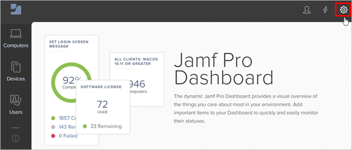

2. Under **All Settings**, click **Computer Management**.

    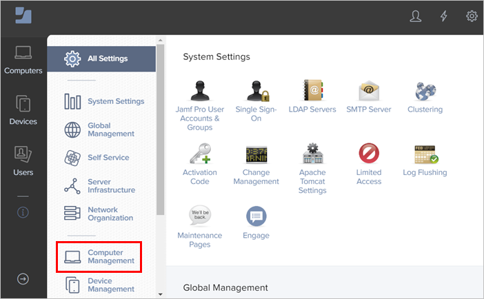

3. Under **Computer Management**, click **Packages**.

    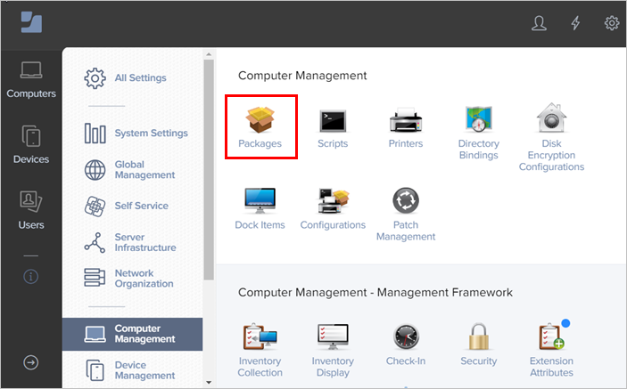

4. On the **Packages** page, click **+ New** to add a new package.

    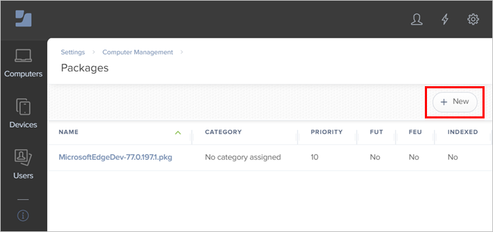

5. On the **New Package** page, enter the details about the package and then click **Save**. (For example, DISPLAY NAME, INFO, or NOTES.)

    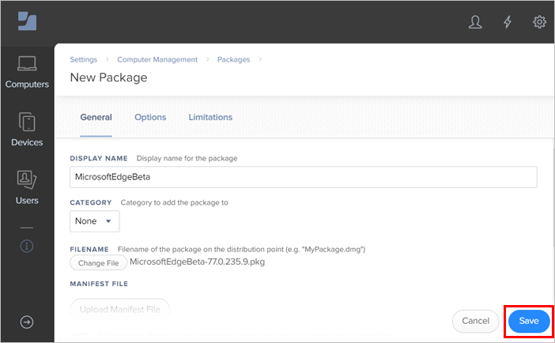

6. Select **Computers** on the menu bar, and then select **Policies** in the navigation bar.

7. Select **+ New** to display the **New Policy** pane.

    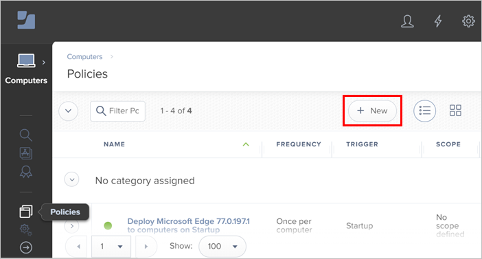

8. On the **Options** tab, select **General**.

    - Under **DISPLAY NAME**, enter the display name for the policy.
    - Under **Trigger**, select the event that will trigger the policy. (In the following example, the event is Startup.)

    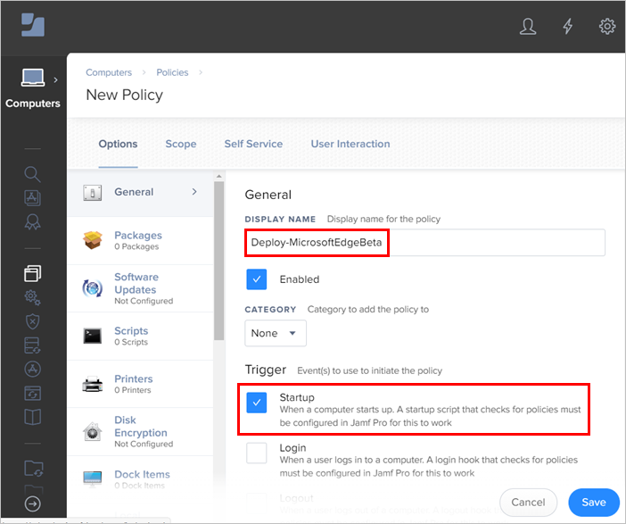

9. On the **Options** tab, click **Packages**.

10. On the **Configure Packages** popup, click **Configure**.

    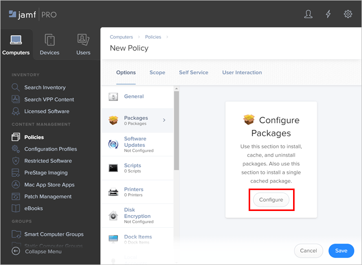

11. The package that you added shows on the **Packages** pane. Click **Add**. For this example, the package is "MicrosoftEdgeBeta" in the following screenshot.

    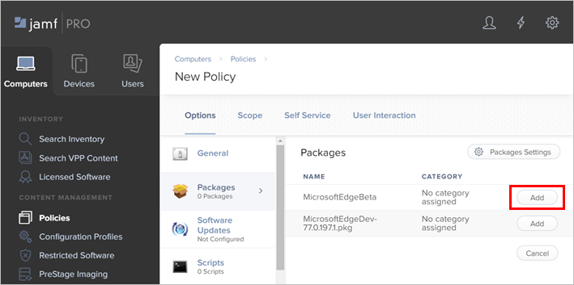

12. On the **New Policy** page, uUse the drop-down lists to select the **DISTRIBUTION POINT** and **ACTION** to take for the policy. Click **Save**. The following screenshot uses "Each computer's default distribution point" and "Install" as an example.

    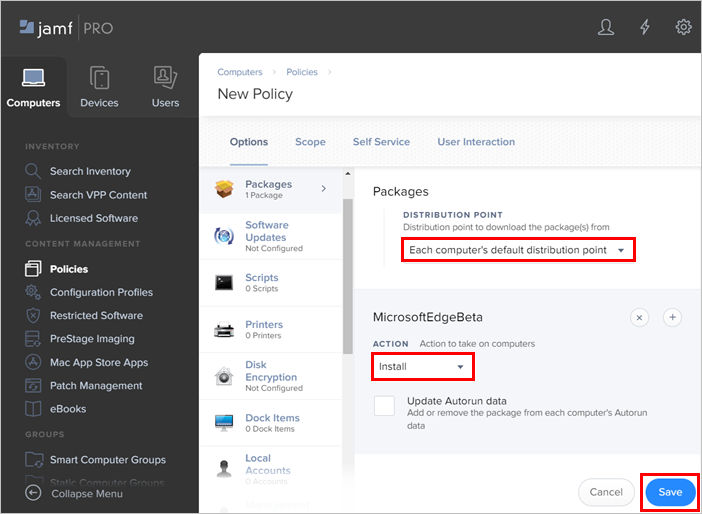

13. On the **New Policy** page, select the **Scope** tab. You can manage the scope of the deployment based on computers or users. For this example, select **All Computers** from the **TARGET COMPUTERS** drop-down list and then click **Save**.

    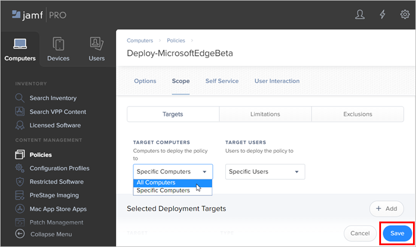

14. At this point you can review the Microsoft Edge deployment policy. If the deployment options meet your requirements, click **Done**.

    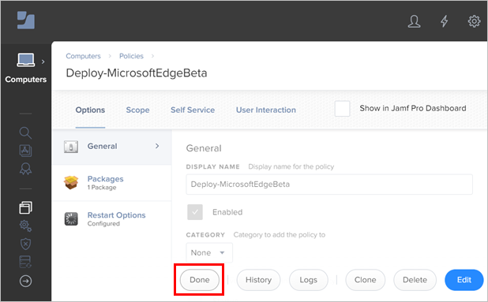

    > [!NOTE]
    > You can return to a deployment policy at any time to change settings.

Congratulations! You’ve just finished configuring Jamf to deploy Microsoft Edge for macOS. When the trigger condition you defined is true, the package will get deployed to the computers you specified.

## See also

- [Microsoft Edge Enterprise landing page](https://aka.ms/EdgeEnterprise)
- [Jamf.com](https://www.jamf.com/)
- [Integrate Jamf with Microsoft Intune](/intune/conditional-access-integrate-jamf)