# Deploy Microsoft Edge using System Center Configuration Manager

This article shows you how to automate a Microsoft Edge deployment by using System Center Configuration Manager (SCCM).

>[!NOTE]
>This article applies to Microsoft Edge version 77 or later.

## Before you begin

Review the information in [Introduction to application management in Configuration Manager](/sccm/apps/understand/introduction-to-application-management). This application management article will help you understand the terminology used in this article and is a guide to preparing your site to install applications.

Download the Microsoft Edge Enterprise installation files (**MicrosoftEdgeDevEnterpriseX64.msi** and/or **MicrosoftEdgeDevEnterpriseX86.msi**) from the [Microsoft Edge Enterprise landing page](https://aka.ms/EdgeEnterprise).

Make sure you store the Microsoft Edge installation files in an accessible network location.

## Create the application

You'll create the application using a Configuration Manager wizard.

### Start the Create Application Wizard and create the application  

1. In the Configuration Manager console, click **Software Library** > **Application Management** > **Applications**.  

2. On the **Home** tab, in the **Create** group, click **Create Application**. Or, right-click on **Applications** in the navigation bar and then click **Create Application**.

    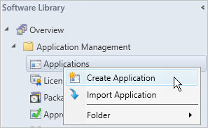

3. On the **General** page of the **Create Application Wizard**, choose **Automatically detect information about this application from installation files**. This pre-populates some of the information in the wizard with information that's extracted from the installation .msi file. Provide the following information:  

   - **Type**: Choose **Windows Installer (\*.msi file)**.  

   - **Location**: Type the location (or click **Browse** to select the location) of the installation file **MicrosoftEdgeDevEnterpriseX64.msi** or **MicrosoftEdgeDevEnterpriseX86.msi**. Note that the location must be specified in the form *\\\Server\Share\File* for Configuration Manager to locate the installation files.  

   Your **Specify settings for this application** page will look like the following example:  

    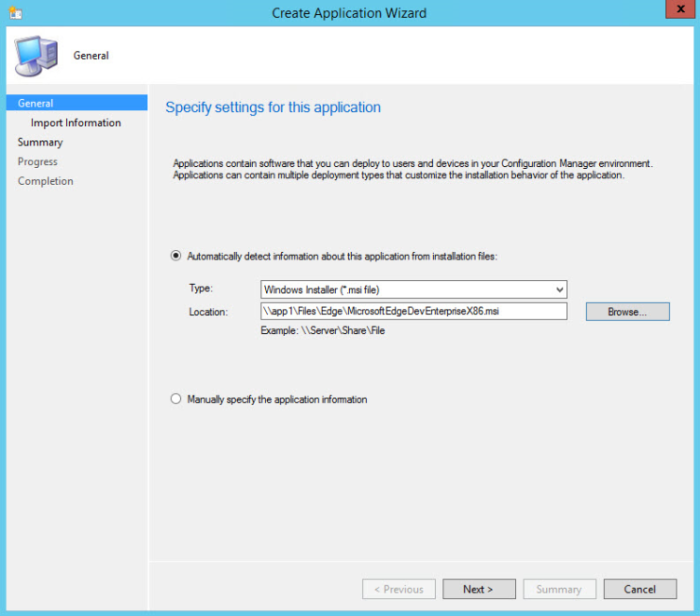

4. Click **Next**. Under **Details** on the **Imported Information** page, you'll see information about the application and any associated files that were imported. Click **Next** to continue with the wizard.  

    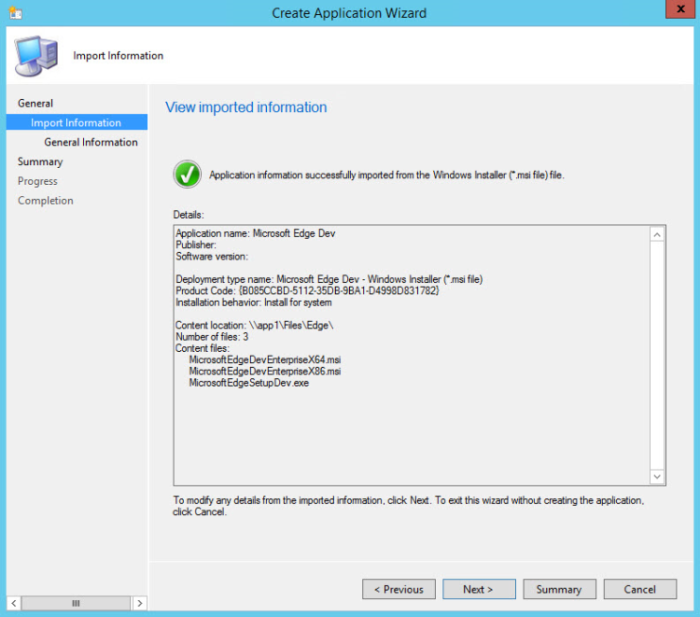

5. On the **General Information** page, you can add more information about the application. For example, Software version, Administrator comments, and Publisher. You can use this information to to help you sort and find the application in the Configuration Manager console.

   You can also use the **Installation program** field to specify the full command line that will be used to install the application on PCs. You can edit this to add your own properties (for example, **/q** for an unattended installation).

   The following screenshot shows an example where the **Specify information about this application** fields are used.

   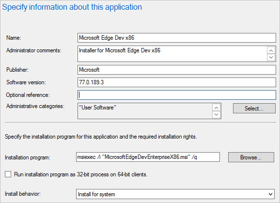

6. Click **Next**.
7. On the **Summary** page, you can confirm your application settings under **Details** and then finish using the wizard. Click **Next**.  

    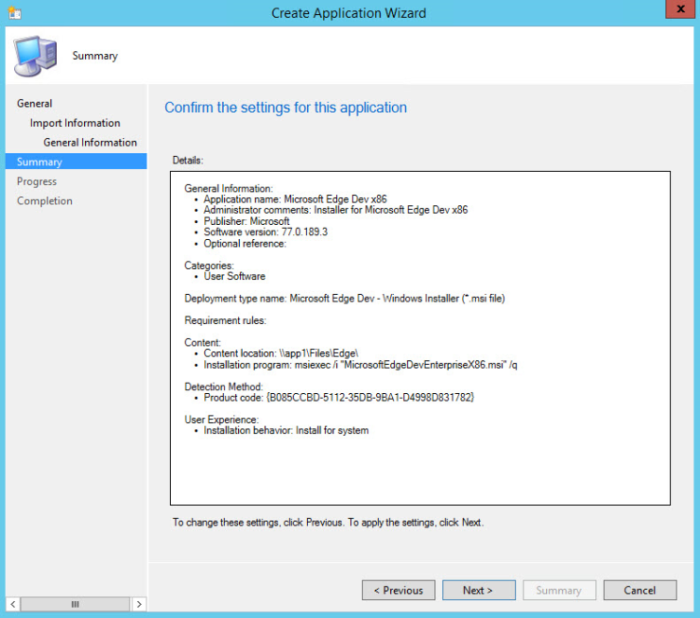

8. On the **Completion** page, click **Close**.

    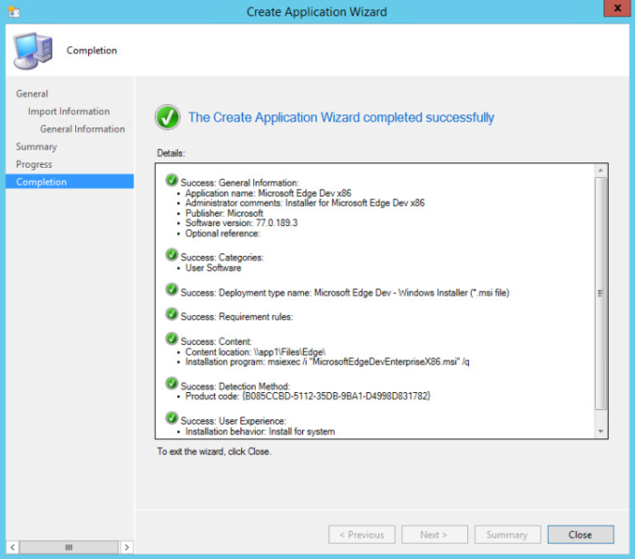

You've finished creating the application. Use the following steps to see it in Configuration Manager:

- select the **Software Library** workspace
- expand **Application Management**
- click **Applications**.

The following screenshot shows the example used for this article.  

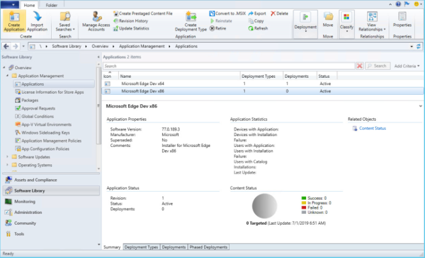

## Change application properties and deployment settings

After you create an application, you can refine the application settings if you need to. To look at the application properties:

- select the application
- in **Home**>**Properties**, click **Properties**.  

   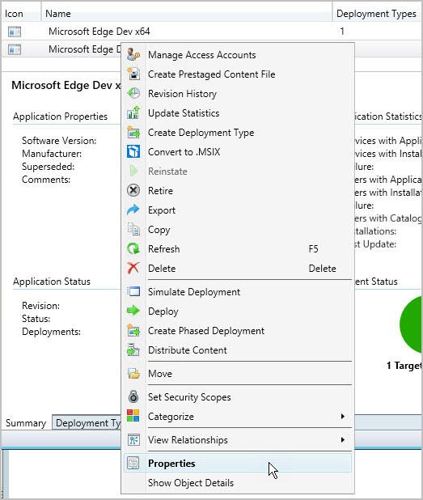

 In the **<application name\> Application Properties** dialog page, you'll see a tabbed view of the items that you can configure to change the behavior of the application. For more information about the settings you can configure, see [Create applications](/sccm/apps/deploy-use/create-applications).

For this example, you'll change some properties of the application's deployment type. To change the deployment properties:

1. Click the **Deployment Types** tab.
2. Under **Deployment types:**, select the application **Name**
3. Click **Edit**.

   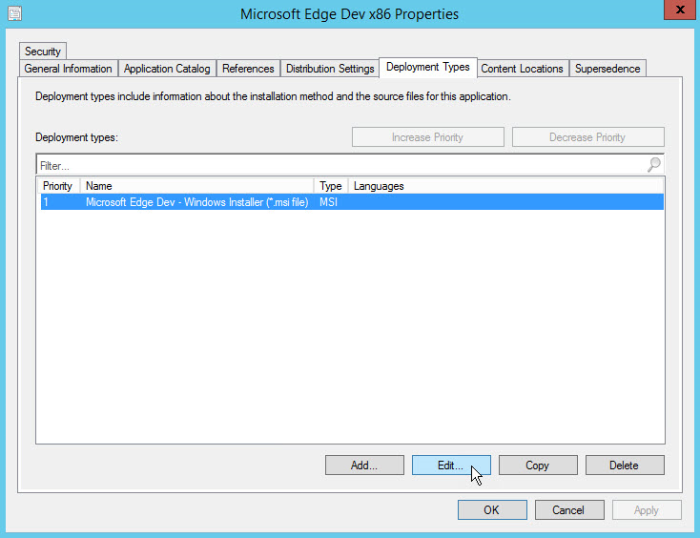

### Add a requirement to the deployment type

 Requirements specify conditions that must be met before an application is installed on a device. You can choose from built-in requirements or you can create your own. For example, you can add a requirement that the application will only be installed on PCs that are running Windows 10 **x86** or **x64**, depending on the installation file's target processor architecture. In this example, you'll specify Windows 10 **x86**.

1. From the deployment type properties page you just opened, click the **Requirements** tab.

2. Click **Add** to open the **Create Requirement** dialog.

    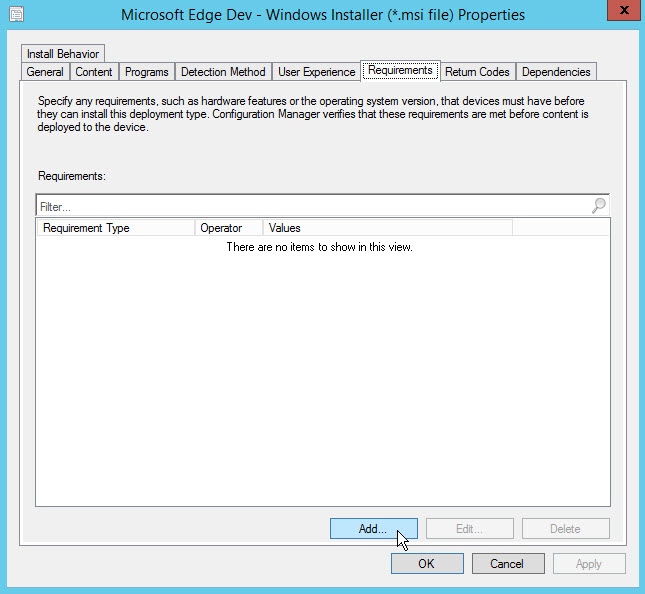

3. In the **Create Requirement** dialog box, specify the following information:

    - **Category**: **Device**  

    - **Condition**: **Operating system**  

    - **Rule type**: **Value**  

    - **Operator**: **One of**  

    - From the operating systems list, select **Windows 10** > **All Windows 10 (32-bit)**.  

    When you're finished, the dialog will look like the following screenshot example:

    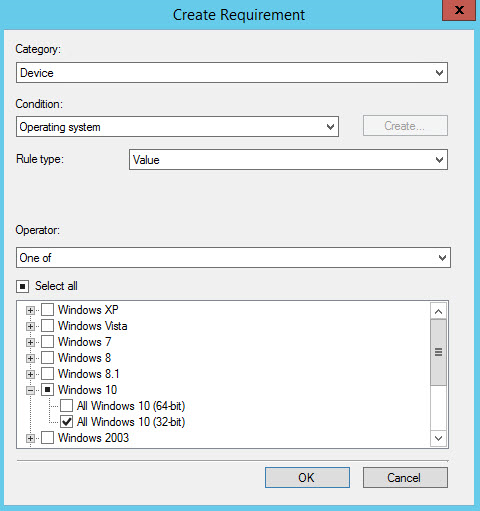

4. Click **OK** to close each open property page and return to the **Applications** list in the Configuration Manager console.  

## Add the application content to a distribution point  

To deploy the updated application to PCs, make sure that the application content is copied to a distribution point. PCs access the distribution point to install the application.  

>[!TIP]
>To find out more about distribution points and content management in Configuration Manager, see [Deploy and manage content for System Center Configuration Manager](/sccm/core/servers/deploy/configure/deploy-and-manage-content).  

1. In the Configuration Manager console, click **Software Library**.  

2. In the **Software Library** workspace, expand **Applications**. Select the application you created in the list of applications.

3. On the **Home** tab in the **Deployment** group, click **Distribute Content**.  

4. On the **General** page of the **Distribute Content Wizard**, check that the application name is correct, and then click **Next**.  

5. On the **Content** page, review the information that will be copied to the distribution point, and then click **Next**.  

6. On the **Content Destination** page, click **Add** to select one or more collections, distribution points, or distribution point groups on which to install the application content.

7. Complete the wizard.

You can check that the application content was copied successfully to the distribution point from the **Monitoring** workspace, under **Distribution Status** > **Content Status**.  

## Deploy the application  

Next, deploy the application to a device collection in your hierarchy. In this example, you deploy the application to the **All Systems** device collection.  

>[!TIP]
>Remember that only Windows 10 computers of the specified processor architecture will install the application because of the requirements that you selected earlier.  

1. In the Configuration Manager console, click **Software Library** > **Application Management** > **Applications**.

2. From the list of applications, select the application that you created earlier. Then, on the **Home** tab in the **Deployment** group, click **Deploy**, or right-click the application and select **Deploy**.

    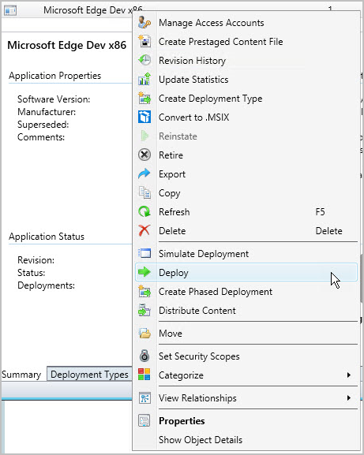

3. On the **General** page of the **Deploy Software Wizard**, click **Browse** to select the device collection to which you want to deploy the application.

    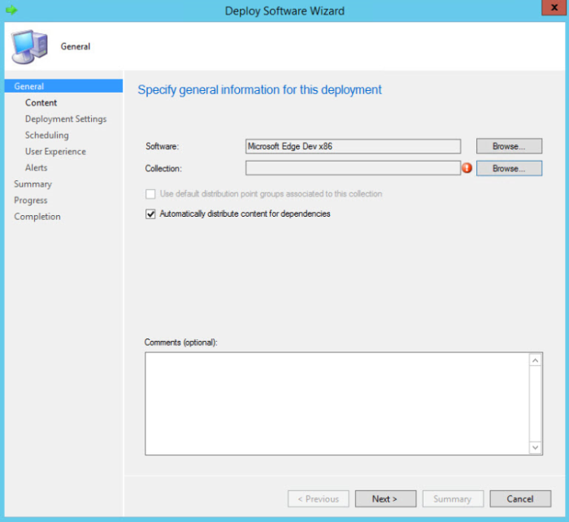

4. On the **Content** page, check that the distribution point from which you want PCs to install the application is selected.

    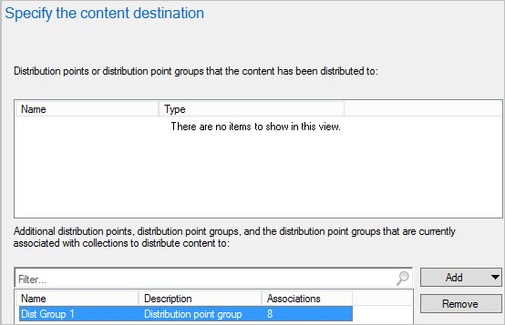

5. On the **Deployment Settings** page, make sure that the deployment action is set to **Install**, and the deployment purpose is set to **Required**.

    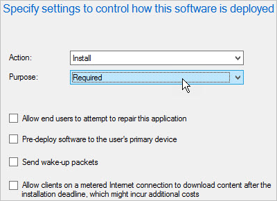

    >[!TIP]
    >By setting the deployment purpose to **Required**, you make sure that the application is installed on PCs that meet the requirements that you set. If you set this value to **Available**, then users can install the application on demand from Software Center.  

6. On the **Scheduling** page, you can configure when the application will be installed. For this example, select **As soon as possible after the available time**.

    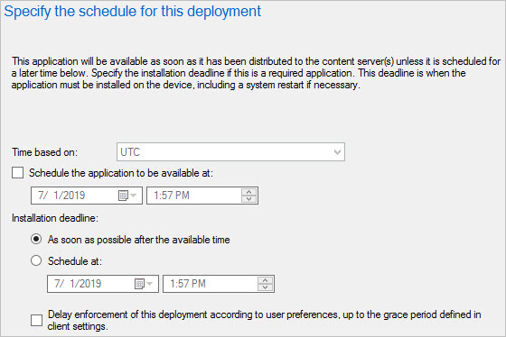

7. On the **User Experience** page, select your desired values and click **Next**.

    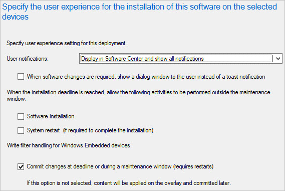

8. Specify your desired alert options and click **Next**.

    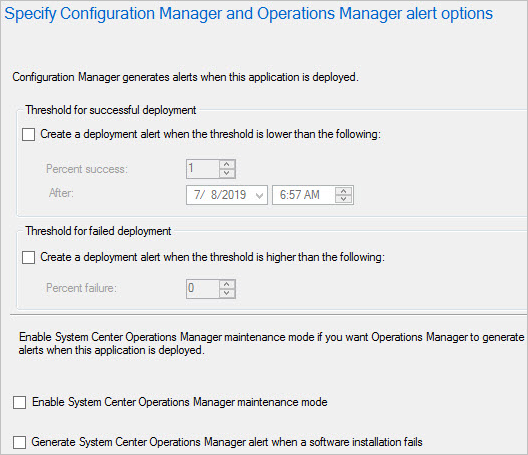

9. Complete the wizard.

Use the information in the following **Monitor the application** section to see the status of your application deployment.  

## Monitor the application

 In this section, you'll take a quick look at the deployment status of the application that you just deployed.  

### To review the deployment status  

1. In the Configuration Manager console, click **Monitoring** > **Deployments**.  

2. From the list of deployments, select the application.

    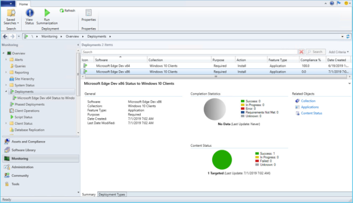

3. On the **Home** tab in the **Deployment** group, click **View Status**.  

4. Select one of the following tabs to see more status updates about the application deployment:  

    - **Success**: The application installed successfully on the indicated PCs.  

    - **In Progress**: The application has not yet finished installing.  

    - **Error**: An error occurred installing the application on the indicated PCs. Further information about the error is also displayed.  

    - **Requirements Not Met**: No installation attempt was made on the indicated devices because they did not meet the requirements you configured (in this example, because they do not run on Windows 10.)

    - **Unknown**: Configuration Manager was unable to report the status of the deployment. Check back again later.  

    >[!TIP]
    >There are several ways you can monitor application deployments. For more information, see [Monitor applications from the System Center Configuration Manager console](/sccm/apps/deploy-use/monitor-applications-from-the-console).  

## End-user experience  

Users who have PCs that are managed by Configuration Manager and are running Windows 10 of the specified processor architecture, will see a message telling them that they must install the Microsoft Edge Dev application. When they accept this installation option, the application is installed.  

## See also

- [Microsoft Edge Enterprise landing page](https://aka.ms/EdgeEnterprise)
- [Create and deploy an application with System Center Configuration Manager](/sccm/apps/get-started/create-and-deploy-an-application)