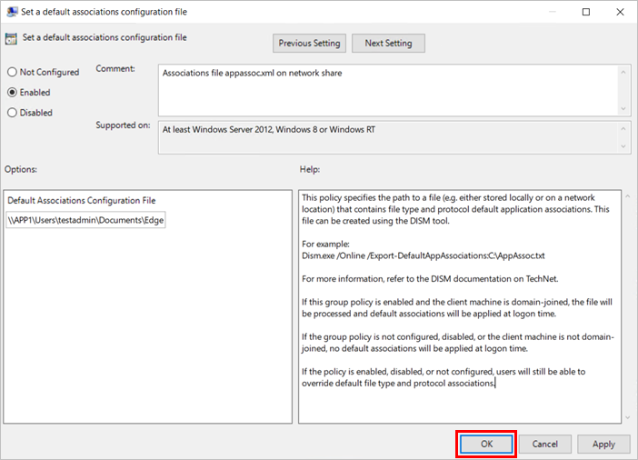

# Set Microsoft Edge as the default browser

This article explains how you can set Microsoft Edge as the default browser on Windows and macOS.

> [!NOTE]
> This article applies to Microsoft Edge version 77 or later on Windows 8 and Windows 10. For Windows 7 and macOS, see the [Set Microsoft Edge as default browser](./microsoft-edge-policies.md#defaultbrowsersettingenabled) policy.

## Introduction

You can use the **Set a default associations configuration file** Group Policy or the [DefaultAssociationsConfiguration](/windows/client-management/mdm/policy-csp-applicationdefaults#applicationdefaults-defaultassociationsconfiguration) Mobile Device Management setting to set Microsoft Edge as the default browser for your organization.

To set Microsoft Edge Stable as the default browser for html files, http/https links, and PDF files use the following application association file example:

```xml
<?xml version="1.0" encoding="UTF-8"?>
<DefaultAssociations> 
  <Association ApplicationName="Microsoft Edge" ProgId="MSEdgeHTM" Identifier=".html"/>
  <Association ApplicationName="Microsoft Edge" ProgId="MSEdgeHTM" Identifier=".htm"/>
  <Association ApplicationName="Microsoft Edge" ProgId="MSEdgeHTM" Identifier="http"/>
  <Association ApplicationName="Microsoft Edge" ProgId="MSEdgeHTM" Identifier="https"/>  
  <Association ApplicationName="Microsoft Edge" ProgId="MSEdgePDF" Identifier=".pdf"/>
</DefaultAssociations>
```

> [!NOTE]
> To set Microsoft Edge Beta as the default browser, set **ApplicationName** to "Microsoft Edge Beta" and **ProgId** to "MSEdgeBHTML". To set Microsoft Edge Dev as the default browser, set **ApplicationName** to "Microsoft Edge Dev" and **ProgId** to "MSEdgeDHTML".


> [!NOTE]
> The default file associations aren't applied if Microsoft Edge isn't installed on the target device. In this scenario, users are prompted to select their default application when they open a link or a htm/html file.

## Set Microsoft Edge as the default browser on domain-joined devices

You can set Microsoft Edge as the default browser on domain-joined devices by configuring the **Set a default associations configuration file** group policy. Turning this group policy on requires you to create and store a default associations configuration file. This file is stored locally or on a network share. For more information about creating this file, see [Export or Import Default Application Associations](/windows-hardware/manufacture/desktop/export-or-import-default-application-associations).

### To configure the group policy for a default file type and protocol associations configuration file:

1. Open the Group Policy editor and go to the **Computer Configuration\Administrative Templates\Windows Components\File Explorer**.
2. Select **Set a default associations configuration file**.
3. Click **policy setting**, and then click **Enabled**.
4. Under **Options:**, type the location to your default associations configuration file.
5. Click **OK** to save the policy settings.

The example in the next screenshot shows an associations file named *appassoc.xml* on a network share that is accessible from the target device.

   

   > [!NOTE]
   > If this setting is enabled and the user's device is domain-joined, the associations configuration file is processed the next time the user signs on.

## Set Microsoft Edge as the default browser on Azure Active Directory joined devices

To set Microsoft Edge as the default browser on Azure Active Directory joined devices follow the steps in the [DefaultAssociationsConfiguration](/windows/client-management/mdm/policy-csp-applicationdefaults#applicationdefaults-defaultassociationsconfiguration) Mobile Device Management setting using the following application association file as an example.

```xml
<?xml version="1.0" encoding="UTF-8"?>
<DefaultAssociations>
  <Association ApplicationName="Microsoft Edge" ProgId="MSEdgeHTM" Identifier=".html"/>
  <Association ApplicationName="Microsoft Edge" ProgId="MSEdgeHTM" Identifier=".htm"/>
  <Association ApplicationName="Microsoft Edge" ProgId="MSEdgeHTM" Identifier="http"/>
  <Association ApplicationName="Microsoft Edge" ProgId="MSEdgeHTM" Identifier="https"/>  
  <Association ApplicationName="Microsoft Edge" ProgId="MSEdgePDF" Identifier=".pdf"/>
</DefaultAssociations>
```

> [!NOTE]
> To set Microsoft Edge Beta as the default browser, set **ApplicationName** to "Microsoft Edge Beta" and **ProgId** to "MSEdgeBHTML". To set Microsoft Edge Dev as the default browser, set **ApplicationName** to "Microsoft Edge Dev" and **ProgId** to "MSEdgeDHTML".

## Set Microsoft Edge as the default browser on macOS

Attempting to programmatically set the default browser on macOS causes a prompt to appear for the end user. This prompt is a macOS security feature that can only be automated away by using an AppleScript.

Because of this limitation, there are two main methods for setting Microsoft Edge as the default browser on a macOS. The first option is to flash the device with an image of macOS where Microsoft Edge has already been set as the default browser. The other option is to use the [Set Microsoft Edge as default browser](./microsoft-edge-policies.md#defaultbrowsersettingenabled) policy, which prompts the user to set Microsoft Edge as the default browser.

When using either of these methods, it is still possible for a user to change the default browser. This is because for security reasons, the default browser preference can’t be blocked programmatically. For this reason, we recommend that you deploy the **Set Microsoft Edge as default browser** policy even if you create an image with Microsoft Edge as the default browser. If the policy is set and a user changes the default browser from Microsoft Edge the next time they open Microsoft Edge, they will be prompted to set it as the default.

## See also

- [Plan your deployment of Microsoft Edge](./deploy-edge-plan-deployment.md)
- [Microsoft Edge Enterprise landing page](https://aka.ms/EdgeEnterprise)
- [Set Microsoft Edge as default browser (Windows 7 and macOS)](./microsoft-edge-policies.md#defaultbrowsersettingenabled)
- [Windows 10 – How to configure file associations for IT Pros?](/archive/blogs/windowsinternals/windows-10-how-to-configure-file-associations-for-it-pros)
- [Export or Import Default Application Associations](/windows-hardware/manufacture/desktop/export-or-import-default-application-associations)
  - [DISM Overview](/windows-hardware/manufacture/desktop/what-is-dism)
  - [DISM - Deployment Image Servicing and Management](/windows-hardware/manufacture/desktop/dism---deployment-image-servicing-and-management-technical-reference-for-windows)