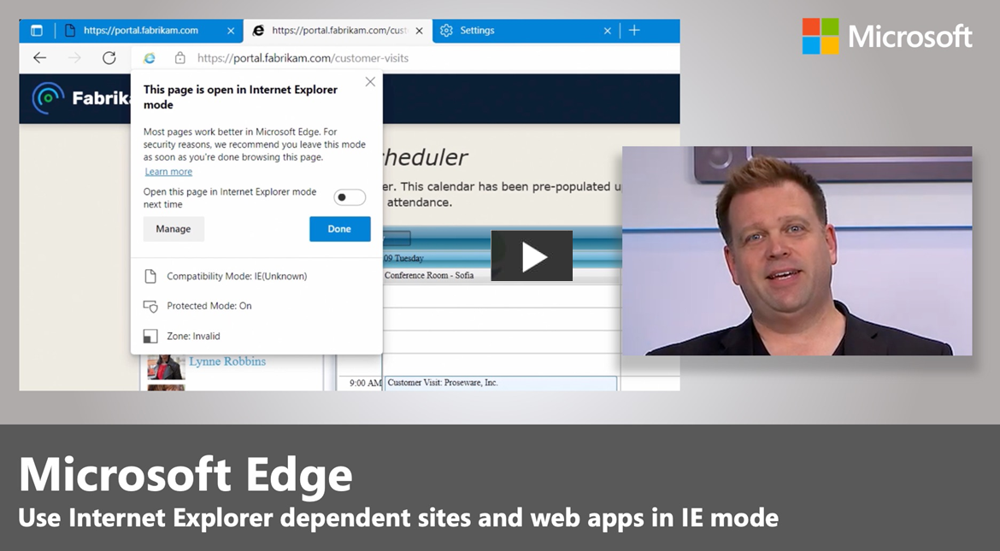

# Cloud Site List Management for Internet Explorer (IE) mode

This article explains how to configure and use Cloud Site List Management for Internet Explorer (IE) mode through the Microsoft 365 Admin Center.

> [!NOTE]
> This user experience is currently only available to worldwide and GCC cloud instances.

## Overview

As you transition your workflows and applications from IE11 to IE mode, **Cloud Site List Management** lets you manage your site lists for IE mode in the cloud. You can work with site lists using the **Microsoft Edge Site Lists** experience in the **Microsoft 365 Admin Center**.

To learn more, watch the next video.

This experience lets you store your organization's site list in a compliant cloud location instead of needing an on-premises infrastructure to host your site list. You can create, import, export site lists, and audit changes to site list entries through the Microsoft 365 Admin Center. You can publish multiple site lists to the cloud and use group policy to assign different groups of devices to use different lists.

## Prerequisites

The following prerequisites apply to this feature.

1. Customers must have a Microsoft Entra tenant.
2. Admins must have Microsoft Edge version 93 or greater installed and the latest version of the [policy files](https://aka.ms/edgeenterprise).
3. Admins need to be an [Microsoft Edge Administrator](/azure/active-directory/roles/permissions-reference#edge-administrator) on the tenant to access the Microsoft Edge site lists experience.

## Cloud Site List Management experience

There are four aspects to the Cloud Site List Management experience:

- Publishing the enterprise site list to the cloud.
- Associating the cloud site list with Microsoft Edge.
- Managing site list contents on the Microsoft 365 Admin Center.
- Viewing site feedback on the Microsoft 365 Admin Center.

### Publish enterprise site list to the cloud

Admins can publish one or more site lists to an authenticated endpoint that Microsoft Edge clients within their tenant can download for the IE mode experience. Admins can import the existing enterprise site list XML into the Microsoft Edge Site Lists experience in the Microsoft 365 Admin Center and then publish it to the cloud location.

### Associate the cloud-hosted site list with Microsoft Edge

With Microsoft Edge version 93, admins can use the [InternetExplorerIntegrationCloudSiteList](/deployedge/microsoft-edge-policies#internetexplorerintegrationcloudsitelist) setting to configure one of the cloud-hosted site lists that Microsoft Edge can consume for IE mode. Users must be signed in to Microsoft Edge for the client to consume the site list from the cloud.

> [!IMPORTANT]
> When this policy is configured, it overrides the original [InternetExplorerIntegrationSiteList](/deployedge/microsoft-edge-policies#internetexplorerintegrationsitelist) policy.

### Manage site list contents on the Microsoft 365 Admin Center

Admins can create a new list or import an existing site list into the Microsoft Edge site lists experience. They can add, edit, delete site list contents, and view comment history to track changes to individual entries. The next section explains how to opt in to public preview and access the Microsoft Edge site lists experience in the Microsoft 365 Admin Center.

### Manage site feedback on the Microsoft 365 Admin Center

With Microsoft Edge version 99, admins can use the [InternetExplorerIntegrationCloudUserSitesReporting](/DeployEdge/microsoft-edge-policies#internetexplorerintegrationcloudusersitesreporting) and [InternetExplorerIntegrationCloudNeutralSitesReporting](/DeployEdge/microsoft-edge-policies#internetexplorerintegrationcloudneutralsitesreporting) policies to identify gaps in their site list with site feedback. They can view sites that users have added to their [local site lists](/deployedge/edge-ie-mode-local-site-list), and potentially misconfigured neutral sites.

## Publish enterprise site list to the cloud

Use the following steps as a guide to create a site list, import a site list, and publish a site list. Before you can complete these steps, sign in the Microsoft 365 admin center.

1. Sign in to the [Microsoft 365 admin center](https://admin.microsoft.com) with your admin credentials.
2. On the left navigation pane, select **Settings > Org settings**.
3. You'll see the **Microsoft Edge site lists** option.

   > [!NOTE]
   > If you don't see this option on the Org settings page while we are rolling out to all production instances, you'll need to opt in to **Targeted release**. If you don't see the **Microsoft Edge site lists** option, see this FAQ: [I don't see the "Microsoft Edge site lists" option in the "Org settings" page on Microsoft 365 Admin Center. Why is that?](#i-dont-see-the-microsoft-edge-site-lists-option-in-the-org-settings-page-on-microsoft-365-admin-center-why-is-that).

### Steps to create a site list

1. On the Org settings page, select **Microsoft Edge site lists**
2. On the resulting page, select **Create a new list**.
3. Enter a **Site list name** and a **Description**, and then select **Create**.
4. After you get confirmation, select **Close panel**.

### Steps to import a site list

1.    Select the site list you want to populate (The option to import the updated site list will only appear if an existing site list is selected beforehand).
2. From the listed options that become available, select **Import list**.
3. On the right-hand panel, select **Browse**.
4. Select the file you want to import and then select **Upload** on the bottom of the panel.
5. You can skim through the URLs in the uploaded file. If you want to pick a different file, you can select **Upload a different file** at the top of the panel. If everything looks correct, select **Add** at the bottom of the panel.
6. After your list is imported, select **Close panel**.

### Steps to publish a site list

1. To publish a site list, go back up a level to the Microsoft Edge site lists page. Select the breadcrumb above the site list name to go up a level.
2. On the Microsoft Edge site lists page, select the site list you want to publish to the cloud, and then select **Publish site list**.
3. On the right-hand panel, update the **Version number** and select **Publish** the bottom of the panel.
4. After confirmation, select **Close panel**.
5. The **Published status** column, **Last published**, and **Last published by** are all updated.

## Associate the cloud-hosted site list with Microsoft Edge

Use the following steps to associate the cloud-hosted site list with Microsoft Edge.

1. To configure devices to use a published site list, select the site list you want to assign to devices.
2. On the resulting page, copy the **Site list ID**.
3. For the device group you pick, select **Enabled** and enter the **Site list ID** in the [Configure the Enterprise Mode Cloud Site List](/deployedge/microsoft-edge-policies#internetexplorerintegrationcloudsitelist) policy.
4. You can run **gpupdate/force** from  the Command Prompt to update the device with the policy or wait for the group policy to take effect. After the policy is updated, you can verify that Microsoft Edge is reading the cloud site list by going to [edge://compat/enterprise](edge://compat/enterprise). You need to be signed into Microsoft Edge.

> [!NOTE]
> After publishing a site list the first time and updating group policy, you need to restart Microsoft Edge. Wait 60 seconds or select the **Force Update** button on [edge://compat/enterprise](edge://compat/enterprise). When publishing updates to an already associated site list, there may be an older version of the site list in the cache. This entry will be refreshed after 60 seconds. For more information, see [What happens if users log out of Microsoft Edge?](#what-happens-if-users-log-out-of-microsoft-edge).

## Manage site list contents on the Microsoft 365 Admin Center

You can add, edit, delete site list contents, and view comment history to track changes to individual entries for sites and shared session cookies.

> [!NOTE]
> Persistent-cookies, which have been created with an `Expires-attribute`, can't be shared between Microsoft Edge and Internet Explorer.

If you have hybrid scenarios that require your site list to be hosted on-premises, you can export your site list from the Microsoft 365 Admin Center. Use the following steps as a guide for managing site list content.

### Add a site to the site list

You can add individual sites to any site list. After adding sites to the list, you can use the predefined filters using the **Filter** button (next to the Search box) to view updates to the list.

1. Go to the site list where you want to add a site.
2. Select **Add a site**.
3. Enter the site address and pick the engine that should be used to open the site. Add comments as needed and then select **Save**.

   > [!NOTE]
   > The **Status** column for any entries added to a published site list will show **Addition pending**. If you navigate to the list of site lists by selecting **Microsoft Edge site lists** at the top of the screen, you'll see that the **Published Status** column shows **Changes pending publish** to indicate that latest updates to the site list need to be published in order for users to receive them. You can use the **Filter** button (next to the Search box) to select **Addition pending** to see all the added entries that are pending publication.

### Delete a site from the site list

Use the following steps to delete a site entry.

1. Pick the site entry that you'd like to delete from the site list. Select **Delete site**.
2. Select **Delete** in the dialog pop-up.
3. After you see confirmation that a site entry has been deleted, it will stay on the list until the site list is published to the cloud location. You can view the list of deleted sites before publishing by selecting the **Filter** button and filtering for sites in the **Delete pending** state.

   > [!NOTE]
   > The **Status** column for any entries deleted from a published site list will show **Delete pending**. If you navigate to the list of site lists by selecting **Microsoft Edge site lists** at the top of the screen, you'll see that the **Published Status** column shows **Changes pending publish** to indicate that latest updates to the site list need to be published in order for users to receive them. You can use the **Filter** button (next to the Search box) to select **Delete pending** to see all deleted entries that are pending publication.

### View the change history for site entries

To view the change history for site entries:

- Select the site entry that you want to see the change history for, and then select **View history**.

### Copy a site to other site lists

Use the following steps to copy a site entry from a site list to one or more site lists.

1. Pick a site entry that you'd like to copy to another list. Select **Copy to more lists**.
2. Select one or more site lists you'd like to copy to from the dropdown list.
3. Select **Copy site** at the bottom of the panel.
4. After you see confirmation that a site entry has been copied, it will stay on the site list you copied it from. It will also appear on the site list(s) you copied it to.

   > [!NOTE]
   > The **Status** column for any entries copied to a published site list will show **Addition pending**. If you navigate to the list of site lists by selecting **Microsoft Edge site lists** at the top of the screen, you'll see that the **Published Status** column shows **Changes pending publish** to indicate that latest updates to the site list need to be published in order for users to receive them. You can use the **Filter** button (next to the Search box) to select **Addition pending** to see all the added entries that are pending publication.

### Add a shared session cookie to the site list

You can add individual shared session cookies to any site list. After adding shared cookies to the list, you can use the predefined filters using the **Filter** button (next to the Search box) to view updates to the list.

1. Go to the site list where you want to add a shared cookie.
2. Select **Add a shared cookie**.
3. Enter the domain and cookie name. Add comments as needed and then select **Save**.

> [!NOTE]
> The **Status** column for any entries added to a published site list will show **Addition pending**. If you navigate to the list of site lists by selecting **Microsoft Edge site lists** at the top of the screen, you'll see that the **Published Status** column shows **Changes pending publish** to indicate that latest updates to the site list need to be published for users to receive them. You can use the **Filter** button (next to the Search box) to select **Addition pending** to see all the added entries that are pending publication.

### Delete a shared session cookie from the site list

Use the following steps to delete a shared session cookie entry.

1. Pick the entry that you'd like to delete from the site list. Select **Delete shared cookie**.
2. Select **Delete** in the dialog pop-up.
3. After you see confirmation that an entry has been deleted, it will stay on the list until the site list is published to the cloud location. You can view the list of deleted shared cookies before publishing by selecting the **Filter** button and filtering for cookies in the **Delete pending** state.

> [!NOTE]
> The **Status** column for any entries deleted from a published site list will show **Delete pending**. If you navigate to the list of site lists by selecting **Microsoft Edge site lists** at the top of the screen, you'll see that the **Published Status** column shows **Changes pending publish** to indicate that latest updates to the site list need to be published for users to receive them. You can use the **Filter** button (next to the Search box) to select **Delete pending** to see all deleted entries that are pending publication.

### View the change history for shared session cookies

To view the change history for shared session cookies:

- Select the entry that you want to see the change history for, and then select **View history**.

### Copy a shared session cookie to other site lists

Use the following steps to copy a shared session cookie entry from a site list to one or more site lists.

1. Pick an entry that you'd like to copy to another list. Select **Copy to more lists**.
2. Select one or more site lists you'd like to copy to from the dropdown list.
3. Select **Copy cookie** at the bottom of the panel.
4. After you see confirmation that a site entry has been copied, it will stay on the site list you copied it from. It will also appear on the site list(s) you copied it to.

> [!NOTE]
> The **Status** column for any entries copied to a published site list will show **Addition pending**. If you navigate to the list of site lists by selecting **Microsoft Edge site lists** at the top of the screen, you'll see that the **Published Status** column shows **Changes pending publish** to indicate that latest updates to the site list need to be published in order for users to receive them. You can use the **Filter** button (next to the Search box) to select **Addition pending** to see all the added entries that are pending publication.

### Export a site list

There are scenarios where you want to export a site list. For example, if you're unable to move your site list to the cloud right away or if you need to maintain a hybrid environment with site lists in the cloud and on-premises. You can use the Cloud Site List Management experience to manage updates to a site list in a central location and export the site list to the on-premises host.

To export a site list:

1. On the Microsoft Edge site lists page, select the site list that you want to export.
2. Select **Export list** to download the site list XML file

### Restore a previous version of a site list

Use the following steps as a guide to restore the previous version of a site list.

> [!NOTE]
> Only the last 3 published versions of a site list are saved. When you publish more than 3 versions, the saved version with the lowest version number will be permanently deleted, and you will no longer be able to restore that version. If you want to keep a copy of a site list, you should export it before publishing a new version.

1. On the Microsoft Edge site lists page, select the list that you'd like to restore to a previous version.
2. Select a previous version from the **Version** dropdown list.
3. You can view the contents of a previous version of the site list. You can also export it if you want to save a copy by selecting **Export** in the message bar.
4. After picking the version you want to restore, select **Restore** in the message bar.
5. If you have unpublished changes in the current version of the site list, you can choose to include them by selecting the checkbox in the panel.

   > [!NOTE]
   > If you don't include the unpublished changes, they will be lost when you restore the previous version.

6. Select **Restore** at the bottom of the panel to restore the previous version.

## Manage site feedback on the Microsoft 365 Admin Center

The Site feedback tab shows the sites that users are adding to their local IE Mode site list, and potentially misconfigured neutral sites reported by Microsoft Edge. You'll see the site address, the number of users who are adding this site, and which published, cloud-hosted site lists the feedback came from. You can act on an individual entry by adding it to an existing site list(s), pausing, or deleting the feedback. You can also view change history and comments.

### Add a site to site lists

Use the following steps to add a site to one or more site lists from site feedback.

1. Pick the entry that you want to add. Select **Add to site lists**.  
2. Select one or more site lists to add to from the dropdown. Pick the engine that should be used to open the site and add comments as needed.
3. Select **Add site** at the bottom of the panel.

   > [!NOTE]
   > The status for this entry will update to **Resolved** because it was **Added**. This site will now appear on the site list(s) you selected.

### Pause incoming feedback on a site

You can postpone acting on a pending entry by pausing feedback. You can pause feedback for 30 days or indefinitely. Use the following steps to pause incoming feedback.  

1. Pick an entry that you want to pause feedback on. Select **Pause Feedback**.  
2. Add comments as needed and select how long you'd like to pause feedback for.  
3. Select **Pause** at the bottom of the panel.

    > [!NOTE]
    > The status for this entry will update to **Resolved** because it was **Paused**. If you paused for 30 days, then after 30 days if there's any incoming feedback, the entry's status will refresh back to **Pending** for you to act on.

### Delete feedback on a site

Use the following steps to delete a feedback entry.

1. Pick the entry that you want to delete. Select **Delete feedback**.
2. Select **Delete** on the pop-up dialog.

    > [!NOTE]
    > If you delete an entry, it might reappear in the future as incoming feedback if users continue to add the site to their local site lists or if Microsoft Edge detects it as a potentially misconfigured neutral site.

### View the change history for site feedback entries

To view the change history:

- Select the entry that you want to see the change history for, and then select **Feedback history** in the side panel.

## FAQ

### I don't see the "Microsoft Edge site lists" option in the "Org settings" page on Microsoft 365 Admin Center. Why is that?

The experience will be available when rollout completes by mid-December. While the experience is rolling out, you'll need to opt in to view this experience in the Microsoft 365 Admin Center. You must be a global admin in Microsoft 365 to opt in.

You can use the following steps to opt in:

1. Sign in to the [Microsoft 365 Admin Center](https://admin.microsoft.com) and then go to  **Settings > Org settings**. Under the **Organization profile** tab, choose **Release preferences**.
2. To disable targeted release, select **Standard release**, then select **Save changes**.
3. To enable targeted release for all users in your organization, select **Targeted release for everyone**, then select **Save changes**.
4. To enable targeted release for some people in your organization, select **Targeted release for selected users**, then select **Save changes**.
5. Choose **Select users** to add users one at a time, or **Upload users** to add them in bulk.
6. When you finish adding users, select **Save changes**.

For more information, see [Set up the Standard or Targeted release options - Microsoft 365 admin](/microsoft-365/admin/manage/release-options-in-office-365)

### Can I manage my site list data programmatically instead of using the M365 Admin Center experience?

Yes, there's a set of Microsoft Graph APIs for Cloud site list management that are currently in preview. Learn more here: [Use the Edge API in Microsoft Graph - Microsoft Graph beta](/graph/api/resources/browser-edge-api-overview?view=graph-rest-beta).

### When I select "Microsoft Edge site lists" and try to create a new list, I get this error - "Request failed with status code 500". Why is that?

Microsoft Edge Site Lists stores its data and configuration in a service infrastructure that's shared with enterprise cloud services such as Exchange Online, SharePoint Online, Teams, and Microsoft Entra ID. In rare cases, when Microsoft Edge site lists is the first feature to use this infrastructure, provisioning might take some time. In these cases, the initial request from the Microsoft 365 Admin Center will fail. When the request fails, an alert is sent to the provisioning system to address the problem. Typically provisioning completes in three days. Therefore, if you get this error, try again in a few days and create a new list. If you still can't create a new list, or if you need urgent assistance, contact Microsoft Support.

### Can users who haven't signed in to Microsoft Edge download the site list?

No, users must sign in to the browser to download the cloud hosted site list. You can configure a policy to allow Implicit Sign in to prevent user experience disruption. For more information, see [ImplicitSignInEnabled](/DeployEdge/microsoft-edge-policies#implicitsigninenabled).

### What is the default refresh interval after updates are made to site list contents?

The site list is refreshed in Microsoft Edge every two hours. You can change this interval in the [InternetExplorerIntegrationSiteListRefreshInterval](/deployedge/microsoft-edge-policies#internetexplorerintegrationsitelistrefreshinterval) policy. The minimum refresh interval is 30 minutes.

### What happens if users log out of Microsoft Edge?

Access to the site list requires explicit browser sign in for the first download. In a scenario where the user logs out after being logged in, the site list is cached in Microsoft Edge. The list will stay cached even if the user logs out of Microsoft Edge from their Microsoft Entra account. Microsoft Edge won't try to fall back to the non-cloud download location while the Cloud site list policy is configured. Microsoft Edge attempts to update the cached site list at the following times (note that all attempts will fail if the user isn't signed in to Microsoft Edge):

- 60 seconds after you restart the browser.
- Every two hours when Microsoft Edge is running. The 120-minute refresh interval can be changed by using the [InternetExplorerIntegrationSiteListRefreshInterval](/deployedge/microsoft-edge-policies#internetexplorerintegrationsitelistrefreshinterval) policy. The minimum refresh interval is 30 minutes.

### Where is the cloud site list hosted?

The data is stored in Substrate Data Store which ensures that the data is stored in a compliant location and confers to local data handling rules. Substrate decides what region the data is stored based on the geo location you have chosen for your tenant.

## Support and Feedback

Support for Cloud Site List Management experience is covered by your existing [Microsoft Premier Support](https://www.microsoft.com/unifiedsupport/premier) contract. You can reach out to Microsoft Support to report issues or feedback. You can also leave feedback in our [TechCommunity forum](https://techcommunity.microsoft.com/t5/enterprise/bd-p/EdgeInsiderEnterprise).

## See also

- [About IE mode](./edge-ie-mode.md)
- [Microsoft Edge Enterprise landing page](https://aka.ms/EdgeEnterprise)
