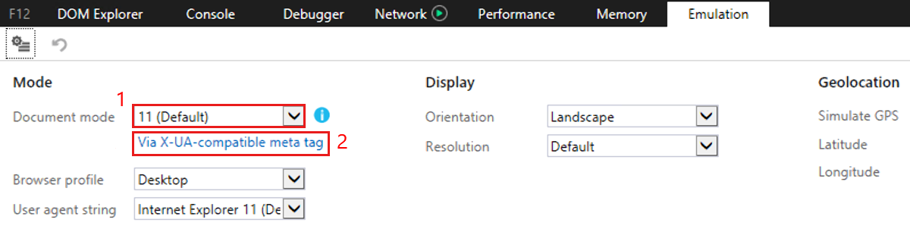

# Internet Explorer (IE) mode troubleshooting and FAQ

> [!NOTE]
> The Internet Explorer 11 desktop application will be retired and go out of support on  June 15, 2022. To see the list of what’s in scope, see the [Internet Explorer 11 desktop app retirement FAQ](https://techcommunity.microsoft.com/t5/windows-it-pro-blog/internet-explorer-11-desktop-app-retirement-faq/ba-p/2366549). The same IE11 apps and sites you use today can open in Microsoft Edge with Internet Explorer mode. To learn more, see the [The future of Internet Explorer on Windows 10 is in Microsoft Edge](https://blogs.windows.com/windowsexperience/2021/05/19/the-future-of-internet-explorer-on-windows-10-is-in-microsoft-edge/) blog post.

This article provides troubleshooting tips and an FAQ for Microsoft Edge version 77 or later.

> [!NOTE]
> This article applies to Microsoft Edge version 77 or later.

## Common IE mode issues

Use this section as a guide to help you troubleshoot and fix the two most common issues when moving to Microsoft Edge with IE mode. These issues are:

- Incorrect Document mode configurations
- Incomplete neutral site configurations

### Incorrect Document mode configurations

This section describes the symptoms and gives steps to diagnose and fix this issue.

#### Symptoms

Users will experience the following symptoms:
  
- Sizing and positioning of page elements might be off or they might be missing 
- Some functionality might be lost or not work as expected. For example, buttons that worked with Internet Explorer don’t do anything or return an error.

#### How to troubleshoot and fix

The general strategy is to duplicate the same settings that worked with Internet Explorer 11 for a specific site in our IE mode site list entry. Use the F12 Developer Toolbar's "Emulation" tab in IE 11, shown in the next screenshot to investigate the scenario you want to fix. To open the Developer toolbar, press the F12 key and then select **Open DevTools**.



The Emulation tab shows two pieces of information to focus on: the Document mode (1), and the text below the dropdown list (2). This information can help explain why we are in the 11 (Default) mode for the page or site we’re looking at.

There are different messages that can be displayed for the Document mode, and in our example they are:
  
- Via X-UA-compatible meta tag
- Via X-UA-compatible HTTP header

The two X-UA-Compatible options indicate that either the webpage or the web server where the site is hosted, is showing the document mode that should be used by the browser.  
We want to honor the document mode in nearly all cases. To do that, we need to select one of the following modes in the IE mode site list entry for the site:

- Default
- IE8 Enterprise
- IE7 Enterprise

These options respect the webpage or web server directives. Remember that we need to select an option that includes the specified document mode. In the screenshot example, because the specified document mode is 11, we’d select "Default"  because IE8 Enterprise and IE7 Enterprise don't support IE 11 document mode.  

If the Document mode indicates that one of the following compatibility views is needed for the site, the configuration setting is straightforward.

- Via local compatibility view settings
- Via the compatibility view list
- Via intranet compatibility settings

Because all the Compatibility View settings result in "IE7 Enterprise" behavior, choose this setting in the "Compat Mode" section of the IE mode site list entry.

For more information about the logic that Internet Explorer or IE mode uses to land in one doc mode over another, see the [Deprecated document modes and Internet Explorer 11](/internet-explorer/ie11-deploy-guide/deprecated-document-modes) article.

The general rule is to use the most current logic-based mode that allows a given site to work as expected. We’d start with the Default mode, move to IE8 Enterprise mode, and then to IE7 Enterprise mode if needed. This selection gives child pages the flexibility to use different Document modes as necessary via the built-in logic for their specific needs. As a result, all the website pages aren’t locked in to one specific Document mode.  

The following table lists the available document modes for these settings.

| Logic-based mode | Default | IE8 Enterprise | IE7 Enterprise |
|--|--|--|--|
| Available Document modes | IE11 Doc mode<br> IE10 Doc mode<br>IE9 Doc mode<br> IE8 Doc mode<br>IE7 Doc mode<br>IE5 Quirks mode | IE8 Doc mode<br>IE7 Doc mode<br>IE5 Quirks mode   | IE7 Doc mode<br>IE5 Quirks mode  |

> [!NOTE]
> In some cases, a particular site or page requires a specific document mode to function as designed. We recommend that explicit Document mode options should only be used when the logic-based options aren’t effective.

### Incomplete neutral site configurations

This section describes the symptoms and gives steps to diagnose and fix this issue.

#### Symptoms
  
A page relies on SSO for authentication, but users are prompted multiple times for credentials, experience a looping redirect behavior, failed authentication errors, or some combination of these symptoms.
  
#### How to troubleshoot and fix
  
Before we start analyzing a  failing workflow in Microsoft Edge, look at the address bar for the IE mode "e" logo, shown in the next screenshot.


If, during the SSO authentication process, we see the "e", but it disappears after a redirect, this points to a missing neutral site. After Microsoft Edge drops into IE mode, we need to stay there to maintain session and cookie information. If the URL shows up in the address bar long enough to identify it, add it to the IE mode site list as a neutral site using the steps described in [Configure neutral sites](/deployedge/edge-ie-mode-sitelist#configure-neutral-sites).

Often, the redirect cycle happens so quickly that it’s difficult to identify the missing neutral sites. To help with this analysis, we use a tool that’s built into the Chromium engine: **net-export**.

> [!TIP]
> Network traces are inherently noisy. To minimize the noise, close all other browser instances and tabs that aren’t needed for the specific workflow that you’re investigating.

The following steps describe how to troubleshoot a neutral site configuration.
  
1. Open a new tab in Microsoft Edge and go to *edge://net-export*.
2. Select **Start Logging to Disk**, and then pick a location where you want to save the resulting .json log. This log can safely be deleted after you finish troubleshooting.
3. Open another tab (keep the net-export tab open), and repeat the failing workflow.
4. After you finish, return to the net-export tab and select **Stop Logging**.
5. Select the "netlog viewer" hyperlink.
6. On the resulting page, select **Choose File**, and then pick the .json file you created in step 2.
7. After the log file is loaded, select **Events** from the left side menu.
8. Scroll through the network log and identify the starting URL. (You can also use the search function to find your starting point.)
9. From the starting point, scroll downward and look for URLs in the workflow that don’t have an entry in your IE mode site list. Pay special attention to URLs with indicators for SSO, AUTH, LOGIN, and so on.
10. After you identify a candidate URL, add it to the IE mode site list as a neutral site by selecting **None** in the Open-in dropdown. Test the workflow again.

In some cases, multiple neutral site entries are needed, depending on the specific site architecture in place. If the workflow still fails after adding a new neutral site, repeat the process to capture a new net-export log and perform another pass.

In some rare instances, it may be necessary to configure specific shared cookies to ensure that required information gets to your IE mode sites. If you are aware of a specific cookie that’s  needed, you can configure cookie sharing using the steps described in [Cookie sharing from Microsoft Edge to Internet Explorer](/deployedge/edge-ie-mode-add-guidance-cookieshare).

## What if these steps don't fix the issue?

This article is designed to help troubleshoot the most common IE mode configuration issues, but it might not cover every possible scenario. If you run into an issue that you can't fix and need help with, contact App Assure at [https://aka.ms/AppAssure](https://aka.ms/AppAssure) and we'll help you with your problem.

## Get general diagnostic and configuration information

You can get Internet Explorer mode diagnostic information on the Microsoft Edge Compatibility tab. To open this tab, go to *edge://compat/iediagnostic*. This page may show diagnostic messages. This page also provides configuration information for the following categories:

- **Registry key check.** (Displayed only if the check fails.) Checks to see if Internet Explorer integration is set up correctly in the registry. If not, the user can select **Fix it** to resolve the problem.
- **Internet Explorer mode.** Shows the API version that's used, based on the configuration and OS. If there's a problem, the user may be prompted to install a Windows Update.
- **Internet Explorer mode setting.** Shows whether Internet Explorer mode is enabled, and how it's configured.
- **Command line.** Shows the command-line string and switches used to start Microsoft Edge.
- **Group policy settings.** Shows whether IE mode is configured using group policies, and the policies that are applied.

### Error message: "To open this page in Internet Explorer mode, reinstall Microsoft Edge with administrator privileges."

You might see this error if you don't have all required Windows Updates. See the prerequisites listed in [About IE mode](./edge-ie-mode.md) for the required versions of Windows and Microsoft Edge.

If you've already installed all required Windows Updates, you might see this error if:

- You're using the Canary channel, which is installed at the user level by default.
- You're using the Stable, Beta, or Dev channel, but when prompted for elevation when installing the elevation was canceled. When you cancel the elevation prompt, the installation will continue at the user level.
- Internet Explorer 11 has been disabled in Windows Features.

Possible solutions are:

- Run the installer for any channel at the system level: `installer.exe --system-level`.
- Enable Internet Explorer 11 in Windows Features.

To check if Microsoft Edge is installed at the systems level, type "edge://version" in the Microsoft Edge address bar. The Executable path will show a path starting with *C:\Program Files*, which indicates a system install. If the Executable path begins with *C:\Users*, uninstall and then reinstall Microsoft Edge with administrator privileges.

### Error message "To open this page in IE mode, try restarting Microsoft Edge."

You might see this error if there was an unexpected error in Internet Explorer. Restarting Microsoft Edge usually fixes this error.

### Error message: "Turn off remote debugging to open this site in IE mode otherwise it might not work as expected."

You might see this error if you're remote debugging and navigate to a web page configured to run in IE mode. You can continue, but the page will be rendered using Microsoft Edge.

### Error message: "Could not retrieve EMIE site list."

You might see this error on the *edge://compat/enterprise* page indicating that the site list download failed. Starting with Microsoft Edge version 87, when cookies are blocked for third party requests using the [BlockThirdPartyCookies](/deployedge/microsoft-edge-policies#blockthirdpartycookies) policy, HTTP authentication also isn't allowed. You can allow cookies for the specific domain hosting your Enterprise Mode Site List using the [CookiesAllowedForURLs](/deployedge/microsoft-edge-policies#cookiesallowedforurls) policy to ensure that site list downloads are successful.

## Frequently Asked Questions

### Will IE mode replace Internet Explorer 11?

Yes, the Internet Explorer 11 desktop application will be retired and go out of support on June 15, 2022. To see what’s in scope, see [Lifecycle FAQ - Internet Explorer](/lifecycle/faq/internet-explorer-microsoft-edge). The same IE11 apps and sites you use today can open in Microsoft Edge with Internet Explorer mode. To learn more, read [The future of Internet Explorer on Windows 10 is in Microsoft Edge](https://blogs.windows.com/windowsexperience/2021/05/19/the-future-of-internet-explorer-on-windows-10-is-in-microsoft-edge/).

### How can I debug my legacy application while using IE mode on Microsoft Edge?

You can use IEChooser to launch the Internet Explorer DevTools to debug the content of your IE mode tabs. To use IEChooser, follow these steps:

1. Open IEChooser.
   - Open the Run dialog box. For example, press the `Windows logo key` + `R`.
   - Enter `%systemroot%\system32\f12\IEChooser.exe`, and then select **Ok**.
2. In IEChooser, select the entry for the IE mode tab.

### Can I test a site in Microsoft Edge while it is configured to open IE mode in the Enterprise Mode Site List?

Yes, while you are modernizing your legacy sites, you can test IE mode configured applications on Microsoft Edge. To test these apps you can configure the [InternetExplorerModeTabInEdgeModeAllowed](/deployedge/microsoft-edge-policies#internetexplorermodetabinedgemodeallowed) policy. If you enable this policy, your users can open IE mode sites in Microsoft Edge by selecting **Settings and more** (the ellipses icon ...) > **More Tools** > **Open sites in Edge mode**.

### Can I use "View in File Explorer" in SharePoint Online on Microsoft Edge?

Starting with Microsoft Edge version 95, you can enable the **View in File Explorer** capability for SharePoint Online Modern Document Libraries. For this experience to be visible and work for your users, you will need to enable the Microsoft Edge ["Configure the View in File Explorer feature for SharePoint pages in Microsoft Edge"](/deployedge/microsoft-edge-policies#configureviewinfileexplorer) policy and update your SharePoint Online tenant configuration. Learn more: [View SharePoint files with File Explorer in Microsoft Edge - SharePoint in Microsoft 365 | Microsoft Docs](/SharePoint/sharepoint-view-in-edge).

However, rather than use the View in File Explorer option, the recommended approach to managing files and folders outside of SharePoint is to [Sync SharePoint and Teams files with your computer](https://support.microsoft.com/office/sync-sharepoint-and-teams-files-with-your-computer-6de9ede8-5b6e-4503-80b2-6190f3354a88?ui=en-us&rs=en-us&ad=us) or [Move or copy files in SharePoint](https://support.microsoft.com/office/move-or-copy-files-in-sharepoint-00e2f483-4df3-46be-a861-1f5f0c1a87bc?ui=en-us&rs=en-us&ad=us).

### Does IE mode on Microsoft Edge support the 'no-merge' option that was supported in Internet Explorer 11?

The recommended alternatives for the no-merge functionality in Microsoft Edge are one of the following actions:

1. Use Profiles in Microsoft Edge - Each profile maps to a different IE session for IE mode pages, so it behaves identically to the no-merge option.
2. Use the `--user-data-dir=<path>` command line, but with a different path for each session. If needed, you can create a utility for the user to run that both launches Microsoft Edge and changes the path for the session.

If neither of the previous options work for your scenario, starting in Microsoft Edge version 93, IE mode on Microsoft Edge will support no-merge. For an end-user, when a new browser window is launched from an IE mode application, it will be in a separate session, like the no-merge behavior in IE11.

For each Microsoft Edge window, the first time an IE mode tab is visited within that window, if it’s a designated "no-merge" site, that window is locked into a different "no-merge" IE session.  This window stays locked from all other Microsoft Edge windows until the last IE mode tab is closed in the locked window. This follows previous behavior where users could launch IE with no-merge and launch Microsoft Edge without no-merge using other mechanisms. All sites opening in a new window (through window.open) will respect the merge nature of the parent process.

> [!NOTE]
> Session switching isn’t supported. Navigations within the same IE mode tab will use the same session.

You can validate the no-merge behavior in Microsoft Edge version 93 or later by following these steps:

1. Ensure that IE mode is enabled on Microsoft Edge version 93 or later.
2. You can configure sites that need to prevent session sharing in the Enterprise Mode Site List by setting the value of the merge-type attribute to “no-merge”. This attribute is not applicable only when the open-in element is set to Microsoft Edge. By default, all sites have a merge-type value of merge. (**Note:** The integrated site list manager tool available at *edge://compat/sitelistmanager* includes a **No merge** checkbox when you Add or Edit a site.)

   ```
   <site url="contoso.com">
   <open-in merge-type="no-merge">IE11</open-in>
   </site>
   ```

3. Navigate to any site configured as no-merge. The site should be in its own unmerged IE session. When you open another Microsoft Edge instance or window and navigate to the same site, it should be in its own IE session. Note that are multiple iexplore.exe processes in Task Manager.

If you have any feedback, reach out through one of our feedback channels: Microsoft support or the [TechCommunity](https://techcommunity.microsoft.com/t5/enterprise/bd-p/EdgeInsiderEnterprise) forum.

### Can I save links as webpages in Internet Explorer mode?

Yes, you can enable the Save Target As option in the context menu for Internet Explorer mode in Microsoft Edge. To do this, configure the group policy "*Allow Save Target As in Internet Explorer mode*" located at *Computer Configuration > Administrative Templates > Windows Components > Internet Explorer*. The save mechanism works the same as it does in Internet Explorer and if the target is saved as an html file, re-opening the file will render the page in Microsoft Edge.

The ability to save links as web pages  requires the following minimum operating system updates:

- Windows 10, version 2004, Windows Server version 2004, Windows 10, version 20H2 : [KB4580364](https://support.microsoft.com/help/4580364/windows-10-update-kb4580364)
- Windows 10, version 1903, Windows 10, version 1909, Windows Server version 1903: [KB4580386](https://support.microsoft.com/help/4580386/windows-10-update-kb4580386)
- Windows 10, version 1809, Windows Server version 1809, Windows Server 2019: [KB4580390](https://support.microsoft.com/help/4580390/windows-10-update-kb4580390)
- Windows 10, version 1803: [KB4586785](https://support.microsoft.com/help/4586785/windows-10-update-kb4586785)
- Windows 10, version 1607: [KB4586830](https://support.microsoft.com/help/4586830/windows-10-update-kb4586830)
- Windows 10, version 1507: [KB4586787](https://support.microsoft.com/help/4586787/windows-10-update-kb4586787)

### My application requires transferring POST data between IE mode and Microsoft Edge. Is this supported?

Starting with Microsoft Edge Beta channel version 96, navigations that switch between Internet Explorer mode and Microsoft Edge will include form data and additional HTTP headers. However, if form data includes file attachments, they will not be transferred between engines. You can choose what data types should be included in such navigations using the [InternetExplorerIntegrationComplexNavDataTypes](/deployedge/microsoft-edge-policies#internetexplorerintegrationcomplexnavdatatypes) group policy.

In addition to Microsoft Edge version 96, you need to have the following Windows updates installed for this experience:

- Windows 11 [KB5007262](https://support.microsoft.com/topic/november-22-2021-kb5007262-os-build-22000-348-preview-7f3e18d7-4189-4882-b0e9-afc920253aee) or later
- Windows Server 2022 [KB5007254](
https://support.microsoft.com/topic/november-22-2021-kb5007254-os-build-20348-380-preview-9a960291-d62e-486a-adcc-6babe5ae6fc1) or later
- Windows 10 version 2004; Windows Server version 2004; Windows 10 version; Windows Server version 20H2 and Windows 10 version 21H1 - [KB5006738](https://support.microsoft.com/topic/october-26-2021-kb5006738-os-builds-19041-1320-19042-1320-and-19043-1320-preview-ccbce6bf-ae00-4e66-9789-ce8e7ea35541) or later
- Windows 10 version 1909 [KB5007189](
https://support.microsoft.com/topic/november-9-2021-kb5007189-os-build-18362-1916-91b4647c-9979-4d84-8e64-efc8674e8c1f) or later

## See also
  
- [Microsoft Edge Enterprise landing page](https://aka.ms/EdgeEnterprise)
- [About IE mode](./edge-ie-mode.md)
- [Additional Enterprise Mode information](/internet-explorer/ie11-deploy-guide/enterprise-mode-overview-for-ie11)
