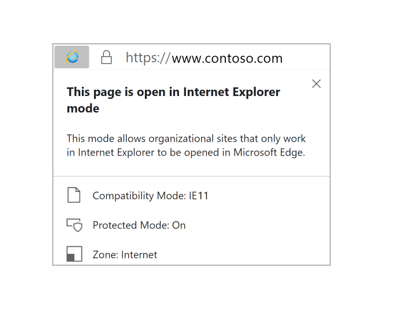

# What is Internet Explorer (IE) mode?

>[!Note]
> The Internet Explorer 11 desktop application will be retired and go out of support on June 15, 2022 (for a list of what’s in scope, [see the FAQ](https://techcommunity.microsoft.com/t5/windows-it-pro-blog/internet-explorer-11-desktop-app-retirement-faq/ba-p/2366549)). The same IE11 apps and sites you use today can open in Microsoft Edge with Internet Explorer mode. [Learn more here](https://blogs.windows.com/windowsexperience/2021/05/19/the-future-of-internet-explorer-on-windows-10-is-in-microsoft-edge/).

We created Internet Explorer (IE) mode in Microsoft Edge for organizations that still need Internet Explorer 11 for backward compatibility with existing websites but also need a modern browser. This feature makes it easier for organizations to use one browser, for legacy web/apps or for a modern web/app. This article provides an introduction to using Microsoft Edge with IE mode.

For an advanced configuration guide, see [Configure IE mode for Microsoft Edge](https://assistants.microsoft.com/configureiemode).

> [!NOTE]
> This article applies to Microsoft Edge version 77 or later.

## What is IE mode?

IE mode on Microsoft Edge makes it easy to use all of the sites your organization needs in a single browser. It uses the integrated Chromium engine for modern sites, and it uses the Trident MSHTML engine from Internet Explorer 11 (IE11) for legacy sites.

When a site loads in IE mode, the IE logo indicator displays on the left side of navigation bar. You can click the IE logo indicator to display additional information, as shown:

  

Only those sites that you specifically configure (via policy) will use IE mode, all other sites will be rendered as modern web sites. For a site to use IE mode, you need to either:

- List the site in the Enterprise Mode Site List XML defined in one of these policies:
  - Microsoft Edge 78 or later, "Configure the Enterprise Mode Site List"
  - Internet Explorer, "Use the Enterprise Mode IE website list"
  > [!NOTE]
  > We only process one Enterprise Mode Site List. The Microsoft Edge site list policy takes precedence over the Internet Explorer site list policy.
- Configure the **Send all intranet sites to Internet Explorer** group policy and set it to **Enabled** (Microsoft Edge 77 or later.)

### IE mode supports the following Internet Explorer functionality

- All document modes and enterprise modes
- ActiveX controls (such as Java or Silverlight). **Note**: Silverlight reaches [end of support](https://support.microsoft.com/windows/silverlight-end-of-support-0a3be3c7-bead-e203-2dfd-74f0a64f1788) on October 12, 2021. 
- Browser Helper Objects 
- Internet Explorer settings and group policies that affect security zone settings and Protected Mode
- F12 developer tools for IE, when launched with [IEChooser](/deployedge/edge-ie-mode-faq#how-can-i-debug-my-legacy-application-while-using-ie-mode-on-microsoft-edge-)
- Microsoft Edge extensions (Extensions that interact with the IE page content directly are not supported.)

### IE mode doesn't support the following Internet Explorer functionality

- Internet Explorer toolbars
- Internet Explorer settings and group policies that control the navigation menu.
- IE11 or Microsoft Edge F12 developer tools

## Prerequisites

The following prerequisites apply to using Microsoft Edge with IE mode.

> [!IMPORTANT]
> To ensure success, install the latest updates for Windows and Microsoft Edge. Failure to do so will likely cause IE mode to fail.

1. The minimum system updates for the operating systems listed in the next table.

 | Operating system | Version       | Updates |
 |------------------|---------------|---------|
 | Windows 11       |               |         |
 | Windows 10       | 1909 or later |         |
 | Windows 10       | 1903          | [KB4501375](https://support.microsoft.com/help/4501375/windows-10-update-kb4501375) or later |
 | Windows Server   | 1903          | [KB4501375](https://support.microsoft.com/help/4501375/windows-10-update-kb4501375) or later |
 | Windows 10       | 1809          | [KB4501371](https://support.microsoft.com/help/4501371/windows-10-update-kb4501371) or later |
 | Windows Server   | 1809          | [KB4501371](https://support.microsoft.com/help/4501371/windows-10-update-kb4501371) or later |
 | Windows Server   | 2019          | [KB4501371](https://support.microsoft.com/help/4501371/windows-10-update-kb4501371) or later |
 | Windows 10       | 1803          | [KB4512509](https://support.microsoft.com/help/4512509/windows-10-update-kb4512509) or later |
 | Windows 10       | 1709          | [KB4512494](https://support.microsoft.com/help/4512494/windows-10-update-kb4512494) or later |
 | Windows 10       | 1607          | [KB4516061](https://support.microsoft.com/help/4516061/windows-10-update-kb4516061) or later |
 | Windows Server   | 2016          | [KB4516061](https://support.microsoft.com/help/4516061/windows-10-update-kb4516061) or later |
 | Windows 10       | initial version, July 2015 | [KB4520011](https://support.microsoft.com/help/4520011/windows-10-update-kb4520011) or later |
 | Windows 8       | 8.1              | [KB4507463](https://support.microsoft.com/help/4507463/july-16-2019-kb4507463-os-build-preview-of-monthly-rollup) or later; or [KB4511872](https://support.microsoft.com/help/4511872/cumulative-security-update-for-internet-explorer) or later |
 | Windows Server   | 2012 R2       | [KB4507463](https://support.microsoft.com/help/4507463/july-16-2019-kb4507463-os-build-preview-of-monthly-rollup) or later; or [KB4511872](https://support.microsoft.com/help/4511872/cumulative-security-update-for-internet-explorer) or later |
 | Windows 8  | Embedded            | Install [KB4492872](https://support.microsoft.com/help/4492872/update-for-internet-explorer-april-16-2019) to upgrade to Internet Explorer 11; then install [KB4507447](https://support.microsoft.com/help/4507447/windows-server-2012-update-kb4507447) or later; or [KB4511872](https://support.microsoft.com/help/4511872/cumulative-security-update-for-internet-explorer) or later |
 | Windows Server   | 2012           | Install [KB4492872](https://support.microsoft.com/help/4492872/update-for-internet-explorer-april-16-2019) to upgrade to Internet Explorer 11; then install [KB4507447](https://support.microsoft.com/help/4507447/windows-server-2012-update-kb4507447) or later; or [KB4511872](https://support.microsoft.com/help/4511872/cumulative-security-update-for-internet-explorer) or later |
 | Windows 7        |  SP1**        | [KB4507437](https://support.microsoft.com/help/4507437/windows-7-update-kb4507437) or later; or [KB4511872](https://support.microsoft.com/help/4511872/cumulative-security-update-for-internet-explorer) or later |
 | Windows Server   |  2008 R2**    | [KB4507437](https://support.microsoft.com/help/4507437/windows-7-update-kb4507437) or later; or [KB4511872](https://support.microsoft.com/help/4511872/cumulative-security-update-for-internet-explorer) or later |
  > [!IMPORTANT]
  > ** Windows 7 and Windows Server 2008 R2 will be supported by Microsoft Edge even after those operating systems go out of support. In order for IE mode to be supported on these operating systems the devices will need to have the [Extended Security Updates for Windows 7](https://support.microsoft.com/help/4527878/faq-about-extended-security-updates-for-windows-7). We recommend that you upgrade to a supported operating system as soon as possible in order to remain secure. Support for Microsoft Edge with the Extended Security Updates should be considered a temporary bridge to getting to a supported OS state.

2. The Microsoft Edge administrative template. For more information, see [Configure Microsoft Edge](./configure-microsoft-edge.md).
3. Internet Explorer 11 enabled in Windows Features.

## See also

- [Microsoft Edge Enterprise landing page](https://aka.ms/EdgeEnterprise)
- [Additional Enterprise Mode information](/internet-explorer/ie11-deploy-guide/enterprise-mode-overview-for-ie11)
