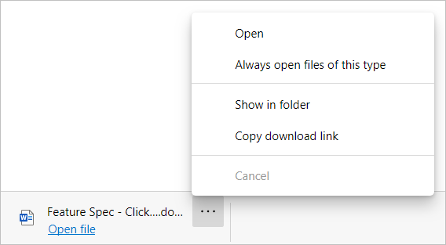

# Understand the ClickOnce and DirectInvoke features in Microsoft Edge

ClickOnce and DirectInvoke are features available in IE and Microsoft Edge that support the use of a file handler to download files from a website. Although they serve different purposes, both features let websites specify that a file requested for download is passed to a file handler on the user's device. ClickOnce requests are handled by the native file handler in Windows. DirectInvoke requests are handled by a registered file handler specified by the website hosting the file.

After setting up ClickOnce or DirectInvoke, the ClickOnce or DirectInvoke prompts can be bypassed by setting up additional enterprise policies. These policies can support either bypassing the ClickOnce or DirectInvoke prompts for specified file types for all domains or for specified file types from specified domains.

For more information about these features, see:

- [ClickOnce](/visualstudio/deployment/clickonce-security-and-deployment?view=vs-2019)
- [DirectInvoke]( https://technet.microsoft.com/learning/jj215788(v=vs.94).aspx)

> [!NOTE]
> Currently, Chromium doesn't provide native support for ClickOnce or DirectInvoke.

## Overview: prerequisites and process

For ClickOnce and DirectInvoke to work as designed and for the file handler to be successfully requested, the file handler must be registered to the operating system as supporting ClickOnce or DirectInvoke. This registration typically happens when the original operating system is installed or when a new program that's installed requests the ability to use DirectInvoke for updates.

When a website receives a download request that requires ClickOnce or DirectInvoke, the following actions happen:

- The website requests that the browser use a specified file handler.
- The browser checks the operating system registry to see if the file handler is registered for the requested file type.
- If the file handler is registered, the browser calls the file handler and passes the URL as an argument to the file handler.
- The file handler processes the URL and downloads the file.

  > [!NOTE]
  > The URL is used to determine the source of the file, as well as any parameters to use when accessing the file.  For example: endpoints, a manifest, or metadata.

## Use cases

The following use cases are representative.

You can use ClickOnce to easily deploy and update software on devices with minimal user interaction. Users can install and run a Windows application by clicking a link in a web page. If configured correctly, the ClickOnce application can install programs without having users set configurations for the installer. For example, file locations, what options to install, and so on.

DirectInvoke use cases depend on the intent of the website requesting DirectInvoke. For example, the collaborative file-editing feature of Microsoft Word. Instead of clicking a link and downloading the entire copy of a document you're working on with your colleagues, DirectInvoke lets you download the parts of the document that have been changed. This strategy reduces the amount of data transferred and can reduce the time needed to open the document.  

## Current support for ClickOnce and DirectInvoke in Microsoft Edge

Support for ClickOnce and DirectInvoke:

- ClickOnce and DirectInvoke are supported out of the box for all Windows users.

  > [!NOTE]
  > Users that want to disable ClickOnce support can go to *edge://flags/#edge-click-once* and select **Disabled** from the dropdown list. You'll have to **Restart** the browser.

- ClickOnce and DirectInvoke aren't supported on any platforms other than Windows.

## ClickOnce and DirectInvoke file handling security

ClickOnce and DirectInvoke are protected by Microsoft Defender SmartScreen's URL reputation scanning service.

If a ClickOnce or a DirectInvoke request is flagged by the Microsoft Defender SmartScreen URL reputation service as unsafe, users with ClickOnce or DirectInvoke enabled will see two popups.

The first popup asks the user if they want to open the file. This popup is displayed regardless of whether the file was flagged as safe or unsafe. The user can **Report the file as unsafe**, **Cancel** the request, or click **Open** to continue.

   

If the user tries to open the file, and the file was flagged as unsafe, a second popup is displayed.  This popup warns the user that the file was flagged as unsafe, and asks them if they're sure they want to download the file.

The second popup only shows up if:

- the file is a ClickOnce or DirectInvoke file
- ClickOnce or DirectInvoke are enabled
- the file is flagged as unsafe

 

> [!NOTE]
> If ClickOnce or DirectInvoke are disabled, requested files are treated as regular downloads and if flagged as unsafe, will be marked as unsafe. This is consistent with the treatment of other unsafe downloads.

## ClickOnce and DirectInvoke policies

There are two group policies that you can use to enable or disable ClickOnce and DirectInvoke for enterprise users. These two policies are [ClickOnceEnabled](./microsoft-edge-policies.md#clickonceenabled) and [DirectInvokeEnabled](./microsoft-edge-policies.md#directinvokeenabled). These two policies are labeled in the Group Policy Editor as "Allow users to open files using the ClickOnce protocol" and "Allow users to open files using the DirectInvoke protocol" respectively.

To specify file type(s) that the ClickOnce or DirectInvoke prompts should be bypassed for, use the policy labeled in the Group Policy Editor as “List of file types that should be automatically opened on download”. This will allow specified file types to be automatically opened after download for all domains.  

To bypass the ClickOnce or DirectInvoke prompts for specific file types for specific domains by setting up two additional policies labelled in the Group Policy Editor as “List of file types that should be automatically opened on download” and “URLs where AutoOpen-FileTypes can apply”. Please note that the policy “URLs where AutoOpen- FileTypes can apply” is a supporter policy for “List of file types that should be automatically opened on download” and does nothing on its own.  

## ClickOnce and DirectInvoke behavior

The following examples show file handling when ClickOnce and DirectInvoke are enabled or disabled.

### ClickOnce enabled

1. A user opens a link to a page that requests ClickOnce support and gets the prompt in the next screenshot.

   

2. After the user clicks **Open**, ClickOnce attempts to launch the application.

   

3. After the user clicks **Open**, the browser shows a popup that asks the user if they're sure they want to install the application.

   

   > [!NOTE]
   > The interface, messaging, and options shown by the ClickOnce file handler will vary depending on the type and configuration of the file that's accessed.

### ClickOnce disabled

1. When a user opens a link to a page that requests ClickOnce support, they will see a message in the download tray that is similar to the one in the next screenshot.

   

### DirectInvoke enabled

1. A user opens a link to a page that requests DirectInvoke support and gets the prompt in the next screenshot.

   

2. When the user clicks **Open**, the requested file handler is opened. In this example, Microsoft Word is used to open the document that's shown in the previous screenshot.

   > [!NOTE]
   > The interface, messaging, and options shown by the DirectInvoke file handler will vary depending on the type and configuration of the file that's accessed.

### DirectInvoke disabled

1. When a user opens a link to a page that requests DirectInvoke support, DirectInvoke behaves the same as when ClickOnce is disabled. They will see a message in the download tray that's similar to the one in the next screenshot.

   

## See also

- [ClickOnce security and deployment](/visualstudio/deployment/clickonce-security-and-deployment)
- [DirectInvoke in Internet Explorer](/previous-versions/windows/internet-explorer/ie-developer/dev-guides/jj215788(v=vs.85))
- [Microsoft Edge Enterprise landing page](https://aka.ms/EdgeEnterprise)