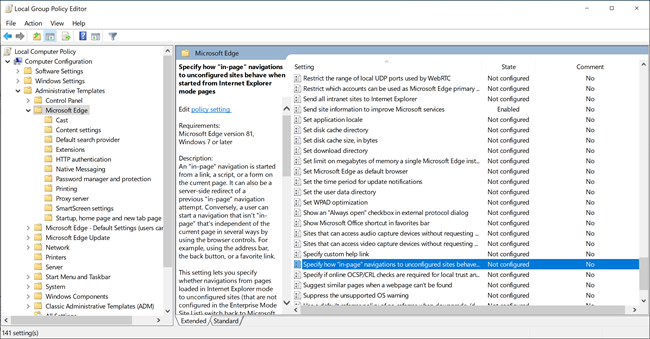
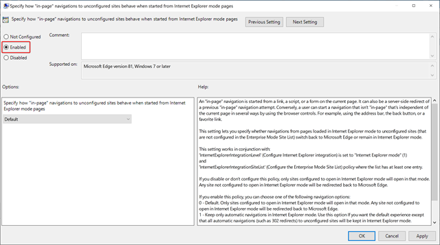

# Keep in-page navigation in Internet Explorer mode

You can use this policy as a temporary solution to force all in-page navigation from Internet Explorer mode (IE mode) sites to stay in IE mode.

An in-page navigation is started from a link, a script, or a form on the current page. It can also be a server-side redirect of a previous in-page navigation attempt. Conversely, a user can start a navigation that isn't in-page that's independent of the current page in several ways by using the browser controls. For example, using the address bar, the back button, or a favorite link.

>[!NOTE]
>This article applies to Microsoft Edge version 81 or later.

## Prerequisites

The following Windows updates are required for this policy:

- Windows 10 version 1909 & 1903, Windows Server version 1909 & 1903  ([KB4532695](https://support.microsoft.com/help/4532695))
- Windows 10 version 1809, Windows Server version 1809, Windows Server 2019 ([KB4534321](https://support.microsoft.com/help/4534321))
- Windows 10 version 1803 ([KB4534308](https://support.microsoft.com/help/4534308))
- Windows 10 version 1709 ([KB4534318](https://support.microsoft.com/help/4534318))

## About this policy

This policy gives you time to identify and configure all of the authentication servers used by your IE mode sites. However, this policy can result in an inconsistent browsing experience, where some sites are rendered in IE mode and at other times rendered in Microsoft Edge mode. This experience depends on whether the navigation to the site began from an IE mode page. Any site that isn't explicitly configured to open in a specific rendering engine will be subject to this inconsistency.

If you enable this policy, we recommend that you disable it after you've identified all the authentication servers and added them to the site list as neutral. This action ensures that your modern sites never inadvertently render in IE mode.

## Keep in-page navigation in IE mode

To keep automatic or all in-page navigation in Internet Explorer mode, follow these steps:

1. Open Local Group Policy Editor.
2. Click **Computer Configuration** > **Administrative Templates** > **Microsoft Edge**.
3. Under **Setting**, double-click **Specify how "in-page" navigations to unconfigured sites behave when started from Internet Explorer mode pages**.

   

4. Select **Enabled** 

   

5. Choose one of the following options from the dropdown list:

   - **Default** - Only sites configured to open in Internet Explorer mode will open in that mode. Any site not configured to open in Internet Explorer mode will be redirected back to Microsoft Edge.
   - **Keep only automatic navigations in Internet Explorer mode** - Use this option if you want the default experience except that all automatic navigations (such as 302 redirects) to unconfigured sites will be kept in Internet Explorer mode.
   - **Keep all in-page navigation in Internet Explorer mode** ***(Least Recommended)*** - All navigations from pages loaded in IE mode to unconfigured sites are kept in Internet Explorer mode.

6. Click **OK** or **Apply** to save the policy settings.

## See also

- [Microsoft Edge Enterprise landing page](https://aka.ms/EdgeEnterprise)
