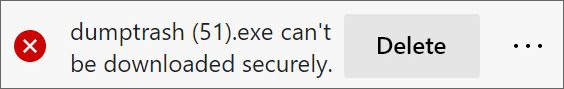
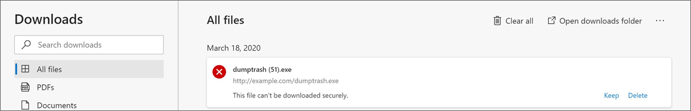
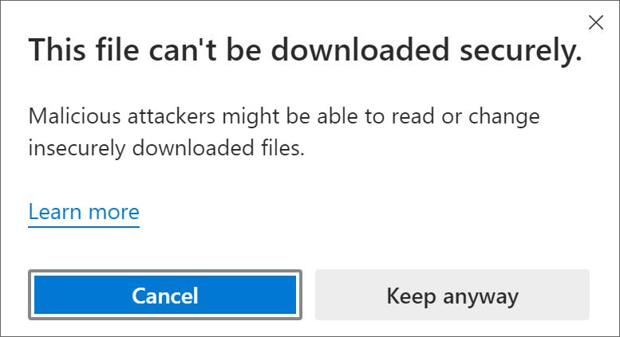

# Learn about Microsoft Edge and mixed content downloads

This article explains mixed content downloads and how Microsoft Edge handles them.

>[!NOTE]
>This article applies to Microsoft Edge version 85 or later.

## What are mixed content downloads?

A mixed content download happens when you start a download from an HTML page that was loaded over a secure HTTPS connection, but one of the following conditions exists:

- One or more of the download location's redirects was loaded over an insecure HTTP connection.
- The final download location was loaded over an insecure HTTP connection.

Either scenario is a mixed content because the request was made using secure HTTPS and both HTTP and HTTPS content are involved in reaching the final download destination. Modern browsers display warnings about this type of content to indicate to the user that this download may be transferred insecurely even though the original page accessed was secure.

## Download warnings and user options

The download warning ensures that users know that the file they're downloading could be read by malicious attackers on their network. This warning lets a user make an informed decision on whether to download the file.

In Microsoft Edge, mixed content downloads will be blocked but users can override and download the file if they want to. Microsoft Edge plans on starting to block mixed content executable file downloads starting with Microsoft Edge version 85 and will block different filetypes in future releases.

> [!NOTE]
> Deployment of this feature is subject to change based on release schedule and user feedback.

<!-- The schedule of the block for different filetypes is to be determined and may be impacted by usage data and user feedback. -->

In the download shelf, the block warning message looks like the example in the next screenshot.

 

On the download page, the block warning looks like the following screenshot example:

 

If a user decides to keep the download, they are prompted to confirm their action. The next screenshot shows an example of this confirmation prompt.

 

## Supporting policies

Enterprises that want to exclude mixed content blocking from specific websites can use the [InsecureContentAllowedForUrls](https://docs.microsoft.com/deployedge/microsoft-edge-policies#insecurecontentallowedforurls) policy to do so.

## Content license

> [!NOTE]
> Portions of this page are modifications based on work created and shared by Chromium.org and used according to terms 
  described in the [Creative Commons Attribution 4.0 International License](http://creativecommons.org/licenses/by/4.0/). The original page can be found [here](https://developers.google.com/web/fundamentals/security/prevent-mixed-content/what-is-mixed-content).
  
 This work is licensed under a <a rel="license" href="http://creativecommons.org/licenses/by/4.0/">Creative Commons Attribution 4.0 International License</a>.

## See also

- [Microsoft Edge Enterprise landing page](https://aka.ms/EdgeEnterprise)
