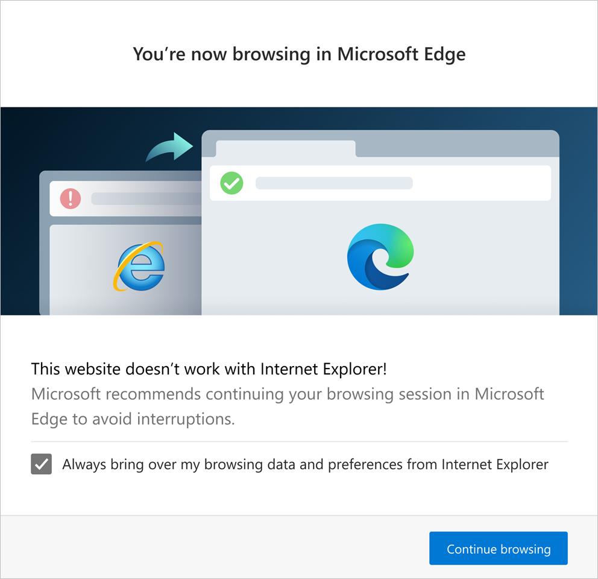

# Need Microsoft Edge for compatibility with modern web sites

The **HideInternetExplorerRedirectUXForIncompatibleSitesToMicrosoftEdgeEnabled** policy enables Internet Explorer users to continue browsing after they go to an incompatible site. Users that land on an incompatible site are automatically redirected to Microsoft Edge.

> [!NOTE]
> This article applies to Microsoft Edge version 87 or later.

## Overview

Many modern websites have designs that are incompatible with Internet Explorer. Whenever an Internet Explorer user visits an incompatible site they get a message that tells them the site is incompatible with their browser.

> [!NOTE]
> Microsoft maintains a list of all sites that are known to be incompatible with Internet Explorer.

## Microsoft Edge in action

When a user goes to site that is incompatible with Internet Explorer several things happen.

First, they're notified about the website incompatibility and the fact that they're now using Microsoft Edge.

A website incompatibility banner, shown in the next screenshot, appears below the address bar for every redirection.

The website incompatibility banner:

- encourages the user to switch to Microsoft Edge
- offers to make Microsoft Edge as the default browser
- gives the user the option to explore Microsoft Edge.

## See also

- [Microsoft Edge Enterprise landing page](https://aka.ms/EdgeEnterprise)