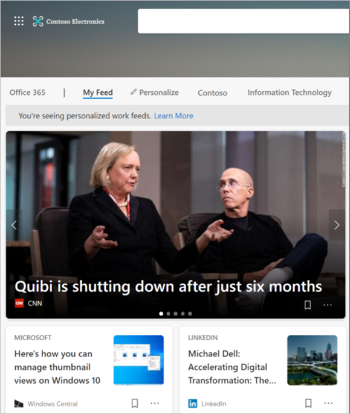

# Backwards compatibility for the Enterprise New tab page

This article describes the change to the New tab page and how users can be backwards compatible with Microsoft Edge version 87 and earlier.

> [!NOTE]
> This article applies to Microsoft Edge version 87 or later.

## Information feeds from single endpoint

The new version of the Enterprise New tab page combines compliant Microsoft 365 content with industry relevant and compliant information feeds that are served via the MSN.com endpoint.

> [!NOTE]
> Office 365 content was originally served using the [Office.com](https://www.office.com) domain.

If access to the MSN.com domain is restricted for your organization, we strongly recommend giving users access to this [url](https://ntp.msn.com).

If you need more time to enable access to the MSN domain, we recommend using the [NewTabPageSetFeedType](https://docs.microsoft.com/deployedge/microsoft-edge-policies#newtabpagesetfeedtype), that lets you choose either the Microsoft News or Office 365 feed experience for the new tab page.

### Keep using Office.com

 You can configure the **NewTabPageSetFeedType** policy to keep using the deprecated Office.com domain.

> [!IMPORTANT]
> The **NewTabPageSetFeedType** policy and the Office.com domain that serves Office 365 content will quit working when Microsoft Edge version 90 is released.

The following policy settings will force the Enterprise New tab page to render Office document content from the Office.com domain.

- Set the policy as **Mandatory**.
- Set the value of the policy mapping to **Office (1) = Office 365 feed experience**.

If the switch to the Office.com isn't possible, reach out and send us feedback. Another option is to configure the [NewTabPageLocation](https://docs.microsoft.com/deployedge/microsoft-edge-policies#newtabpagelocation) so it points to an endpoint URL that's allowed by your organization.

> [!NOTE]
> The **NewTabPageLocation** policy has precedence if the **NewTabPageSetFeedType** policy is also configured.

## Enterprise users will now get Microsoft news content via My Feed

The Enterprise New tab page will offer industry relevant information in **My Feed** and Office 365 content in a single view for users signed in with their Azure Active Directory (Azure AD) account. For users signed in with their Azure Active Directory (Azure AD) who selected the Microsoft News option in the settings flyout, their new tab page view will be replaced with **My Feed** content. When they open a new tab page in the browser it will look like the example in the next screenshot.

> [!NOTE]
> Users who aren't signed in with Azure AD will continue to see the MSN News feed when they open a new tab.

## Page layout

With the changes to the New tab page, the Page layout no longer has to control two specific content types (Office 365 and Microsoft News), so the content toggle isn't available. The next screenshot shows the flyout for the Page layout.

If you want to keep accessing Microsoft News content that isn't tied to your organization, you must use a different browser profile. Go to  *edge://settings/profiles* and sign out of your Azure AD profile. This action will bring up the  standard view for the Enterprise new tab page. 

## See also

- [Microsoft Edge Enterprise landing page](https://aka.ms/EdgeEnterprise)
- [Enterprise Mode for Internet Explorer 11](https://docs.microsoft.com/internet-explorer/ie11-deploy-guide/enterprise-mode-overview-for-ie11)
