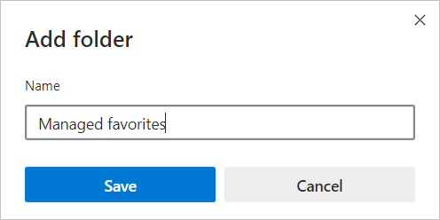
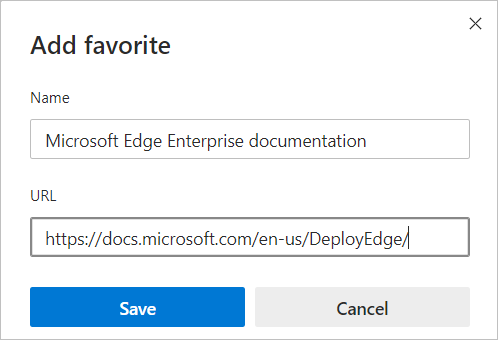
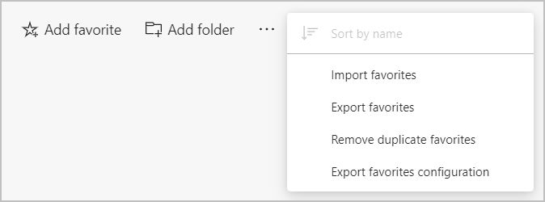
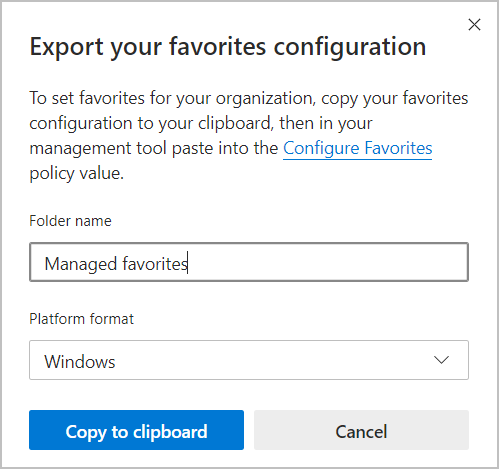
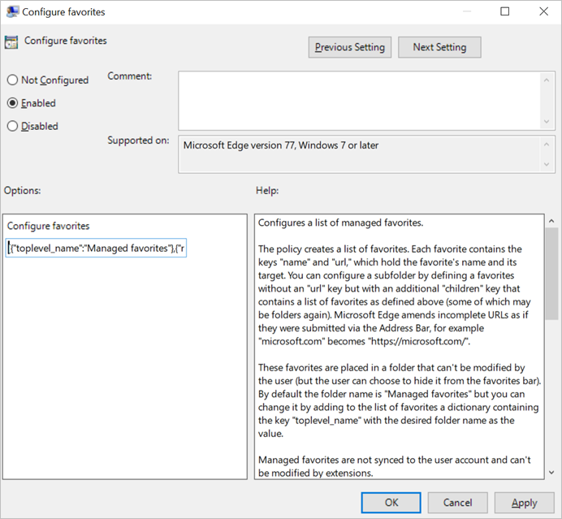

# Provision favorites for Microsoft Edge

This article describes how to provision a set of favorites and folders for your organization. You can use the configure favorites enterprise group policy to provision these favorites and folders.

> [!NOTE]
> This article applies to Microsoft Edge version 85 or later.

## Prerequisites and recommendations

- Microsoft Edge version 85 with the appropriate administrative template installed for group policies.
- We recommend that you use a new profile in Microsoft Edge to set up these favorites. All favorites that are saved with the profile will be included in the export.  

## Provision favorites and folders

Use the following steps to provision favorites and folders for your users.

1. Go to the Microsoft Edge address bar and type this URL: *edge://flags/#edge-favorites-admin-export*.
2. Under **Favorites configuration export for administrators**, pick **Enabled** from the dropdown list and then click **Restart**.
3. Navigate to the Favorites management page at *edge://favorites* so you can start adding the favorites and folders that you want to provision. 
4. On the **Favorites bar**, click **Add folder**. The folder structure of favorites that are set in the profile you're using will be reflected in the folder you provision for your users. The next screenshot shows "Managed favorites", the folder we'll use to provision favorites.

   

5. Select "Managed favorites" and then click then click **Add favorite**. The next screenshot shows the favorite we've added.

   

6. Go to the address bar and navigate to *edge://favorites*, click the ellipsis "**…**" and choose **Export favorites configuration**. The next screenshot shows the options you have when provisioning favorites.

   

7. Under **Export your favorites configuration** you provide a name for the folder that your users will see. Type the Folder name and pick the Platform format you want to use. Click **Copy to clipboard**. The next screenshot shows "Managed favorites" for the folder name and the platform is Windows.

   

8. Open the Group Policy Editor, navigate to *Computer Configuration/Administrative Templates/* and pick **Configure Favorites**. Enable the "Configure Favorites" policy. Under **Options:**, paste the exported contents in the Configure favorites text area then click **Apply**. The next screenshots shows an example of the "Managed favorites" folder from step 5.

   

9. Click **OK** or **Apply** to safe the policy settings.

## See also

- [Microsoft Edge Enterprise landing page](https://aka.ms/EdgeEnterprise)