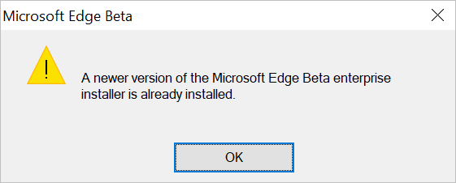

# How to roll back Microsoft Edge to a previous version

This article describes how to roll back to a previous version of Microsoft Edge using the rollback feature. To learn more about this feature, watch [Video: Microsoft Edge version rollback](microsoft-edge-video-version-rollback.md).

>[!NOTE]
>This article applies to Microsoft Edge version 86 or later.

## Introduction to rollback

Rollback lets you replace your Microsoft Edge browser version with an earlier version. This feature is designed to be a safety net for enterprises deploying Microsoft Edge. It provides a way to troubleshoot issues with Microsoft Edge. The benefits of rollback are the ability to revert to previous browser version easily and quickly. Rollback reduces the potential impact that a Microsoft Edge issue has on business operations.

## Before you begin

It's important to understand how the rollback feature is installed in a Microsoft Edge environment. You can deploy rollback using two different methods: manually with an MSI or by using Microsoft Edge update and Group Policy. We also encourage using a selection of Group Policies for a smoother deployment.

### Recommendations

The rollback feature is meant to be a temporary fix for issues you might find in a Microsoft Edge browser update. We recommend that users install the latest version of the Microsoft Edge browser to use the protection provided by the latest security updates. Rollback to an earlier version risks exposure to known security issues.

Before temporarily rolling back your browser version, we also highly recommend that you enable Sync for all the users in your organization. If you don't turn on Sync, there's a risk of permanent browsing data loss. For more information about Sync, see [Microsoft Edge Sync](microsoft-edge-enterprise-sync.md).

> [!CAUTION]
> Only use rollback when necessary, there's always the risk of data loss.

## Enable rollback manually with an MSI

Use the following steps to roll back manually with an MSI.

1. Disable Microsoft Edge Updates.

   > [!NOTE]
   > We recommend that you install the most current Administrative templates. For more information, see [Download and install the Microsoft Edge administrative template](./configure-microsoft-edge.md#1-download-and-install-the-microsoft-edge-administrative-template).

   - Open the local Group Policy Editor and go to *Computer Configuration>Administrative Templates>Microsoft Edge Update>Applications>Microsoft Edge>*.
   - Select **Update policy override** and then select **Enabled**.
   - Under **Options**, pick **Update disabled** from the Policy dropdown list.

2. Get the MSI.

   - Download the MSI for the version you want to roll back to [from here](https://www.microsoft.com/edge/business/download).
   - Save the MSI to your desktop.

3. Run the rollback command.

   - Open the Windows command prompt with **Run as administrator**.
   - Type the following command, where: *C:\Users\username\Desktop\test* is the path to the MSI you downloaded, and FileName is the name of the .msi file: 
 `C:\Users\username\Desktop\test>msiexec /I FileName.msi /qn ALLOWDOWNGRADE=1` 
     > [!NOTE]
     > For more information about msiexec, see [msiexec](/windows-server/administration/windows-commands/msiexec).
   - Close and reopen Microsoft Edge to verify that the rollback worked. Under **Settings and more** (ALT + F), go to **Settings** and select **About Microsoft Edge**.

## Enable rollback with Microsoft Edge update and Group Policy

Use the following steps to enable rollback with Microsoft Edge update and Group Policy.

1. Open the local Group Policy Editor and go to *Computer Configuration>Administrative Templates>Microsoft Edge Update>Applications>Microsoft Edge>*.
2. Select **Rollback to target version** and then select **Enabled**.
3. Select **Target version override** and pick the browser version you want to roll back to.
4. Select **Update policy override** and then select **Enabled**. Under **Options**, pick one of the following options from the Policy dropdown list (except for **Update disabled**):

   - Always allow updates
   - Automatic silent updates only

     > [!NOTE]
     > To force a group policy update, type `gpupdate /force` at the Windows administrator Command Prompt (Run as administrator).

5. Click **OK** to save the policy settings. Rollback will happen the next time Microsoft Edge Update checks for an update. If you want the update to happen sooner, you can change the Microsoft Edge Update polling interval or enable rollback using an MSI.

### Common rollback errors

The following errors will prevent rollback:

- Input is an unsupported target version
- Input is a non-existent target version
- Input is incorrectly formatted

### Recommended Group Policies

The following group policies and settings are highly recommended for using rollback.

#### Sync Group Policies

- ForceSync. Set ForceSync to enabled. This policy will force enable Sync on all Azure Active Directory (Azure AD) users. This policy is only effective for Microsoft Edge versions 86 and later.
- The *Configure the list of the types that are excluded from synchronization policy* allows admins to control what data can be synced by users.

#### Browser restart Group Policies

We recommend forcing a restart on users after rollback is enabled.

- Enable *Notify a user that a browser restart is recommended or required for pending updates*. Under Options, select **Required**.
- Enable *Set the time period for update notifications* and then set the desired time in milliseconds.

## Snapshot

A snapshot is a version stamped copy of the user data folder. During a version upgrade, a snapshot of the previous version is made and stored in the snapshot folder. After rollback occurs, a version matched snapshot will be copied into the new user data folder and deleted from the snapshot folder. If no version matched snapshot is available upon downgrade, rollback will rely on Sync to populate user data into the new Microsoft Edge version.

The [UserDataSnapshotRetentionLimit](./microsoft-edge-policies.md#userdatasnapshotretentionlimit) group policy allows you to set a limit for the number of snapshots that can be retained at any given time. By default, three snapshots are kept. You can configure this policy to keep from 0-5 snapshots.

## Frequently asked questions

### Manual MSI rollback

#### What generic MSI failures that can happen?

1. If the Install update group policy is disabled, rollback won't occur.

   - To use rollback, make sure Install is set to **Enabled**. When this policy is disabled, it prevents Microsoft Edge channels from being installed. For more information, see [Install](./microsoft-edge-update-policies.md#install).

2. If Enlightenment Updates aren't present, Microsoft Edge installations will be blocked unless *Allow Microsoft Edge Side by Side browser experience* is enabled.

   - For Windows versions 1903 and 1909: If your last update was before October 2019, you may have this issue.
   - For Windows versions 1709, 1803, and 1809: If your last update was before November 2019, you may have this issue. 
For more information, see [Windows updates to support the next version of Microsoft Edge](./microsoft-edge-sysupdate-windows-updates.md)

#### The following error message was shown after using the Command Prompt and rollback didn't occur. What's wrong?

*ALLOWDOWNGRADE=1* was not executed.

### Microsoft Edge Update and Group Policy rollback

#### I set *Rollback to target version*, enabled *Update policy override*, input my desired browser version for *Target version override*, but the browser version wasn't what I expected. What's wrong?

Some common errors that prevent rollback are:

- If Rollback to target version isn't set, rollback will not be executed.
- There are one of the following issues with the target version override setting:

  - Target version override is set to an unsupported target version.
  - Target version override is set to a non-existent target version.
  - Target version override input is incorrectly formatted.

- If Update policy override is set to "Updates disabled", Microsoft Edge Update won't accept any updates and rollback isn't executed.

### I set all the group policies correctly, but rollback didn't execute. What happened?

Microsoft Edge Update hasn't run a check for updates yet. By default, auto-update checks for updates every 10 hours. You can fix this issue by changing Microsoft Edge Update's polling interval with the Auto-update check period override group policy. For more information, see the [AutoUpdateCheckPeriodMinutes](./microsoft-edge-update-policies.md#autoupdatecheckperiodminutes) policy.

### As an IT admin, I followed all the steps for rollback correctly. Only a portion of my user group was rolled back. Why haven't the other users been rolled back yet?

The group policy setting hasn't synced to all the clients yet. When admins set a group policy, clients don't receive these settings instantaneously. You can [Force a Remote Group Policy Refresh](/previous-versions/windows/it-pro/windows-server-2012-r2-and-2012/jj134201(v=ws.11)).

## See also

- [Microsoft Edge Enterprise landing page](https://aka.ms/EdgeEnterprise)
- [Video: Microsoft Edge version rollback](microsoft-edge-video-version-rollback.md)
