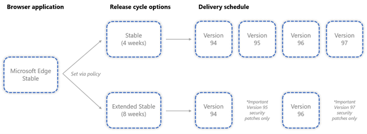

# Overview of the Microsoft Edge channels

One of the benefits of the next version of Microsoft Edge is that Microsoft can provide new features on a regular basis. However, as the admin who deploys Microsoft Edge to the users in your organization, you might want to have more control over how often your users get these new features. Microsoft provides you four options, called channels, to control how often Microsoft Edge is updated with new features. Here's an overview of the four options.

For more information on support for each channel read: [Microsoft Edge Lifecycle](/deployedge/microsoft-edge-support-lifecycle)
  
> [!NOTE]
> This article applies to Microsoft Edge version 77 or later.

## Channel overview

|Channel|Primary purpose|How often updated with new features|Supported?|
|:---:|---|:---:|:---:|
|[Stable](#stable-channel)|Broad Deployment|~4 weeks|Yes|
|[Extended Stable](#extended-stable-channel)|An enterprise release option for Stable aligned to a longer release cycle |~8 weeks|Yes|
|[Beta](#beta-channel)|Representative validation in the organization|~4 weeks|Yes|
|[Dev](#dev-channel)|Planning and developing|Weekly|No|
|[Canary](#canary-channel)|Bleeding edge content|Daily|No|

Which update channel you decide to deploy to your users depends on several factors, such as how many line of business applications the user leverages and that you need to test any time they have an updated version of Microsoft Edge. To help you make this decision, review the following information about the four update channels that are available for Microsoft Edge.

### Stable Channel

The Stable Channel is intended for broad deployment in your organization, and it is the channel that most users should be on. It is the most stable of the channels and is the a result of the stabilization of the feature set available in the prior Beta Channel release. New features ship about every 4 weeks. Security and quality updates ship as needed. A release from the Stable Channel is serviced until the next release from the channel is available.

### Beta Channel

The Beta Channel is intended for production deployment in your organization to a representative sample set of users. It is a supported release, and each release from Beta is serviced until the next release from this channel is available. This is a great opportunity to validate that things work as expected in your environment, and if you encounter an issue have it remediated prior to the release going publishing to the Stable Channel. New features ship about every 4 weeks. Security and quality updates ship as needed.

### Dev Channel

The Dev Channel is intended to help you plan and develop with the latest capabilities of Microsoft Edge, but with higher quality than the Canary Channel. This is your opportunity to get an early look at what is coming next and prepare for the next Beta release.

### Canary Channel

The Canary Channel ships daily and is the most bleeding edge of all the channels. If you want access to the newest investments then they will appear here first. Because of the nature of this cadence problems will arise overtime, so you may want another channel installed side by side if you are leveraging the Canary releases.

### Extended Stable Channel

Unlike our preview channels (Canary, Dev, and Beta), the Extended Stable Channel is not available as a separate browser application; rather, it is an enterprise release option for the Microsoft Edge Stable application that is aligned to a longer, 8-week major release cycle (as opposed to the 4-week major release cycle found in Stable). While we recommend automatically updating Stable on its 4-week release cycle, Extended Stable exists to more effectively serve organizations who may require a longer timeline to test and validate new browser versions.

The 8-week “Extended Stable” release cycle option for Microsoft Edge Stable delivers cumulative feature updates aligned with _even-numbered_ releases beginning with Microsoft Edge 94; any feature updates from odd-numbered releases will be packaged up and delivered as part of the subsequent even-numbered release. For instance, if an organization selects the 8-week “Extended Stable” release cycle with Microsoft Edge 94, they will receive subsequent feature updates with Microsoft Edge 96, Microsoft Edge 98, and so on. While feature updates are packaged and delivered with new version releases based on the selected release cycle, important security patches and fixes will be delivered as needed independent of the selected release option to help maintain browser security. Customers can opt into the Extended Stable release option at any time, and it will take affect with the next Extended Stable release.

#### Opting-in to the Extended Stable Release Cadence

##### Opting-in to Extended Stable on Windows with Automatic Updates (recommended)

If you automatically update Microsoft Edge, you can use group policy objects to opt-in to the Extended Stable Release Cadence. [Follow this guide](https://docs.microsoft.com/en-us/DeployEdge/configure-microsoft-edge#1-download-and-install-the-microsoft-edge-administrative-template) for more information on downloading and installing the latest Microsoft Edge Group Policy administrative templates.

1. Open the local Group Policy Editor and go to _Computer Configuration>Administrative Templates>Microsoft Edge Update>Applications>Microsoft Edge>_.
2. Select **Target Channel override** and then select **Enabled**.
3. Under **Options**, pick **“Extended Stable”** from the Policy dropdown list.

When the next update to the Extended Stable channel is released that has a version number larger than what your device currently has installed, Microsoft Edge will automatically update onto the Extended Stable channel. The version string on `edge://settings/help` will indicate that you are running a different channel.

> [!NOTE]
> Opting-in to Extended Stable will take effect when there is a new update on the Extended Stable channel with a larger version number (major or minor) than what is currently installed on your device. If you are running the latest version of Microsoft Edge Stable and opt-in to Extended Stable, it will take effect with the next patch or update of Microsoft Edge.
>
> By default, Microsoft Edge will not downgrade itself. If you are currently running an odd-numbered version of Microsoft Edge Stable, opting-in to Extended Stable will mean that you will receive NO updates until the next even-numbered Microsoft Edge release.
>
> If you want to ensure that all of your devices start with a specific version of Extended Stable, you can deploy that specific version of Edge Stable as an MSI with rollback enabled. For example, if you want to start with Extended Stable 94 but some devices have already updated to Stable 95, you can deploy an MSI of Edge 94 with rollback enabled. For more information on how to deploy Edge MSIs with rollback enabled, consult our [rollback guide](https://docs.microsoft.com/en-us/DeployEdge/edge-learnmore-rollback).

##### Opting-in to Extended Stable on Windows via Intune

Microsoft Edge Administrative Templates can be managed similarly to local Group Policy Objects from the Microsoft Endpoint Manager admin center. Follow our [guide on configuring Microsoft Edge with Intune](https://docs.microsoft.com/en-us/mem/intune/configuration/administrative-templates-configure-edge). 

The “**Target Channel override**” setting can be found under the “_Microsoft Edge Update >Applications>Microsoft Edge_” subfolders. It should be set to “**Extended Stable**” 

When the next update to the Extended Stable channel is released that has a version number larger than what your device currently has installed, Microsoft Edge will automatically update onto the Extended Stable channel. The version string on `edge://settings/help` will indicate that you are running a different channel.

##### Opting-in to Extended Stable on Windows via Configuration Manager

Refer to our guide on [updating Microsoft Edge with Configuration Manager](https://docs.microsoft.com/en-us/mem/configmgr/apps/deploy-use/deploy-edge#update-microsoft-edge) for more information on how to synchronize and approve Microsoft Edge updates in Configuration Manager.

Extended Stable updates are distributed in the software library under the “Microsoft Edge” product category, similar to existing updates for the Stable, Beta, and Dev channels. However, unlike Beta and Dev, which apply to their own browser applications, the Extended Stable updates apply to Microsoft Edge Stable application. Therefore, for your Windows Update client to determine whether to apply Stable or Extended Stable updates, it checks the status of the “Target Channel override” group policy. If the policy is not configured or is set to “Stable,” Stable updates will apply. If it is set to “Extended Stable,” then Extended Stable updates will apply. Follow the instructions above for opting-in to Extended Stable with Automatic Updates for instructions on how to properly set the Group Policy. 

## Flighting Pre-release Channels in your Organization

The “Target Channel override” group policy can also be used to seamlessly flight pre-release channels of Microsoft Edge in your organization without your users needing to use a second web browser application. For example, you can set the “Target Channel override” policy to “Beta” for a representative sample set of users in your organization. When those users open Microsoft Edge, they will be running the Beta channel release rather than Stable (probably without their even realizing it!). This can give you an early insight into how the next version of Microsoft Edge will perform in your enterprise and help to validate that everything works as expected in your environment. You’ll get early signals from your users who encounter any issues and can ensure they are remediated prior to the release being published to the Stable Channel. As a part of troubleshooting a user’s problem, the version string at `edge://settings/help` will inform you if the user’s channel is different than the default Stable channel.

> [!NOTE]
> Since build on the “Beta” and “Dev” channels of Microsoft Edge have major version numbers larger than that of “Stable,” if you take an update to the “Beta” or “Dev” channel and wish to revert back to Stable, [Microsoft Edge’s rollback feature](https://docs.microsoft.com/en-us/DeployEdge/edge-learnmore-rollback) will be required. Simply setting “Target Channel override” back to Stable will mean you will receive NO updates until the latest Stable release has a greater version number than the version of Microsoft Edge you are presently running on your device.

## See also

- [Microsoft Edge Enterprise landing page](https://aka.ms/EdgeEnterprise)
- [Channel downloads](https://aka.ms/EdgeEnterprise)
