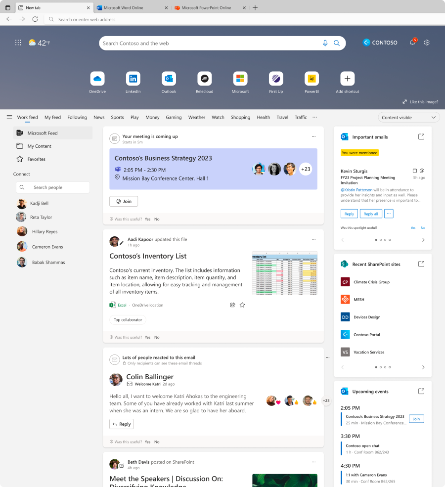
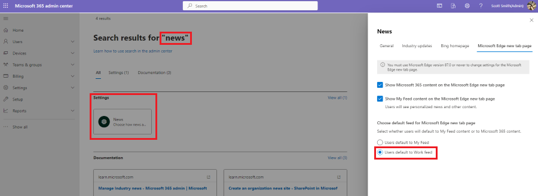

# Microsoft Edge Enterprise new tab page

The Enterprise new tab page is a direct response to a new challenge that workers face daily: frequent context switching. Our research shows that in addition to managing schedules, workers juggle roughly three projects a day—and on average, switch between them two to three times a day. Combine that switching with a torrent of emails, pings, and calls (which, when combined, can easily number in the triple digits) and they're constantly switching contexts throughout their day. Finally, add on the challenge of hybrid workplaces and it's no wonder they want to work smarter not harder.

## The role of the browser

As the browser role grows to become central for workers to finish everyday tasks, it's more important now than ever that information workers can cut through the noise and find what they need. That's why we've created a personalized productivity dashboard right in the Microsoft Edge Enterprise new tab page. Any enterprise user of Microsoft Edge can use this by opening a new tab and then selecting the **Work feed** tab.

The dashboard is a focal point for quickly finding the information you need and stay up to date on the things that matter most, all while cutting out the noise. Now, we'll highlight some of the top features that can help keep your employees productive.

We're continuously looking to improve the browser experience so we want to get your feedback, which you can provide by pressing alt + shift + I to open the **Send feedback** dialog where you can share your thoughts.

:::image type="content" source="media/microsoft-edge-enterprise-ntp/new-tab-feedback.png" alt-text="Send browser feedback":::

## Microsoft Feed

Microsoft Feed helps you discover and learn about people and interests relevant at work. The feed shows you a mix of content and activity from across Microsoft 365 to help you stay connected to your colleagues and informed about what's happening around you.

You might, for example, see updates to documents you're working on with others, links shared with you in Teams chats, suggested tasks to follow up, highlights about colleagues, and much more.

[Learn more about Microsoft Feed.](https://support.microsoft.com/office/discover-and-learn-with-microsoft-feed-9c190800-e348-46b7-9d46-41c628b80ebb?storagetype=live)

## Microsoft Feed is personal and personalized

Microsoft Feed is personalized to you. What you see in your feed is different from what your colleagues see in theirs.  

You will only see documents or other content directly shared with you or that you have access to in any case. This can be documents that are stored in a shared folder in OneDrive or on a SharePoint site that you have access to, or a link that someone sent you in an email conversation or a Teams chat.

Documents are not stored in Microsoft Feed. If you want to change permissions on any of your documents, you can do this from where the documents are stored, such as OneDrive or SharePoint. Microsoft Feed always respects the permissions that are set on documents, and will not show your documents to people who don't have access to them.

When you or others share a document as an attachment in email, or through a Teams chat, only people in the email conversation or the Teams chat will see that document in their feed.

## Recent SharePoint sites card

Tired of jumping through hoops to get to your SharePoint sites? Here's a shortcut to help you get the information you need to be productive, even faster.

:::image type="content" source="media/microsoft-edge-enterprise-ntp/new-tab-sharepoint-sites-50.png" alt-text="List of recent SharePoint sites":::

## My Content

Our research shows that information workers can handle tens, if not hundreds of files over a given week. This volume can get overwhelming when you don't know where each file is saved or who sent it to you. Select My Content to find the files that are most important to you. Don't see them here? That's okay, you can either use our new Work Search features (information later) to look up the file name or the name of the colleague who sent it to you, or select **More at Microsoft 365** at the bottom of the list to find more.

:::image type="content" source="media/microsoft-edge-enterprise-ntp/new-tab-quick-access-files.png" alt-text="Quick access to files list":::

## Upcoming events card

One of the most important aspects of keeping up with a fast-paced work environment is knowing what meetings you have coming up and when they're scheduled. As if it wasn't hard difficult enough to begin with, hybrid work has increased the number of meetings for many workers, causing overload. No productivity dashboard is complete without a glanceable calendar to make sure you're prepared for your meetings. And with one click you can join your Teams meeting or send a message to other attendees if you happen to be running late.

:::image type="content" source="media/microsoft-edge-enterprise-ntp/new-tab-upcoming-events-50.png" alt-text="List of upcoming events from user calendar":::

## To Do task list

One of the most effective ways for many users to stay productive when they're getting overwhelmed is to make a to do list. This keeps users organized and can be cathartic to check items off the list when they are feeling stressed. We have To Do integration in the browser so you can get all the greatness of [Microsoft To Do](https://todo.microsoft.com/tasks/) in an easily accessible format.

:::image type="content" source="media/microsoft-edge-enterprise-ntp/new-tab-to-do-50.png" alt-text="To do task list":::

## Address bar

Trying to find something for work, but can't quite figure out where to start? Just search for it! The Microsoft Edge address bar (location bar or URL bar) supports finding work content through Microsoft Search for Bing (MSB). Type your query and search or select one of the auto-suggested work results in Microsoft Suggests. You can also select "my organization" in the Microsoft search banner for work information only.

## How to make Work feed the default tab

The new tab page will remember the last tab the user selected, so simply selecting the Work feed tab will set it as default.

For tenant admins, if you'd like to have your organization automatically set Work feed as the default tab, follow these steps:

1. Sign in to the [Microsoft 365 admin center](https://admin.microsoft.com/Adminportal/Home#/homepage).
2. In the Search bar type **News** and press **Enter**.
3. Under **Settings**, select **News > Microsoft Edge new tab page**.
5. *Clear* the box that says **Show Microsoft 365 content on the Microsoft Edge new tab page**.
6. To re-enable the feature, check the box that says **Show My Feed content on the Microsoft Edge new tab page**.
7. To make it a default feed, **Set Users default to Work feed**.

## How to disable My Feed or Work feed tabs

Tenant admins can disable the My Feed or Work feed tabs using the Microsoft 365 admin center by following these steps:

1. Sign in to the [Microsoft 365 admin center](https://portal.office.com/Adminportal/Home).
2. Go to **Org settings** > **News**.
3. Under **News**, **select Microsoft Edge new tab page**.
4. Uncheck "Show Work feed content…" or "Show My Feed content…".

## See also

- [Microsoft Edge Enterprise landing page](https://aka.ms/EdgeEnterprise)
