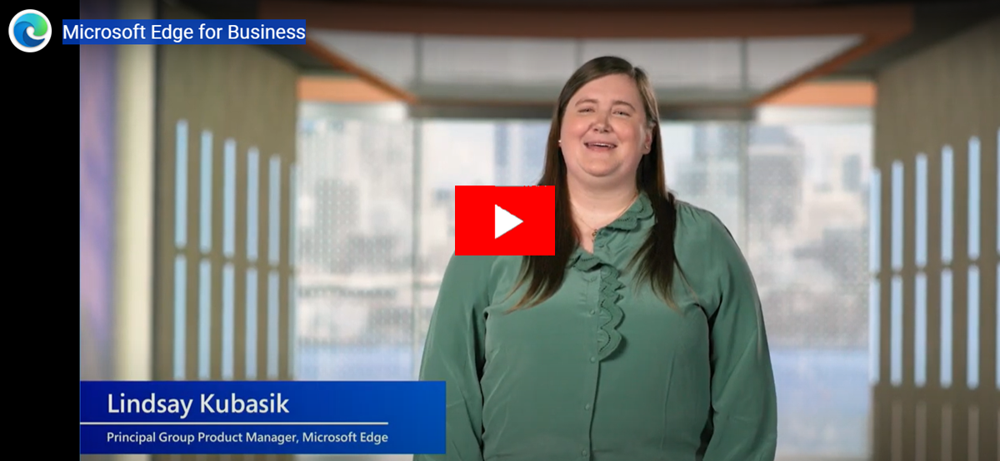
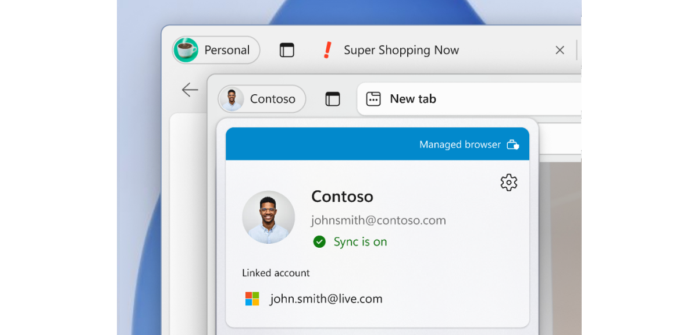

# Microsoft Edge for Business (Public Preview)

This article describes the benefits Microsoft Edge for Business brings to your users and how to enable this experience for your organization.

> [!NOTE]
> Microsoft Edge for Business is available in public preview. Preview features and experiences are in development and are available so you can get early access and send us feedback. Note that for this preview:
> - The Microsoft Edge for Business visual treatment and branding is not currently available on mobile as part of the preview.
> - IT admin management capabilities will be available soon.

## Introduction

Microsoft Edge for Business is a new, dedicated Microsoft Edge experience built for work that enables admins in organizations to give their users a productive and secure work browser across managed and unmanaged devices. It has the same rich set of enterprise controls, security, and productivity features that you're already familiar with in Microsoft Edge, but it's built to help meet the evolving needs of businesses.

Microsoft Edge for Business aims to address the needs of both end users and IT Pros as the browser that automatically separates work and personal browsing into dedicated browser windows with their own favorites, separate caches and storage locations. This separation ensures that work related content doesn't get intermingled with personal browsing, preventing cognitive overload or end users from accidentally sharing sensitive information with unintended audiences. Microsoft Edge for Business is going to be the standard browser experience for organizations, activated by an Microsoft Entra ID login, upon general availability. Check out our [build announcement](https://blogs.windows.com/msedgedev/2023/05/23/microsoft-edge-build-2023-innovations-in-AI-productivity-management-sidebar-apps/#business).

Microsoft Edge for Business is available in public preview on managed PCs, and unmanaged BYOPC.

Microsoft Edge for Business encompasses the experiences summarized in the following table.

| Name | Description | Status |
|:-----|:-----|:------|
| Visually distinct work browser  | Natively built-in rich enterprise controls for secure data access and leak prevention powered by Microsoft Entra ID with refreshed visual treatment. | Public preview |
| Enterprise personal browser | A lightly managed personal browser (MSA Profile) that lets you access your favorite non-work sites and services without compromising safety for the enterprise.  | Public Preview  |
|  Automatic switching  |  Automatically separates work and personal browsing into dedicated browser windows with their own separate caches and storage locations, so information stays separate.  | Limited functionality in public preview    |
|  Unmanaged BYOPC  |  Secure and compliant access to work resources on personal computers with DLP controls.   |  Public Preview (See following onboarding instructions) |
|  Company branding |  Increase familiarity and trust with company branding in the work browser window.  |  Coming soon     |

## Work Browser (Visual Refresh)

When Microsoft Edge for Business is available, the existing Microsoft Entra profile on Enterprise PCs will automatically apply the new refreshed visual treatment.

> [!NOTE]
> All existing Microsoft Entra profile settings stay the same, including favorites, history, and saved passwords.

The existing Microsoft Edge icon is replaced by the Microsoft Edge for Business icon in the taskbar and other shortcuts:

Inside the browser you see the new profile pill label, profile flyout visual treatment, and flyout band annotation.

## Automatic switching with the Enterprise personal browser

> [!NOTE]
> Applies when device has at least one Microsoft Entra profile and one MSA profile (existing or new).

The Enterprise personal browser is designed to keep work and personal browsing separate for the end users via the new Automatic Switching mechanism. When the device has an existing MSA profile or creates a new one, it enables automatic switching to enforce the browsing context separation. We continue to update our automatic switching logic to support more sites.

Another thing to note, when Microsoft Edge for Business is available, the personal browser profile is lightly managed, without requiring additional configuration. The personal browser profile will automatically inherit only the following policy categories:

- Security Policies (e.g., Application Guard, Enhanced Security Mode, and others)
- Data Compliance Policies (e.g., Microsoft Purview DLP, Microsoft Insider Risk Management)
- Microsoft Edge Update Policies (e.g., Enforcing Microsoft Edge Update Rules)

For more information about the Enterprise personal browser and the policies that only apply to the work browser profile, see [policies](/DeployEdge/edge-learnmore-personal-browser-policies).

## Company Branding

Another Microsoft Edge for Business feature that will be coming soon is support for Company Branding. The first version of this feature will automatically apply branding assets available in the company's tenant, for example, Name, Logo and Color.

As we continue to develop this, we plan to enable more admin customization where new assets can be provided for Microsoft Edge for Business.

## Use the Microsoft Edge for Business preview

Microsoft Edge for Business is available in public preview on managed devices on Microsoft Edge version 116 or later.

Microsoft Edge for Business is enabled by logging into the browser using your Microsoft Entra account. This login ensures that all your Microsoft 365 services are accessible in your work browser window.

The public preview includes some visual treatments for the work browser window, a lightly managed personal browser window, and automatic switching between work and personal browser windows for a growing number of websites.

## Unmanaged BYOPC preview

> [!NOTE]
> This preview requires tenant onboarding.

To enable protected remote or home access to org data from Microsoft Edge for Business on personal Windows devices using:

- Intune Application Configuration Policies (ACP) to customize the org user experience in Microsoft Edge for Business.
- Intune Application Protection Policies (APP) to secure org data and ensure the client device is healthy when using Microsoft Edge for Business.  
- Windows Defender client threat defense integrated with Intune APP to detect local health threats on personal Windows devices.
- Application Protection Conditional Access to ensure the device is protected and healthy before granting protected service access via Microsoft Entra ID.

Participation requirements:

- Access to a test enterprise tenant for validation.
- Provide ongoing feedback about your experience with preview features via our Teams channel.
- Complete Validation scenarios and provide your feedback.
- Engage with the Microsoft product group during the preview.

> [!IMPORTANT]
> Production use of the public preview is not supported. Migration of public preview data to later releases is not supported. If you'd like to participate in the preview, register at [https://forms.office.com/r/UmKN68a7yN](https://forms.office.com/r/UmKN68a7yN)

## Provide feedback

Your feedback while using Microsoft Edge for Business is valuable and it helps us improve the product!

For feedback about enterprise personal browser policy or any of the other Microsoft Edge for Business features, you can press alt + shift + I in the browser to open the **Send feedback** dialog where you can share your thoughts. You can also leave feedback in our [TechCommunity forum](https://techcommunity.microsoft.com/t5/enterprise/bd-p/EdgeInsiderEnterprise).

## Frequently Asked Questions

### How can I correct a wrong browser window decision made by the browser?

There are two ways to change which browser window is used to open a website:  

- Use the following Omnibar Switching icon to switch back to the preferred browser window. This action makes the browser remember your choice for that URL.

  

- Go to `edge://settings/profiles/multiProfileSettings` and select **Choose preferred browser for sites** to turn off or select a preferred profile for the applicable site.

### Does the browser window switching preference sync across other Microsoft Edge channels?

No, currently it doesn't. You have to make switching preferences on each channel separately.  

### What sites does the browser window switch on?

The browser will automatically switch on sites that require Microsoft Entra ID or MSA identities to match the right profile for the best SSO experience.

> [!NOTE]
> If there's a password saved in the profile for certain URLs, switching doesn't happen.

We're rolling out a small list of global shopping sites that don't require Microsoft Entra ID or MSA identities. We'll keep expanding this list as we get more information about these sites.

### How can users control which browser window a website opens in?

The option to manage how sites open appears in the browsing window that opens following the selection to open the URL in a different browser window. Additionally, users can manage and customize their Microsoft Edge for Business and personal URL lists by navigating to **Choose how external links open** in Microsoft Edge settings.

### Will Microsoft Edge for Business add new icons to my taskbar?

No - The existing Microsoft Edge icon will be replaced by the Microsoft Edge for Business icon in the taskbar and other shortcuts. No new icons will be added to the taskbar.

### Will favorites, history, and passwords be shared between the Microsoft Edge for Business and personal browser windows?

No – browser favorites, history, and passwords aren't shared between the browser windows.

### What policies aren't applied in the personal browser profile?

This [document](/DeployEdge/edge-learnmore-personal-browser-policies) lists the policies that only apply to the Microsoft Edge work browser profile.

## See also

- [Microsoft Edge Enterprise landing page](https://aka.ms/EdgeEnterprise)