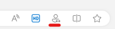

# Microsoft Edge for Business (Early Preview)

This article describes the benefits that Microsoft Edge for Business will bring to your users and explains how to enable this experience and use Microsoft Edge for Business in your organization.

> [!NOTE]
> Edge for Business is available in early preview. Preview features and experiences are in development and are available so you can get early access and send us feedback.

## Introduction

Microsoft Edge for Business is a new, dedicated Microsoft Edge experience built for work that enables admins in organizations to give their users a productive and secure work browser across managed and unmanaged devices.  It has the same rich set of enterprise controls, security, and productivity features that you're already familiar with in Microsoft Edge, but it's built to help meet the evolving needs of businesses.

Microsoft Edge for Business honors the needs of both end users and IT Pros as the browser that automatically separates work and personal browsing into dedicated browser windows with their own separate caches and storage locations, so information stays separate. Microsoft Edge for Business is planned to be the standard browser experience for organizations, activated by an Azure Active Directory (AAD) login, upon general availability. Learn more about Microsoft Edge for Business.  

Microsoft Edge for Business is in preview today on managed devices, and available in private preview for unmanaged BYOPC devices.  

This preview encompasses the experiences summarized in the following table.

| Name | Description | Status |
|:-----|:-----|:------|
|  Separation of work and personal browser windows  |  Easily distinguish between work and personal browser windows through visual elements and feature availability.    |  Early preview   (See following instructions)   |
|  Automatic switching between work and personal browser windows |  Automatically separates work and personal browsing into dedicated browser windows with their own separate caches and storage locations, so information stays separate.  |  Early preview   (See following instructions)     |
|  Company branding within the work browser window  |  Increase familiarity and trust with company branding.  |  Coming soon     |
|  Enterprise controls on managed devices   | Natively built-in rich enterprise controls for secure data access and leak prevention.    |  Available (Same as non-preview)     |
|  Unmanaged BYOPC    |  Secure and compliant access to work resources on personal computers.    |  Private Preview (See following onboarding instructions) |

Microsoft Edge for Business is enabled by logging into the browser using your Azure Active Directory (Azure AD) account. This login ensures that all your Microsoft 365 services are accessible in your work browser window. Users can enable the early preview using the *edge://flags/#edge-project-kodiak*. The next section has more information about flags you can use to enable different aspects of this experience.

## About this early preview

The early preview includes some visual treatments for the work browser window, a lightly managed personal browser window, and automatic switching between work and personal browser windows for a growing number of websites.

The lightly managed personal browser window will have the same security and compliance posture as Microsoft Edge for Business, with the same security, compliance and update policy. All the other work specific policies will only apply to Microsoft Edge for Business (Azure AD profile).

Edge for Business is available in early preview on managed devices on Microsoft Edge version 112 or later. To enable preview on a device, enter the following URLs in the Microsoft Edge address bar and set each flag to "Enabled".

- *edge://flags/#edge-project-kodiak*
- *edge://flags/#edge-project-kodiak-look-and-feel*
- *edge://flags/#edge-project-kodiak-policy-filter*
- *edge://flags/#edge-automatic-profile-switching*

> [!NOTE]
>
> - Users must have a new or existing personal profile to use the personal browser window capability.
> - Edge for Business visual treatment and branding is not currently available on mobile as part of the preview.
> - IT admin management capabilities will be available soon.

### Unmanaged BYOPC preview

> [!NOTE]
> This preview requires tenant onboarding.

To enable protected remote or home access to org data from Microsoft Edge for Business on personal Windows devices using:

- Intune Application Configuration Policies (ACP) to customize the org user experience in Microsoft Edge for Business.
- Intune Application Protection Policies (APP) to secure org data and ensure the client device is healthy when using Microsoft Edge for Business.  
- Windows Defender client threat defense integrated with Intune APP to detect local health threats on personal Windows devices.
- Application Protection Conditional Access to ensure the device is protected and healthy before granting protected service access via Azure Active Directory (Azure AD).

Participation requirements:

- Access to a test enterprise tenant for validation.
- Provide ongoing feedback about your experience with preview features via our Teams channel.
- Complete Validation scenarios and provide your feedback.
- Engage with the Microsoft product group during the preview.

> [!IMPORTANT]
> Production use of the private preview is not supported. Migration of private preview data to later releases is not supported. If you'd like to participate in the preview, register at [https://forms.office.com/r/UmKN68a7yN](https://forms.office.com/r/UmKN68a7yN)

## Provide feedback

Your feedback while using Microsoft Edge for Business is valuable and it helps us improve the product! Please provide feedback at [http://microsoftedgeinsider.com/](http://microsoftedgeinsider.com/).

## Frequently Asked Questions

### How can I correct a wrong browser window decision made by the browser?

There are two ways to change which browser window is used to open a website:  

- Use the following Omnibar Switching icon to switch back to the preferred browser window. This action will make the browser remember your choice for that URL.

  

- Go to *edge://settings/profiles/multiProfileSettings* and select **Choose preferred browser for sites** to turn off or select a preferred profile for the applicable site.

### Does the browser window switching preference sync across other Microsoft Edge channels?

No, currently it doesn't. You have to make switching preferences on each channel separately.  

### What sites does the browser window switch on?

The early preview will provide switching for the following sites:

- Amazon
- BestBuy
- Target
- Walmart

Over time, work-related sites such as Microsoft 365 apps and services requiring work login will automatically open in the work browser window. You will see a growing set of popular sites that will automatically open in the personal browser window as the experience continues to expand.

### How can users control which browser window a website will open in?

The option to manage how sites open appears in the browsing window that opens following the selection to open the URL in a different browser window. Additionally, users can manage and customize their Microsoft Edge for Business and personal URL lists by navigating to **Choose how external links open** in Microsoft Edge settings.

### Will favorites, history, and passwords be shared between the Microsoft Edge for Business and personal browser windows?

No – browser favorites, history, and passwords won't be shared between the browser windows.

## See also

- [Microsoft Edge Enterprise landing page](https://aka.ms/EdgeEnterprise)