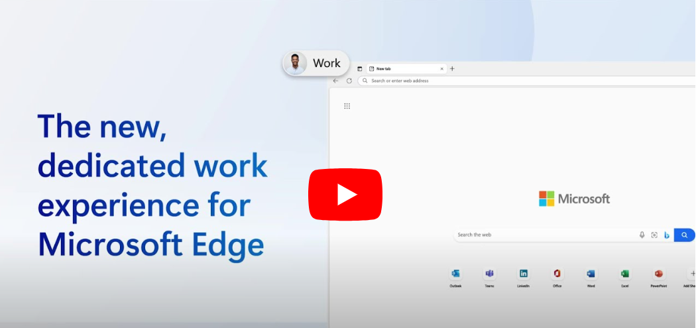
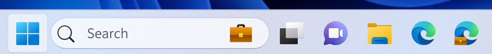
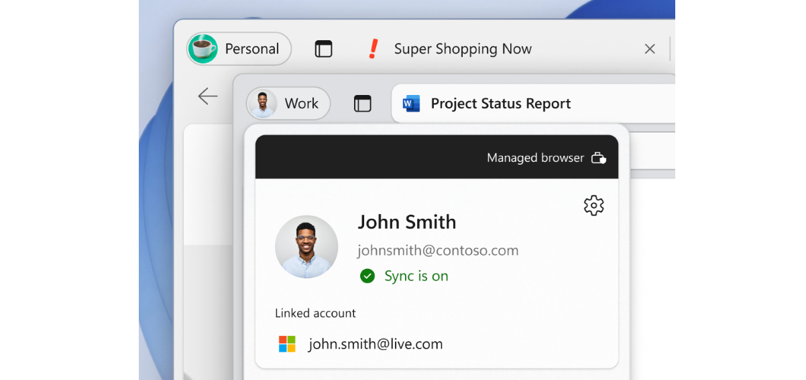
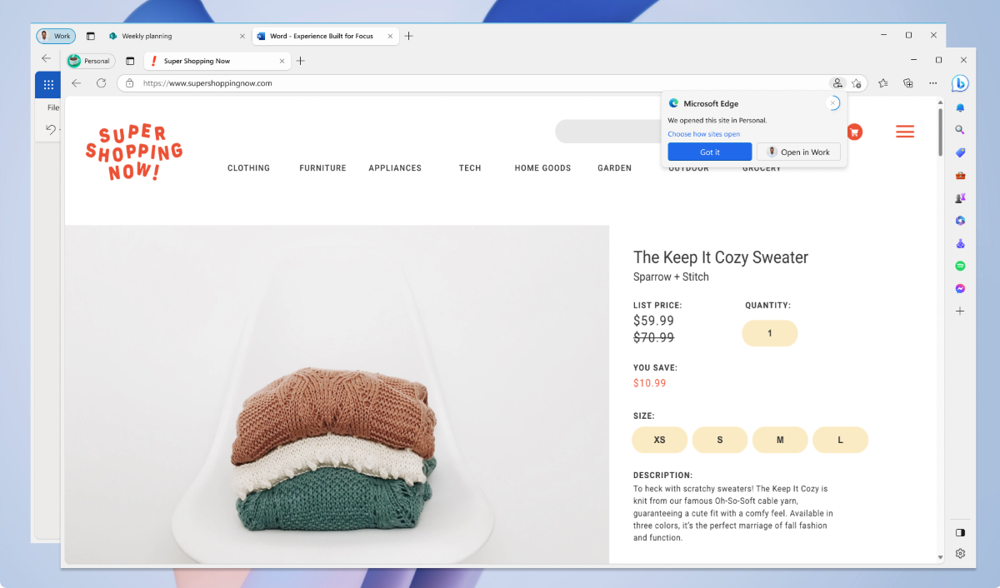
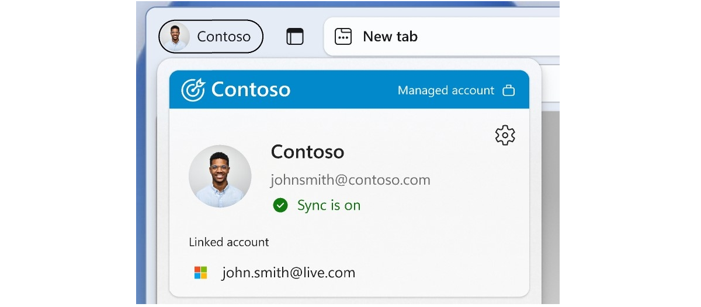

# Microsoft Edge for Business

This article describes the benefits Microsoft Edge for Business brings to your users and how to enable this experience for your organization.

> [!NOTE]
> Microsoft Edge for Business will start rolling out this new enterprise browsing experience in Edge stable release version 116.  
> - The Microsoft Edge for Business company branding will not be available in this release.
> - IT admin management capabilities will be available soon.

## Introduction

Microsoft Edge for Business is a new, dedicated Microsoft Edge experience built for work that enables admins in organizations to give their users a productive and secure work browser across managed and unmanaged devices. It has the same rich set of enterprise controls, security, and productivity features that you're already familiar with in Microsoft Edge, but it's built to help meet the evolving needs of businesses.

Microsoft Edge for Business aims to address the needs of both end users and IT Pros as the browser that automatically separates work and personal browsing into dedicated browser windows with their own favorites, separate caches and storage locations. This separation ensures that work related content doesn't get intermingled with personal browsing, preventing cognitive overload or end users from accidentally sharing sensitive information with unintended audiences. Microsoft Edge for Business is going to be the standard browser experience for organizations, activated by a Microsoft Entra ID (formerly *Azure Active Directory*) login, upon general availability. Check out our [build announcement](https://blogs.windows.com/msedgedev/2023/05/23/microsoft-edge-build-2023-innovations-in-AI-productivity-management-sidebar-apps/#business).
Microsoft Edge for Business will be generally available on managed PCs starting in Stable release version 116, and Intune MAM is now generally available on unmanaged devices.

Microsoft Edge for Business encompasses the experiences summarized in the following table.

| Name | Description | Status |
|:-----|:-----|:------|
| Visually distinct work browsing experience  | Natively built-in rich enterprise controls for secure data access and leak prevention powered by Microsoft Entra ID (formerly *Azure Active Directory*) with refreshed visual treatment. | Available |
| Enterprise personal browsing experience | A lightly managed personal browsing experience (MSA Profile) that lets you access your favorite non-work sites and services without compromising safety for the enterprise. Also switches automatically from work-related navigation into the work browser. | Available  |
|  Automatic switching  |  Helps with enforcing context separation between work and personal browsing.   | Optionally available with limited functionality    |
|  MAM for Windows  |  Secure and compliant access to work resources on personal computers with DLP controls.   |  Available (See following onboarding instructions in [MAM for Windows](#mam-for-windows)) |
| MAM for Mobile |  Secure and compliant access to work resources on mobile devices. | Available, see [MAM for Mobile](#mam-for-mobile)    |
|  Organization branding |  Increase familiarity and trust with company branding in the work browser window.  |  Available, see [Organization Branding](/deployedge/microsoft-edge-organization-branding).    |

## Work Browser (Visual Refresh)

Microsoft Edge for Business is available now, and the existing Microsoft Entra ID (formerly *Azure Active Directory*) profile on Enterprise PCs will automatically apply the new refreshed visual treatment.

> [!NOTE]
> All existing Microsoft Entra ID profile settings stay the same, including favorites, history, and saved passwords.

The Microsoft Edge for Business icon replaces the existing Microsoft Edge icon in the taskbar and other shortcuts:

Inside the browser, you see the new profile pill label, profile flyout visual treatment, and flyout band annotation.

## Automatic switching with the Enterprise personal browsing experience

> [!NOTE]
> Applies when device has at least one Microsoft Entra ID (formerly *Azure Active Directory*) profile and one MSA profile (existing or new).

Enterprise personal browsing is designed to keep work and personal browsing separate for the end users via the new automatic switching mechanism. When the device has an existing MSA profile or creates a new one, it enables automatic switching to enforce the browsing context separation. We continue to update our automatic switching logic to support more sites.

Microsoft Edge for Business is available now, and the personal browser profile is lightly managed, without requiring more configuration. The personal browser profile automatically inherits only the following policy categories:

- Security Policies (for example, Application Guard, Enhanced Security Mode, and others)
- Data Compliance Policies (for example, Microsoft Purview DLP, Microsoft Insider Risk Management)
- Microsoft Edge Update Policies (for example, Enforcing Microsoft Edge Update Rules)

For more information about the Enterprise personal browser and the policies that only apply to the work browser profile, see [policies](/DeployEdge/edge-learnmore-personal-browser-policies).

## Organization Branding

Want to customize the look of Edge for Business?

Now you can customize your organization's branding onto Edge for Business. This branding can help users signed in with an Entra ID (formerly known as Azure Active Directory) more easily differentiate between multiple profiles and browser windows through visual cues on the profile pill, profile flyout, and Edge for Business taskbar icon. This visual option also allows companies to foster employee trust through specifically customized branding, while growing affinity by serving an effective brand reinforcement strategy.

For more information on customizing brand assets, see [Organization branding](/deployedge/microsoft-edge-organization-branding).

## Microsoft Edge for Business

Microsoft Edge for Business is generally available now on managed devices on Microsoft Edge version 116 or later.

Microsoft Edge for Business is enabled by logging into the browser using your Microsoft Entra ID (formerly *Azure Active Directory*) account. This login ensures that all your Microsoft 365 services are accessible in your work browser window.

Included in this release are some visual treatments for the work browser window, a lightly managed personal browser window, and automatic switching between personal and work browser windows for a growing number of websites.

## MAM for Windows

To enable protected remote or home access to org data from Microsoft Edge for Business on personal Windows devices using:

- Intune Application Configuration Policies (ACP) to customize the org user experience in Microsoft Edge for Business.
- Intune Application Protection Policies (APP) to secure org data and ensure the client device is healthy when using Microsoft Edge for Business.  
- Windows Security Center client threat defense integrated with Intune APP to detect local health threats on personal Windows devices.
- Application Protection Conditional Access to ensure the device is protected and healthy before granting protected service access via Microsoft Entra ID (formerly *Azure Active Directory*).

### Prerequisites

- Windows 11, build 10.0.22621 (22H2) or later.
- Microsoft Intune 2309 or higher.
- Microsoft Edge 117.0.2045.31 or higher.

For more information, see [Data protection for Windows MAM](/mem/intune/apps/protect-mam-windows).

## MAM for Mobile

To enable protected remote or home access to org data from Microsoft Edge for Business on personal mobile devices using:

- Intune Application Configuration Policies (ACP) to customize the org user experience in Microsoft Edge for Business for mobile.
- Intune Application Protection Policies (APP) to secure org data and ensure the client device is healthy when using Microsoft Edge for Business for mobile.

For more information, see [Manage Microsoft Edge on iOS and Android with Intune](/mem/intune/apps/manage-microsoft-edge).

## Provide feedback

Your feedback while using Microsoft Edge for Business is valuable and it helps us improve the product!

For feedback about enterprise personal browser policy or any of the other Microsoft Edge for Business features, you can press alt + shift + I in the browser to open the **Send feedback** dialog where you can share your thoughts. You can also leave feedback in our [TechCommunity forum](https://techcommunity.microsoft.com/t5/enterprise/bd-p/EdgeInsiderEnterprise).

## Frequently Asked Questions

### How do I adjust which browser window a site is opened in?

There are two ways to change which browser window is used to open a website:  

- Select the switching icon, pictured below, to switch back to the preferred browser window. This action makes the browser remember your choice for that URL.

  

- Go to `edge://settings/profiles/multiProfileSettings` and select **Profile preferences for sites** to add/edit/delete automatic profile switching websites, or select a preferred profile for the applicable site.

### Does the browser window switching preference sync across other Microsoft Edge channels?

No, currently it doesn't. You have to make switching preferences on each channel separately.

### How do I switch between the Microsoft Edge for Business browser window and the Microsoft Edge browser window?  

With the Edge stable version 116 release, URLs entered into the personal browser window that are for work-related sites, such as Microsoft 365 apps and services, and sites requiring work login, will automatically open in the work browser window.

### Do I need to enable automatic switching?

With this release, switching from the personal browser window to the work browser window will be on by default with the option for the user to turn it off. Switching from the work browser window to the personal browser window will be off by default, with the option to it turn on by the user. This switching will be enabled by default in a future release. To turn automatic switching on/off, go to [Edge settings](edge://settings/profiles/) and toggle **Automatic profile switching** on/off.

### How can users control which browser window a website opens in?

The option to manage how sites open appears in the browsing window that opens following the selection to open the URL in a different browser window. Additionally, users can manage and customize their Microsoft Edge for Business and personal URL lists by navigating to **Choose how external links open** in Microsoft Edge settings.

### Will users see both the Edge and Edge for Business icons on the taskbar?

Users that are only signed in with Microsoft Entra ID will see the Edge for Business icon and not the Edge icon.

### What happens to favorites, passwords, and other data?  

Passwords, favorites, and data currently associated with the user's work profile will be maintained in Edge for Business. Passwords, favorites, and data aren't shared between the work browser window and the personal browser window.

### Are the work and personal browser window connected?

The work browser window (Microsoft Edge for Business) and personal browser window (Microsoft Edge) have their own separate caches and storage locations, so information stays separate. This feature doesn't create any link between the user's Microsoft Entra ID account and their MSA account, and the organization settings related to linking work and personal accounts are unaffected. There are no functional changes to the Microsoft Entra ID profile.

### What policies will be enabled in the personal browser window?

The Microsoft Edge personal browser window is lightly managed, with all the security, compliance, and Edge update policies applied, without the added overhead of managing another browser. To learn more, [visit this site](/DeployEdge/edge-learnmore-personal-browser-policies).

### How does my organization turn off the personal browser window?

To turn off the personal browser window, use the settings described in [Restrict which accounts can be used to sign in to Microsoft Edge](/DeployEdge/microsoft-edge-policies#restrict-which-accounts-can-be-used-to-sign-in-to-microsoft-edge) the steps listed in this document.

### Does Edge for Business support unmanaged devices?

Yes, Edge for Business includes support for unmanaged devices, which is currently available in preview. Follow the steps in [MAM for Windows](#mam-for-windows).  

## See also

- [Additional detailed Microsoft Edge for Business FAQs available in our Tech Community](https://techcommunity.microsoft.com/t5/microsoft-edge-insider/microsoft-edge-for-business-faq/ba-p/3891837)
- [Microsoft Edge Enterprise landing page](https://aka.ms/EdgeEnterprise)
