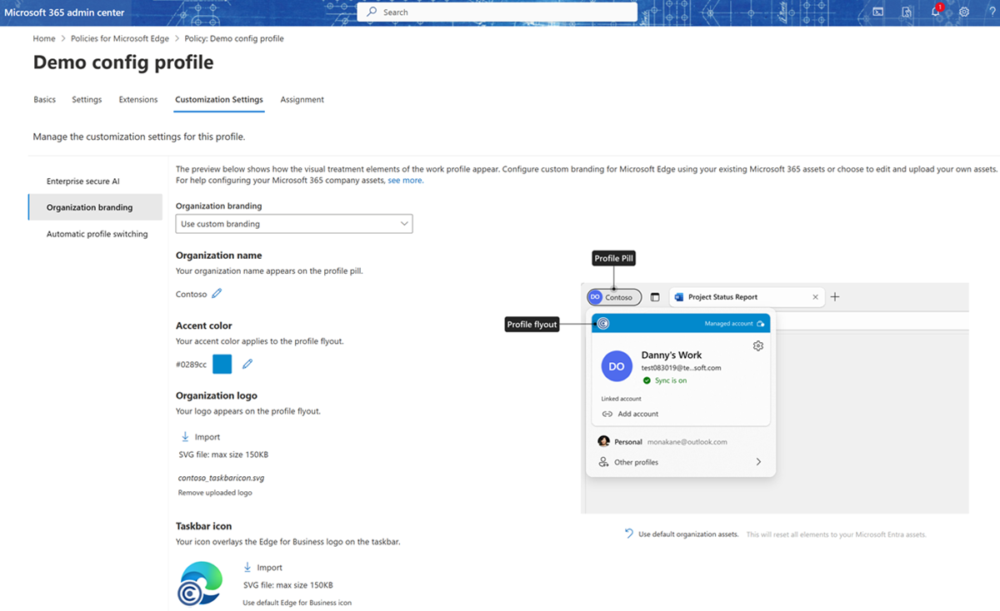

# Organization branding

This document provides a guide to understanding and using organization branding within Microsoft Edge for Business.

## Introduction

Want to customize the look of Microsoft Edge for Business?

Now you can with support for organization branding! This branding can help users signed in with a Microsoft Entra ID more easily differentiate between multiple profiles and browser windows through visual cues on the profile pill, profile flyout, and Edge for Business taskbar icon. Organization branding  also allows companies to foster staff trust through customized branding, while growing affinity by serving an effective brand reinforcement strategy.

## Organization branding assets

Admins have the options to use the default Edge for Business branding elements or choose to customize branding for their organization.
Today, the feature supports configuration of the following visual elements:

- Organization name on the profile pill
- Organization logo and color on the profile flyout
- Organization icon overlay on the Edge for Business taskbar icon

## Use default organization branding assets from Entra

Admins can choose to use default organization branding assets that are already configured in the Microsoft Entra admin center. Default branding customizations can be enabled by admins by deploying the following policies:
- [OrganizationalBrandingOnWorkProfileUIEnabled](/deployedge/microsoft-edge-policies#organizationalbrandingonworkprofileuienabled)
- [OrganizationLogoOverlayOnAppIconEnabled](/deployedge/microsoft-edge-policies#organizationlogooverlayonappiconenabled)

When these policies are enabled, any applicable assets in your existing Microsoft Entra admin center are used for organization branding in Microsoft Edge for Business.

For more details on defaults and checking what is already configured in Microsoft Entra, check your existing company branding.

*The Edge for Business taskbar icon overlay isn't supported for macOS.*

## Customize organization branding through the Microsoft Edge management service

> [!IMPORTANT]
> If OneDrive desktop sync is enabled in the user environment, a OneDrive policy to
[exclude specific kinds of files from being uploaded](/sharepoint/use-group-policy#exclude-specific-kinds-of-files-from-being-uploaded) needs to be enabled to prevent shortcut duplication and enable the organization branding feature. **Note:** You must exclude .Lnk files. The OneDrive sync app won't sync any .Lnk files, regardless of source.

Looking for more advanced customization options? The Edge management service provides admins with an enhanced experience to control, preview, and customize the look of Edge for Business.

To customize the Microsoft Edge browser with your organization's branding assets, sign in to the Microsoft 365 Admin Center and go to the **Organization branding** tab in the **Customization Settings** pivot within a configuration profile. A preview of how the browser elements look on a user's account is shown on the page.

If you don't have any branding policies enabled, the default Edge for Business branding is displayed. When you choose **Use custom branding**, any existing branding assets associated with your Microsoft Entra ID are imported and displayed in the preview. These changes won't take effect until you choose **Save changes**.

From here, you can customize each of the following browser elements with the brand assets you choose.

- Organization name: This name is displayed in the profile pill.
- Accent color: This color appears in the profile flyout header.
- Organization logo: This logo appears in the profile flyout header. To ensure that your logo displays properly:
  - You must upload an SVG (Scalable Vector Graphics) file with a maximum size of 150 KB.
  - The uploaded file should have dimensions with width >= height. We recommend choosing a rectangular logo.
  - For non-square logos, file dimensions must be included at the SVG level ("<svg width="500 pixels" height="200 pixels".)
- Taskbar icon: This logo will overlay the Edge for Business icon on the taskbar. To ensure that your logo displays properly:
  - You must upload an SVG file with a maximum size of 150 KB.
  - The uploaded file should be a square logo that has dimensions with a 1:1 ratio. The file resolution should be no greater than 480 pixels x 480 pixels.

After you finish customizing the browser elements with your organization branding assets, confirm that the preview displays the correct visual appearance and then select **Save changes**.

*Note: Organization branding via Edge management service is currently not supported for:*

- *Microsoft Edge Mobile*
- *Microsoft Edge for Business on unmanaged PCs and macOS*
- *Customers with an Office 365 GCC or Office 365 GCC High and DoD plan*

## Frequently asked questions

### Are there any scenarios where organization branding can't be used?

Yes, organization branding isn't supported for the following scenarios.

- Organization branding isn't applied if:  
  - OneDrive desktop sync is enabled.
  - The OneDrive policy to [exclude specific kinds of files from being uploaded](/sharepoint/use-group-policy#exclude-specific-kinds-of-files-from-being-uploaded) is disabled.
- Organization branding via Entra assets doesn't support the Microsoft Edge for Business taskbar icon overlay in macOS.
- Organization branding via Microsoft Edge management service isn't supported for:
  - Microsoft Edge Mobile.
  - Microsoft Edge for Business on unmanaged PCs and macOS.
  - Customers with an Office 365 GCC, Office 365 GCC High, and DoD plans.

### Why am I unable to see my taskbar icon overlay update?

The taskbar icon overlay is currently not supported for macOS devices. It might also take a couple of restarts upon initial configuration to  see your icon overlay updated on the taskbar.

### Which Microsoft Entra admin center assets are used for the organization branding icons?

- The organization logo uses the header logo. If this logo doesn't exist, it uses the favicon.
- The taskbar icon uses the square logo. If this logo doesn't exist, it uses the favicon.

## See also

- [Microsoft Edge for Business](/deployedge/microsoft-edge-for-business)
- [Microsoft Edge management service](/deployedge/microsoft-edge-management-service)
