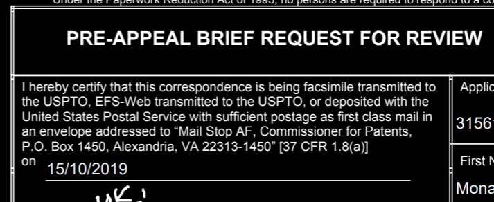
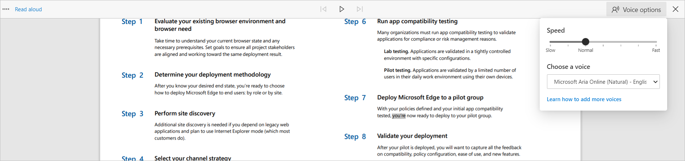

# PDF reader in Microsoft Edge

PDF files make up a substantial part of our day-to-day lives. They come in the form of contracts and agreements, newsletters, forms, research articles, resumes, and so on. These files highlight the need for a reliable, secure, and powerful PDF reader that can be adopted by Enterprises.

Microsoft Edge comes with a built-in PDF reader that lets you open your local pdf files, online pdf files, or pdf files embedded in web pages. You can annotate these files with ink and highlighting. This PDF reader gives users a single application to meet web page and PDF document needs. The Microsoft Edge PDF reader is a secure and reliable application that works across the Windows and macOS desktop platforms.

> [!NOTE]
> This article applies to Microsoft Edge version 77 or later.

## Prerequisites, support, and constraints

The following table shows which channels and versions of Microsoft Edge support each PDF reader feature.

| Feature | Stable channel version |
|---------|------------------------|
| View and print local, online, and embedded PDF files | 79.0.309.71                |
| Basic form filling (JavaScript forms aren't supported) | 79.0.309.71           |
|Table of Contents| 86.0.622.38 |
| Page Layouts|Currently being promoted in [Microsoft Edge Insider](https://www.microsoftedgeinsider.com/) channels |
| Inking  | 80.0.361.48            |
| Ink customization | 83.0.478.54  |
| Highlight  | 81.0.416.53         |
| Text Notes | Currently being promoted in [Microsoft Edge Insider](https://www.microsoftedgeinsider.com/) channels |
| Read Aloud | 84.0.522.63  |
| View MIP protected files | Windows support in 80.0.361.48 Mac support in 81.0.416.53 |
|  View IRM protected files  | 83.0.478.37            |
| View and Validate Digital Signatures (Preview) |  |

### Constraints

Note the following constraints for the current PDF reader:

-  XML Forms Architecture (XFA), is a legacy format of forms that isn't  supported in Microsoft Edge.
-  Documentation related to Accessibility scenarios that currently aren't supported can be found on the [Microsoft Accessibility Conformance Reports](https://cloudblogs.microsoft.com/industry-blog/government/2018/09/11/accessibility-conformance-reports/) blog.

## Features

### Inking

Inking on PDF files comes in handy to take quick notes for easy reference, sign, or fill out PDF forms. This capability is now available in Microsoft Edge. In addition to inking PDF files as needed, you can use color and stroke width to bring attention to different parts of the PDF file. The next screenshot shows how a user can add inking to a pdf page.

<!-- SCREENSHOT -->

### Highlight

PDF reader in Microsoft Edge comes with support for adding and editing highlights. To create a highlight, the user simply needs to select the text, right-click on it, select highlights in the menu and choose the desired color. Highlights can also be created using a pen, or keyboard. The next screenshot shows the highlight options that are available.

### Text Notes

Read Aloud for PDF adds the convenience of listening to PDF content while carrying out other tasks that may be important to users. It also helps auditory learners focus on the content, which makes learning much easier. The next screenshot shows a Read Aloud example. The highlighting shows the text that is currently being read.

### Read Aloud

Read Aloud for PDF adds the convenience of listening to PDF content while carrying out other tasks that may be important to users. It also helps auditory learners focus on the content, which makes learning much easier. The next screenshot shows a Read Aloud example. The highlighting shows the text that is currently being read.

### Protected PDFs

[Microsoft Information Protection (MIP)](https://docs.microsoft.com/microsoft-365/compliance/protect-information?view=o365-worldwide&preserve-view=true) enables users to collaborate with others securely, while adhering to your organization's compliance policies. After a file is protected, the actions users can take on it are determined by the permissions assigned to them.

> [!IMPORTANT]
> A license is required for MIP. For more information, see this [Microsoft 365 licensing guidance](https://docs.microsoft.com/office365/servicedescriptions/microsoft-365-service-descriptions/microsoft-365-tenantlevel-services-licensing-guidance/microsoft-365-security-compliance-licensing-guidance#information-protection).

These files can be opened directly in the browser, without the need to download any other software, or install any add-in. This integrates the security provided by MIP directly into the browser, providing a seamless workflow.

<!-- SCREENSHOT -->

In addition to MIP protected files, PDF files in [Information Rights Management (IRM)](https://docs.microsoft.com/microsoft-365/compliance/set-up-irm-in-sp-admin-center?view=o365-worldwide&preserve-view=true) protected SharePoint libraries can also be opened natively in the browser.

With Microsoft Edge, users can view MIP protected files saved locally, or in the cloud. If saved locally, the file can be opened directly in the browser. If the file is opened from a cloud service as SharePoint, the user may need to use the "Open in browser" option.

If the profile that the user is logged into Microsoft Edge with has at least view permissions to the file, the file will open in Microsoft Edge.

<!-- SCREENSHOT -->

### Certificate Based Digital Signatures (Preview)

Microsoft Information Protection (MIP) enables users to collaborate with others securely, while adhering to their organization's compliance policies. After a file is protected, the actions users can take on it are determined by the permissions assigned to them.

## Accessibility

The PDF reader comes with support for Keyboard accessibility, High contrast mode, and screen reader support across Windows and macOS devices.

### Keyboard Accessibility

Users can use navigate to different parts of the document that a user can interact with, such as form fields and highlights, using the keyboard.

<!-- SCREENSHOT -->

### High contrast mode

PDF reader will use the settings defined at the operating system level to render PDF content in high contrast mode.

<!-- SCREENSHOT -->
<!---->

### Screen reader support

Users can navigate through and read PDF files using screen readers on Windows and Mac computers. <!--The next screenshot shows the toolbar that users can use for audio settings when they're using the Read Aloud option in PDF reader. -->

<!-- SCREENSHOT -->
<!--
 -->

## Security and reliability

Security is among the most important tenets for any organization. PDF reader security is an integral part of the Microsoft Edge security design. Two of the most important security features From a PDF reader perspective, two important security features are process isolation and Microsoft Defender Application Guard (Application Guard).

- Process isolation. PDFs opened from different web sites are completely process isolated. The browser doesn't have to communicate with any websites, or PDF files opened from another source. PDF browsing is secure from any attacks that plan to use compromised PDFs as an attack surface.

- Application Guard. With Application Guard, admins can set a list of sites that are trusted by their organization. If users open any other sites, they are opened in a separate Application Guard window that runs in its own container. The container helps protect the corporate network and any data on user's computer from being compromised.  
This protection also applies to any online PDF files that are viewed. Further, any PDF files that are downloaded from an Application Guard window are stored, and when needed, re-opened in the container. This helps keeps your environment secure not just when the file is downloaded, but through its whole lifecycle. For more information, see [Application Guard](https://docs.microsoft.com/DeployEdge/microsoft-edge-security-windows-defender-application-guard).

### Reliability

Because Microsoft Edge is Chromium-based, users can expect the same level of reliability that they're used to seeing in other Chromium-based browsers.

## Deploy and update PDF reader

The PDF reader gets deployed and updated with the rest of the Microsoft Edge browser. To learn more about deploying Microsoft Edge, watch the [Deploy Microsoft Edge to hundreds or thousands of devices](microsoft-edge-video-deploy.md) video. You can also find more deployment information on the [Microsoft Edge documentation](https://docs.microsoft.com/DeployEdge/) landing page.

> [!TIP]
> You can make Microsoft Edge the default PDF reader for your organization. To do this, [follow these steps](https://docs.microsoft.com/deployedge/edge-default-browser).

## Roadmap and feedback

The roadmap for PDF Reader in Microsoft Edge is available [here](https://techcommunity.microsoft.com/t5/articles/roadmap-for-pdf-reader-in-microsoft-edge/m-p/1467667).

We're actively looking at feedback from you about the features you find important. Feel free to send us feedback through [Microsoft Edge UserVoice](https://microsoftedge.uservoice.com/) and on [Microsoft Edge Insider](https://techcommunity.microsoft.com/t5/microsoft-edge-insider/ct-p/MicrosoftEdgeInsider) forum.

## See also

- [Microsoft Edge Enterprise landing page](https://aka.ms/EdgeEnterprise)