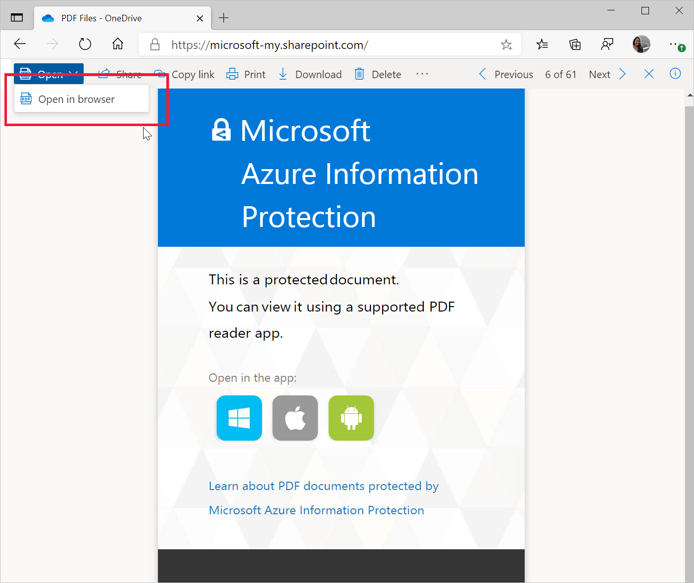

# PDF reader in Microsoft Edge

PDF files make up a large part of our day-to-day lives. They come in the form of contracts and agreements, newsletters, forms, research articles, resumes, and so on. These files highlight the need for a reliable, secure, and powerful PDF reader that can be adopted by Enterprises.

Microsoft Edge comes with a built-in PDF reader that lets you open your local pdf files, online pdf files, or pdf files embedded in web pages. You can annotate these files with ink and highlighting. This PDF reader gives users a single application to meet web page and PDF document needs. The Microsoft Edge PDF reader is a secure and reliable application that works across the Windows and macOS desktop platforms.

> [!NOTE]
> This article applies to Microsoft Edge version 77 or later.

## Prerequisites, support, and constraints

The following table shows which channels and versions of Microsoft Edge support each PDF reader feature.

| Feature | Stable channel version |
|---------|------------------------|
| View and print local, online, and embedded PDF files | 79.0.309.71                |
| Basic form filling (JavaScript forms aren't supported) | 79.0.309.71           |
|Table of contents| 86.0.622.38 |
| Page view |Currently being promoted in [Microsoft Edge Insider](https://www.microsoftedgeinsider.com/) channels |
| Caret mode browsing |87.0.664.41 |
| Inking  | 80.0.361.48            |
| Ink customization | 83.0.478.54  |
| Highlight  | 81.0.416.53         |
| Text notes | Currently being promoted in [Microsoft Edge Insider](https://www.microsoftedgeinsider.com/) channels |
| Read aloud | 84.0.522.63  |
| View Microsoft Information Protection (MIP) protected files | Windows support in 80.0.361.48 Mac support in 81.0.416.53 |
|  View Information Rights Management (IRM) protected files  | 83.0.478.37            |
| View and validate Digital Signatures | Available in Canary and Dev channels. Being actively worked on. |

### Constraints

Note the following constraints for the current PDF reader:

-  XML Forms Architecture (XFA), is a legacy format of forms that isn't  supported in Microsoft Edge.
-  Documentation related to Accessibility scenarios that currently aren't supported can be found on the [Microsoft Accessibility Conformance Reports](https://cloudblogs.microsoft.com/industry-blog/government/2018/09/11/accessibility-conformance-reports/) blog.

## Features

The PDF reader, built into Microsoft Edge, comes with the basic reading and navigation features, as Zoom, Rotate, Fit to page/width, jump to page, and search, among others. They can be accessed through a pin-able toolbar at the top of PDF content. This section gives an overview of some important functions. The next screenshot shows the PDF reader toolbar.

### Table of contents

Table of contents lets users easily navigate through PDF documents that have a table of contents. When a user clicks the Table of contents icon, a navigation pane that  shows a list of the labeled sections and subsections in the PDF document is shown. The user can then click any of the labels in the pane to navigate to that section of the document. The pane stays open for as long as needed and can be closed when the user wants to go back to reading the document. The next screenshot shows the navigation pane for an open document.

### Page view

Microsoft Edge supports different views for PDF documents in our Dev and Canary channels. Users can change the layout of a document from a single page view to two pages that are displayed side by side. To change how the PDF document is being viewed, users can click the Page View button in the PDF toolbar and then choose either view they want to use. The two page view is shown in the next screenshot.

### Caret mode browsing

Caret browsing is available for PDF files opened in Microsoft Edge, which means that users can interact with PDF files using the keyboard. If a user presses the F7 key anywhere in the browser, they're asked if caret browsing should be turned on. If enabled, caret browsing is available for any content opened in the browser, be it PDF files or web pages. When a user presses F7 again, caret browsing is turned off. When caret browsing is active and the focus is on the content, users will see a blinking cursor in the PDF file. The caret can also be used to navigate through the file, or to select text by pressing Shift while moving the cursor. This ability lets users easily create elements as highlights, or interact with elements as links, form fields with the keyboard. The next screenshot shows the popup menu for turning on Caret mode browsing.

### Inking

Inking on PDF files comes in handy to take quick notes for easy reference, sign, or fill out PDF forms. This capability is now available in Microsoft Edge. In addition to inking PDF files as needed, you can use color and stroke width to bring attention to different parts of the PDF file. The next screenshot shows how a user can add inking to a pdf page.

### Highlight

PDF reader in Microsoft Edge comes with support for adding and editing highlights. To create a highlight, the user simply needs to select the text, right-click on it, select highlights in the menu and choose the desired color. Highlights can also be created using a pen, or keyboard. The next screenshot shows the highlight options that are available.

### Text notes

While reading a PDF file, text notes can be added to text in the file to jot down thoughts for easy reference later.

Users can add a note by selecting the piece of text they wish to add a note for and invoking the right-click context menu. Selecting the **Add Comment** option in the menu will open a text box where users can add their comments. They can type the comment and then click the check mark to save the comment.

After a note is added, the selected text will be highlighted, and a comment icon will appear to indicate the comment. Users can hover over that icon to preview the comment or click on it to open and edit the note.

The next screenshot shows a note getting added to highlighted text.

### Read aloud

Read aloud for PDF adds the convenience of listening to PDF content while carrying out other tasks that may be important to users. It also helps auditory learners focus on the content, which makes learning much easier. The next screenshot shows a Read aloud example. The highlighting shows the text that is currently being read.

### Protected PDFs

[Microsoft Information Protection (MIP)](/microsoft-365/compliance/protect-information?preserve-view=true&view=o365-worldwide) enables users to collaborate with others securely, while adhering to your organization's compliance policies. After a file is protected, the actions users can take on it are determined by the permissions assigned to them.

> [!IMPORTANT]
> A license is required for MIP. For more information, see this [Microsoft 365 licensing guidance](/office365/servicedescriptions/microsoft-365-service-descriptions/microsoft-365-tenantlevel-services-licensing-guidance/microsoft-365-security-compliance-licensing-guidance#information-protection).

These files can be opened directly in the browser, without the need to download any other software, or install any add-in. This capability integrates the security provided by MIP directly into the browser, providing a seamless workflow.

In addition to MIP protected files, PDF files in [Information Rights Management (IRM)](/microsoft-365/compliance/set-up-irm-in-sp-admin-center?preserve-view=true&view=o365-worldwide) protected SharePoint libraries can also be opened natively in the browser.

With Microsoft Edge, users can view MIP protected files saved locally, or in the cloud. If saved locally, the file can be opened directly in the browser. If the file is opened from a cloud service as SharePoint, the user may need to use the "Open in browser" option.

If the profile that the user is logged into Microsoft Edge with has at least view permissions to the file, the file will open in Microsoft Edge.

### View and validate certificate-based digital signatures

In this digital world, it becomes important to establish the authenticity and ownership of the content in the document. Certificate-based digital signatures are commonly used in PDF documents to ensure that the content in the document is the same as what the author intended it to be, and has not been changed. With Microsoft Edge, you can view and validate certificate digital signatures in PDFs.

We’re actively working on improving the support to address more scenarios, and are looking forward for feedback about the same.

## Accessibility

The PDF reader comes with support for Keyboard accessibility, High contrast mode, and screen reader support across Windows and macOS devices.

### Keyboard Accessibility

Users can use navigate to different parts of the document that a user can interact with, such as form fields and highlights, using the keyboard. Users can also use Caret mode to navigate and interact with the PDF files using the keyboard.

### High contrast mode

PDF reader will use the settings defined at the operating system level to render PDF content in high contrast mode.

### Screen reader support

Users can navigate through and read PDF files using screen readers on Windows and Mac computers.

## Security and reliability

Security is among the most important tenets for any organization. PDF reader security is an integral part of the Microsoft Edge security design. Two of the most important security features From a PDF reader perspective, two important security features are process isolation and Microsoft Defender Application Guard (Application Guard).

- Process isolation. PDFs opened from different web sites are completely process isolated. The browser doesn't have to communicate with any websites, or PDF files opened from another source. PDF browsing is secure from any attacks that plan to use compromised PDFs as an attack surface.

- Application Guard. With Application Guard, admins can set a list of sites that are trusted by their organization. If users open any other sites, they are opened in a separate Application Guard window that runs in its own container. The container helps protect the corporate network and any data on user's computer from being compromised.  
This protection also applies to any online PDF files that are viewed. Further, any PDF files that are downloaded from an Application Guard window are stored, and when needed, re-opened in the container. This helps keeps your environment secure not just when the file is downloaded, but through its whole lifecycle. For more information, see [Application Guard](./microsoft-edge-security-windows-defender-application-guard.md).

### Reliability

Because Microsoft Edge is Chromium-based, users can expect the same level of reliability that they're used to seeing in other Chromium-based browsers.

## Deploy and update PDF reader

The PDF reader gets deployed and updated with the rest of the Microsoft Edge browser. To learn more about deploying Microsoft Edge, watch the [Deploy Microsoft Edge to hundreds or thousands of devices](microsoft-edge-video-deploy.md) video. You can also find more deployment information on the [Microsoft Edge documentation](./index.yml) landing page.

> [!TIP]
> You can make Microsoft Edge the default PDF reader for your organization. To do this, [follow these steps](./edge-default-browser.md).

## Roadmap and feedback

The roadmap for PDF reader in Microsoft Edge is available [here](https://techcommunity.microsoft.com/t5/articles/roadmap-for-pdf-reader-in-microsoft-edge/m-p/1467667).

We're actively looking at feedback from you about the features you find important. Feel free to send us feedback through the [Microsoft Edge Insider](https://techcommunity.microsoft.com/t5/microsoft-edge-insider/ct-p/MicrosoftEdgeInsider) forum.

## See also

- [Microsoft Edge Enterprise landing page](https://aka.ms/EdgeEnterprise)
- [Microsoft 365 Roadmap](https://www.microsoft.com/microsoft-365/roadmap)
- [Video: Microsoft Edge enterprise grade PDF reader](microsoft-edge-video-pdf-reader.md)