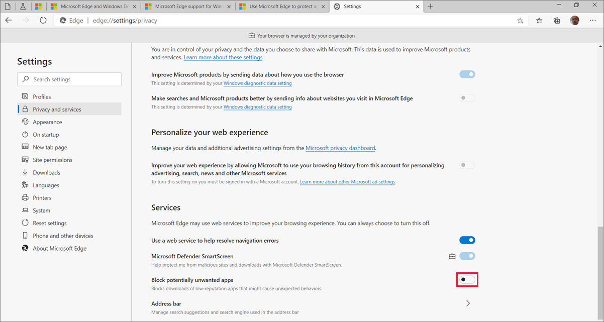
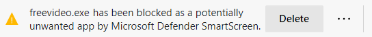

# Protect against potentially unwanted applications (PUAs)

This article explains how you can protect against potentially unwanted applications (PUAs) using Microsoft Edge or by using Windows Defender Antivirus.

> [!NOTE]
> This article applies to Microsoft Edge version 80 or later.

## Overview

Potentially unwanted applications aren't considered to be viruses or malware, but these apps might perform actions on endpoints that adversely affect endpoint performance or use. For example, *Evasion software* actively tries to evade detection by security products. This kind of software can increase the risk of your network being infected with actual malware. PUA can also refer to applications that are considered to have poor reputation.

For a description of the criteria used to classify software as a PUA, see [Potentially unwanted application](/windows/security/threat-protection/intelligence/criteria#potentially-unwanted-application-pua).

## Protect against PUA with Microsoft Edge

Microsoft Edge (version 80.0.361.50 or later) blocks PUA downloads and associated resource URLs.

You can set up protection by enabling the **Block potentially unwanted apps** feature in Microsoft Edge.

> [!NOTE]
> The [Microsoft Edge Team blog post](https://blogs.windows.com/msedgedev/2020/02/27/protecting-users-potentially-unwanted-apps/) describes this new feature and explains how to handle a mislabeled app or report an app as unwanted.

### To enable PUA protection:

1. Open **Settings** in the browser.
2. Select **Privacy and services**.
3. In the **Services** section, check to see that **Microsoft Defender SmartScreen** is turned on. If not, then turn on Microsoft Defender SmartScreen. The example in the following screenshot shows the browser is managed by the organization and that Microsoft Defender SmartScreen is turned on.

   

4. In the **Services** section, use the toggle shown in the preceding screenshot to turn on **Block potentially unwanted apps**.

   > [!TIP]
   > You can safely explore the URL-blocking feature of PUA protection by testing it out on one of our Windows Defender SmartScreen [demo pages](https://demo.smartscreen.msft.net/).

When Microsoft Edge detects a PUA, you will see a message like the one in the next screenshot.

   

### To block against PUA-associated URLs

After you turn on PUA protection in Microsoft Edge, Windows Defender SmartScreen will protect you from PUA-associated URLs.

There are several ways admins can configure how Microsoft Edge and Windows Defender SmartScreen work together to protect users from PUA-associated URLs. For more information, see:

- [Configure Microsoft Edge policy settings on Windows](./configure-microsoft-edge.md)
- [SmartScreen settings](./microsoft-edge-policies.md#smartscreen-settings)
- [SmartScreenPuaEnabled policy](./microsoft-edge-policies.md#smartscreenpuaenabled)
- [Configure Windows Defender SmartScreen](/microsoft-edge/deploy/available-policies?source=docs#configure-windows-defender-smartscreen)

Admins can also customize the Microsoft Defender Advanced Threat Protection (Microsoft Defender ATP) block list. They can use the Microsoft Defender ATP portal to [create and manage indicators for IPs and URLs](/windows/security/threat-protection/microsoft-defender-atp/manage-indicators#create-indicators-for-ips-and-urlsdomains-preview).

## Protect against PUA with Windows Defender Antivirus

The [Detect and block potentially unwanted applications](/windows/security/threat-protection/windows-defender-antivirus/detect-block-potentially-unwanted-apps-windows-defender-antivirus#windows-defender-antivirus) article also describes how you can configure Windows Defender Antivirus to enable PUA protection. You can configure protection using any of the following options:

- [Microsoft Intune](/windows/security/threat-protection/windows-defender-antivirus/detect-block-potentially-unwanted-apps-windows-defender-antivirus#use-intune-to-configure-pua-protection)
- [Microsoft Endpoint Configuration Manager](/windows/security/threat-protection/windows-defender-antivirus/detect-block-potentially-unwanted-apps-windows-defender-antivirus#use-configuration-manager-to-configure-pua-protection)
- [Group Policy](/windows/security/threat-protection/windows-defender-antivirus/detect-block-potentially-unwanted-apps-windows-defender-antivirus#use-group-policy-to-configure-pua-protection)
- [PowerShell cmdlets](/windows/security/threat-protection/windows-defender-antivirus/detect-block-potentially-unwanted-apps-windows-defender-antivirus#use-powershell-cmdlets-to-configure-pua-protection)

When Windows Defender detects a PUA file on an endpoint it quarantines the file and notifies the user ([unless notifications are disabled](/windows/security/threat-protection/windows-defender-antivirus/configure-notifications-windows-defender-antivirus)) in the same format as a normal threat detection (prefaced with "PUA:".) Detected threats also appear in the [quarantine list in the Windows Security app](/windows/security/threat-protection/windows-defender-antivirus/windows-defender-security-center-antivirus#detection-history).

### PUA notifications and events

There are several ways an admin can see PUA events:

- In the Windows Event Viewer, but not in Microsoft Endpoint Configuration Manager or Intune.
- In an email if email notifications for PUA detections is turned on.
- In [Windows Defender Antivirus](/windows/security/threat-protection/windows-defender-antivirus/troubleshoot-windows-defender-antivirus) event logs, where a PUA event is recorded under event ID 1116 with the message: "The antimalware platform detected malware or other potentially unwanted software."

> [!NOTE]
> Users will see "*.exe has been blocked as a potentially unwanted app by Microsoft Defender SmartScreen".

### Allow-list an app

Like Microsoft Edge, Windows Defender Antivirus provides a way to allow files that are blocked by mistake or needed to complete a task. If this happens you can allow-list a file. For more information, see [How to Configure Endpoint Protection in Configuration Manager](/previous-versions/system-center/system-center-2012-R2/hh508770(v=technet.10)#to-exclude-specific-files-or-folders) to learn how to exclude specific files or folders.

## See also

- [Microsoft Edge Enterprise landing page](https://aka.ms/EdgeEnterprise)
- [Threat protection](/windows/security/threat-protection/index)
- [Configure behavioral, heuristic, and real-time protection](/windows/security/threat-protection/windows-defender-antivirus/configure-protection-features-windows-defender-antivirus)
- [Next-generation protection](/windows/security/threat-protection/windows-defender-antivirus/windows-defender-antivirus-in-windows-10)
- [Security baseline for Chromium-based Microsoft Edge, version 79](https://techcommunity.microsoft.com/t5/microsoft-security-baselines/security-baseline-final-for-chromium-based-microsoft-edge/ba-p/1111863)