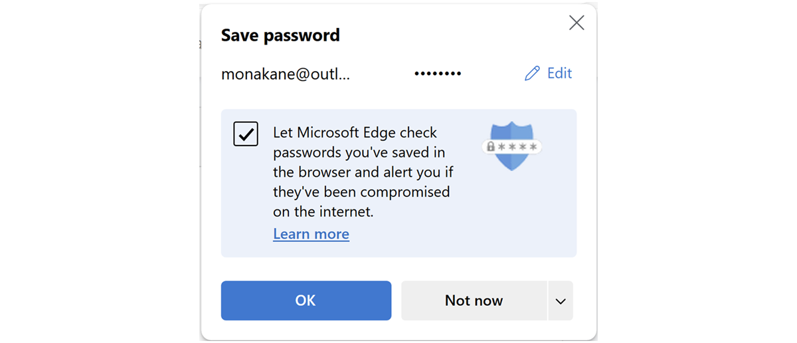

# Password Monitor auto-enabled for users

This article describes how admins can turn on Password Monitor in Microsoft Edge for select users. The article also gives the steps to control how monitoring is enabled.

## Introduction, benefits, and availability

Password Monitor helps Microsoft Edge users protect their online accounts by informing them if any of their passwords are found in an online leak. Online leaks or data breaches happen when bad actors steal data from third-party apps or websites. To learn more, see the [Password Monitor: Safeguarding passwords in Microsoft Edge](https://www.microsoft.com/research/blog/password-monitor-safeguarding-passwords-in-microsoft-edge/)  paper on the Microsoft Research Blog.

### Benefits

Given the frequency and scope of these online attacks having this kind of protection is necessary for everyone. Microsoft Edge has the built-in ability to securely check a user's saved passwords against passwords that are known to be compromised and alerts them if a match is found.  

## Configure group policy for Password Monitor

This feature is controlled via the [PasswordMonitorAllowed](./microsoft-edge-policies.md#passwordmonitorallowed) group policy.

After the policy is enabled, users will get alerted if any of their saved passwords are found to be unsafe because of data breach in third-party apps or websites. If the feature is configured as mandatorily enabled or disabled using group policy, users can't override this setting.

If the feature is configured as recommended enabled, then the UI in Settings stays in the 'Off' state, but a briefcase icon is visible next to it with this description displayed on hover - "Your organization recommends a specific value for this setting and you have chosen a different value". Users can turn this on via consent flyout or directly enable it from Wallet settings > Passwords.

When the feature is configured as recommended enabled or unconfigured, there are different ways users can turn on this feature.

- Getting explicit consent. Signed-in users are asked for permission to turn on Password Monitor and they're prompted when saving a new password.
<!-- insert screenshot here -->

- Direct activation. Users can go to **Settings** > **Passwords** anytime and turn the feature On or Off.

## Frequently Asked Questions

### How can Password Monitor be disabled for my organization?

You can disable Password Monitor for your organization by:

- Using the [PasswordMonitorAllowed](/deployedge/microsoft-edge-policies#passwordmonitorallowed) group policy.
- Stopping data from being synchronized and sent to Microsoft servers.

### Can Password Monitor work even if Password Sync is disabled?

Password Monitor can work even if Password Sync is disabled, provided that the Password Monitor group policy is mandatorily enabled, or the user gave explicit consent to turn on the feature, or the user turned it on themselves using Settings.

## See also

- [Microsoft Edge Enterprise landing page](https://aka.ms/EdgeEnterprise)
