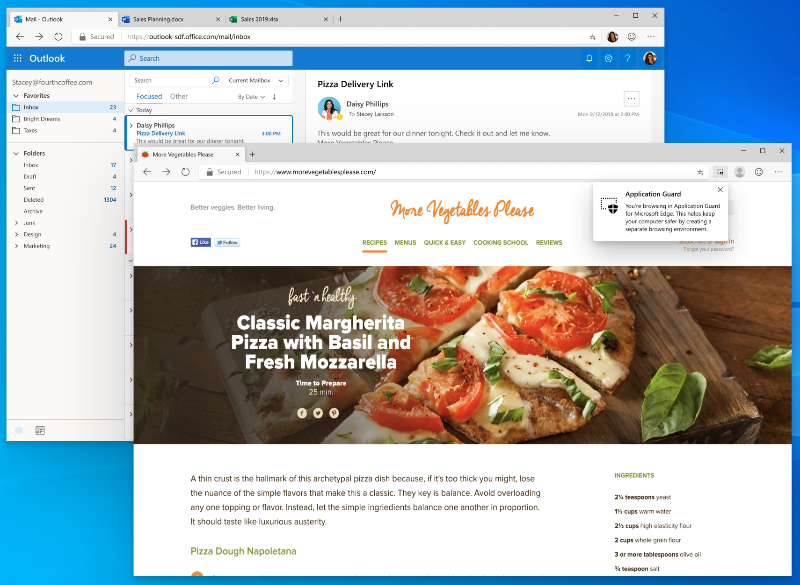
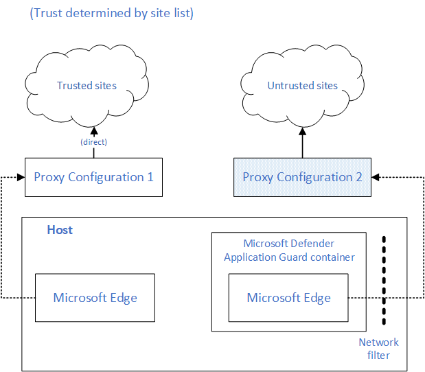
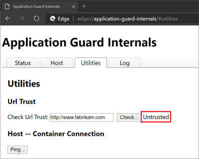

# Microsoft Edge support for Microsoft Defender Application Guard

This article describes how Microsoft Edge supports Microsoft Defender Application Guard (Application Guard).

> [!NOTE]
> This article applies to Microsoft Edge version 77 or later.

## Overview

Security architects in the enterprise must deal with the tension that exists between productivity and security. It's relatively easy to lock down a browser and only allow a handful of trusted sites to load. This approach will improve the overall security posture but is arguably less productive. If you make it less restrictive to improve productivity, you increase the risk profile. It's a hard balance to strike!

It's even harder to keep up with new emerging threats in this constantly changing threat landscape. Browsers remain the primary attack surface on client devices because the browser's basic job is to let users access, download, and open untrusted content from untrusted sources. Malicious actors are constantly working to social engineer new forms of attacks against the browser. Security incident prevention or detection/response strategies can't guarantee 100% safety.

A key security strategy to consider is the [Assume Breach Methodology](https://docs.microsoft.com/office365/Enterprise/office-365-monitoring-and-testing#assume-breach-methodology), which means there's an acceptance that an attack is going to succeed at least once regardless of efforts to prevent it. This mindset requires building defenses to contain the damage, which ensures that corporate network and other resources remain protected in this scenario.  Deploying Application Guard for Microsoft Edge fits right into this strategy.

## About Application Guard

Designed for Windows 10 and Microsoft Edge, Application Guard uses a hardware isolation approach. This approach lets untrusted site navigation launch inside a container. Hardware isolation helps enterprises safeguard their corporate network and data in case users visit a site that is compromised or is malicious.

The enterprise administrator defines what are trusted sites, cloud resources, and internal networks. Everything that's not in the trusted sites list is considered untrusted. These sites are isolated from the corporate network and data on the user's device.

For more information:

- watch our video [Microsoft Edge browser isolation using Application Guard](microsoft-edge-video-security-application-guard.md)
- read [What is Application Guard and how does it work?](https://docs.microsoft.com/windows/security/threat-protection/microsoft-defender-application-guard/md-app-guard-overview#what-is-application-guard-and-how-does-it-work)

The next screenshot shows an example of Application Guard's message showing that the user is browsing in a safe space.

## What's new

Application Guard support in the new Microsoft Edge  browser has functional parity with Microsoft Edge Legacy and includes several improvements.

### Extension support inside the container

Extension support inside the container has been one of the top requests from the customers. Scenarios ranged from wanting to run ad-blockers inside the container to boost browser performance to having the ability to run custom home-grown extensions inside the container.

Extension installs in the container is now supported, starting from Microsoft Edge version 81. This support can be controlled via policy. The `updateURL` that gets used in [ExtensionInstallForcelist](https://docs.microsoft.com/DeployEdge/microsoft-edge-policies#extensioninstallforcelist) policy should be added as Neutral Resources in the Network Isolation policies used by Application Guard.

Some examples of container support include the following scenarios:

- Force installs of an extension on the host
- Removing an extension from the host
- Extensions blocked on the host

> [!NOTE]
> It's also possible to manually install individual extensions inside the container from the extension store. Manually installed extensions will only persist in the container when [Allow Persistence](https://docs.microsoft.com/windows/security/threat-protection/microsoft-defender-application-guard/configure-md-app-guard#application-specific-settings) policy is enabled.

### Identifying Application Guard traffic via Dual Proxy

Some enterprise customers are deploying Application Guard with a specific use case where they need to identify web traffic coming out of a Microsoft Defender Application Guard container at the proxy level. Starting with Stable Channel version 84, Microsoft Edge will support dual proxy to address this requirement. You can configure this functionality using the [ApplicationGuardContainerProxy](https://docs.microsoft.com/DeployEdge/microsoft-edge-policies#applicationguardcontainerproxy) policy.

The following drawing shows the dual proxy architecture for Microsoft Edge.

### Diagnostic page for troubleshooting

Another user pain point is troubleshooting the Application Guard configuration on a device when a problem is reported. Microsoft Edge has a diagnostics page (`edge://application-guard-internals`) to troubleshoot user issues. One of these diagnostics is being able to check the URL trust based on the configuration on the user's device.

The next screenshot shows a multiple tab diagnostics page to help diagnose user reported issues on the device.

### Microsoft Edge updates in the container

Microsoft Edge Legacy updates in the container are part of the Windows OS update cycle. Because the new version of Microsoft Edge updates itself independent of the Windows OS, there is no longer any dependency on container updates. The channel and version of the host Microsoft Edge is replicated inside the container.

## Prerequisites

The following  requirements apply to devices using Application Guard with Microsoft Edge:

- Windows 10 1809 (RS5) and above.
- Only Windows client SKUs

  > [!NOTE]
  > Application Guard is only supported on Windows 10 Pro and Windows 10 Enterprise SKUs.

- One of the management solutions described in [Software requirements](https://docs.microsoft.com/windows/security/threat-protection/microsoft-defender-application-guard/reqs-md-app-guard#software-requirements)

## How to install Application Guard

The following articles provide the information you need to install, configure, and test Application Guard with Microsoft Edge.

- [System requirements](https://docs.microsoft.com/windows/security/threat-protection/microsoft-defender-application-guard/reqs-md-app-guard)
- [Install Microsoft Defender Application Guard](https://docs.microsoft.com/windows/security/threat-protection/microsoft-defender-application-guard/install-md-app-guard)
- [Configure Microsoft Defender group policy settings](https://docs.microsoft.com/windows/security/threat-protection/microsoft-defender-application-guard/configure-md-app-guard)
- [Test Application Guard](https://docs.microsoft.com/windows/security/threat-protection/microsoft-defender-application-guard/test-scenarios-md-app-guard)

## Frequently Asked Questions

### Does Application Guard work in IE Mode?

IE Mode supports Application Guard functionality, but we don't anticipate much use of this feature in IE Mode. IE Mode is recommended to be deployed for a list of trusted internal sites, and Application Guard is for untrusted sites only. Make sure all the IE mode sites or IP addresses are also added to the Network Isolation policy to be considered as trusted resource by Application Guard.

### Do I need to install the Application Guard Chrome extension?

No, the Application Guard feature is natively supported in Microsoft Edge. In fact, the Application Guard Chrome extension isn't a supported configuration in Microsoft Edge.

### Are there any other platform related FAQs?

Yes. [Frequently asked questions - Microsoft Defender Application Guard](https://docs.microsoft.com/windows/security/threat-protection/microsoft-defender-application-guard/faq-md-app-guard) 

## See also

- [Microsoft Edge Enterprise landing page](https://aka.ms/EdgeEnterprise)
- [Microsoft Defender Advanced Threat Protection](https://docs.microsoft.com/windows/security/threat-protection/microsoft-defender-atp/microsoft-defender-advanced-threat-protection)
- [Video: Microsoft Edge browser isolation using Application Guard](https://www.youtube.com/watch?v=zQjaRqNXMqw&t=3s)
