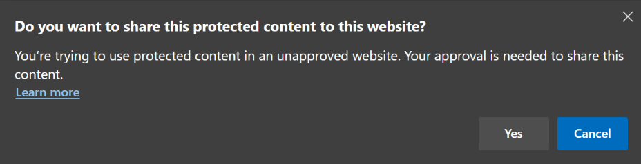
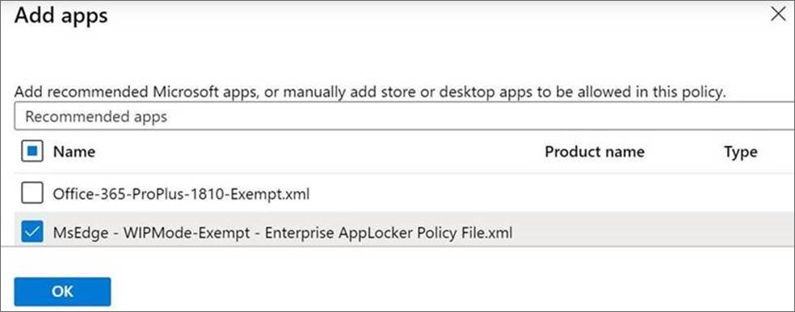

# Microsoft Edge support for Windows Information Protection (WIP)

This article describes how Microsoft Edge supports Windows Information Protection (WIP).

> [!NOTE]
> This applies to Microsoft Edge version 81 or later.

## Overview

Windows Information Protection (WIP) is a Windows 10 feature that helps protect enterprise data from unauthorized or accidental disclosure. With the rise of remote work, there's an increased risk of sharing corporate data outside the workplace. This risk increases when personal activities and work activities occur on corporate devices.

Microsoft Edge supports WIP to help protect content in a web environment where users often share and distribute content.

### System requirements

The follow requirements apply to devices using WIP in the enterprise:

- Windows 10, version 1607 or later
- Only Windows client SKUs
- One of the management solutions described in [WIP prerequisites](/windows/security/information-protection/windows-information-protection/protect-enterprise-data-using-wip#prerequisites)

### Windows Information Protection benefits

WIP provides the following benefits:

- Obvious separation between personal and corporate data, without requiring employees to switch environments or apps.
- Additional data protection for existing line-of-business apps without a need to update the apps.
- The ability to remote wipes corporate data from Intune Mobile Device Management (MDM) enrolled devices while leaving personal data unaffected. 
- Audit reports for tracking issues and for remedial actions such as compliance training for users.
- Integration with your existing management system to configure, deploy, and manage WIP. Some examples are Microsoft Intune, Microsoft Endpoint Configuration Manager, or your current mobile device management (MDM) system.

## WIP policy and protection modes

Using policies, you can configure the four protection modes described in the following table. For more information, see [WIP-protection modes](/windows/security/information-protection/windows-information-protection/protect-enterprise-data-using-wip#wip-protection-modes).

| Mode | Description |
|------|-------------|
| Block | WIP looks for inappropriate data sharing practices and stops the employee from completing the action. This search can include sharing enterprise data to non-enterprise-protected apps in addition to sharing enterprise data between apps or attempting to share outside of your organization's network. |
| Allow Overrides | WIP looks for inappropriate data sharing, warning employees if they do something deemed potentially unsafe. However, this management mode lets the employee override the policy and share the data, logging the action to your audit log. |
| Silent | WIP runs silently, logging inappropriate data sharing, without stopping anything that would have been prompted for employee interaction while in Allow Overrides mode. Unallowed actions, like apps inappropriately trying to access a network resource or WIP-protected data, are still stopped. |
| Off | WIP is turned off and doesn't help to protect or audit your data. After you turn off WIP, an attempt is made to decrypt any WIP-tagged files on the locally attached drives. Your previous decryption and policy info isn't automatically reapplied if you turn WIP protection back on.
 |

## WIP features supported in Microsoft Edge

Starting with Microsoft Edge version 81, the following features are supported:

- Work sites will be indicated by a briefcase icon on the address bar.  
- Files downloaded from a work location are automatically encrypted.
- Silent/Block/Override enforcement for work file uploads to non-work locations.  
- Silent/Block/Override enforcement for file Drag & Drop actions.
- Silent/Block/Override enforcement for Clipboard actions.
- Browsing to work locations from non-work profiles automatically redirects to the Work Profile (associated with the Azure AD Identity.)
- IE Mode supports full WIP functionality.

## Working with WIP in Microsoft Edge

After WIP support is enabled for Microsoft Edge, users will see when work-related information is accessed. The next screenshot shows the briefcase icon in the address bar, indicating that work-related information is accessed via the browser.

 

Microsoft Edge gives users the ability to share protected content in an unapproved website. The next screenshot shows the Microsoft Edge prompt that allows a user to use protected content in an unapproved website.

 

## Configure policies to support WIP

Using WIP with Microsoft Edge requires the presence of a work profile.

### Ensure the presence of a work profile

On hybrid joined machines, Microsoft Edge is automatically signed in with the Azure Active Directory (Azure AD) account. To make sure that users don't remove this profile, which is needed for WIP, configure the following policy:

- [NonRemovableProfileEnabled](./microsoft-edge-policies.md#nonremovableprofileenabled)

> [!NOTE]
> If your environment isn't hybrid joined, you can hybrid join using these instructions: [Plan your hybrid Azure Active Directory join implementation](/azure/active-directory/devices/hybrid-azuread-join-plan).

If hybrid joining isn't an option, you can use on-prem Active Directory accounts to allow Microsoft Edge to auto create a special work profile with the users' domain accounts. Note that on-premises accounts may not receive all of Azure AD's features, such as cloud sync, Office NTP, and so on.)

#### Active Directory (AD) accounts

For AD accounts, you must configure the following policy to have the Microsoft Edge auto create a special work profile.

- [ConfigureOnPremisesAccountAutoSignIn](./microsoft-edge-policies.md#configureonpremisesaccountautosignin)

### Windows policies for WIP

You can configure WIP using Windows policies. For more information, see [Create and deploy WIP policies using Microsoft Intune](/windows/security/information-protection/windows-information-protection/overview-create-wip-policy)

## Frequently Asked Questions

### How do I resolve Error Code -2147024540?

This error code corresponds to the following Windows Information Protection error: *ERROR_EDP_POLICY_DENIES_OPERATION: The requested operation was blocked by Windows Information Protection policy. For more information, contact your system administrator.*

Microsoft Edge shows this error when the organization has enabled Windows Information Protection (WIP) to only allow users with approved applications to access corporate resources. In this case because Microsoft Edge isn't on the approved applications list, the admin will have to update the WIP policies to grant access to Microsoft Edge.

The following screenshot shows how the Microsoft Intune is used to add Microsoft Edge as an allowed app for WIP.

 

If you're not using Microsoft Intune, download and apply the policy update in the [WIP Enterprise AppLocker Policy](https://download.microsoft.com/download/8/9/9/8995d820-065c-4ab1-aa2a-9d6dc0cd7ffa/MsEdge%20-%20WIP%20Enterprise%20AppLocker%20Policy%20Files.zip) file.

## See also

- [Microsoft Edge Enterprise landing page](https://aka.ms/EdgeEnterprise) 
- [Protect enterprise data using Windows Information Protection](/windows/security/information-protection/windows-information-protection/protect-enterprise-data-using-wip)