# Manage the sidebar in Microsoft Edge

This article describes the sidebar in Microsoft Edge and provides information about the  procedures that admins can use to manage this feature  in their organization.

> [!NOTE]
> The Microsoft Edge management service, a dedicated and simplified management tool in the Microsoft 365 admin center, is rolling out now. [Learn more](/deployedge/microsoft-edge-management-service).

## Introduction to the sidebar

For a growing number of people, the browser has become the place where work happens. As the transition from juggling apps to switching tabs entrenches web-based tools in our workflows, the risks to productivity mount. With the sidebar in Microsoft Edge, Enterprise users can access the productivity tools they need while staying in their workflow.

## Use group policies to manage the sidebar

Admins have several policy options for deploying and managing the sidebar in their organization. The following policies can be applied to the sidebar and the individual apps referenced by the sidebar.

| Policy Name | Caption |
|:-----|:-----|
| [HubsSidebarEnabled](/deployedge/microsoft-edge-policies#hubssidebarenabled) | Show Hubs Sidebar |
| [EdgeOpenInSidebarEnabled](/deployedge/microsoft-edge-policies#edgeopeninsidebarenabled) | Enable open in sidebar   |
| [EdgeSidebarCustomizeEnabled](/deployedge/microsoft-edge-policies#edgesidebarcustomizeenabled) | Enable sidebar customize   |
| [EdgeSidebarAppUrlHostBlockList](/deployedge/microsoft-edge-policies#edgesidebarappurlhostblocklist) | Control which apps cannot be opened in Microsoft Edge sidebar |
| [ExtensionInstallBlockList](/deployedge/microsoft-edge-policies#extensioninstallblocklist) | Control which extensions can't be installed |
| [ExtensionInstallAllowList](/deployedge/microsoft-edge-policies#extensioninstallallowlist) |  Allow specific extensions to be installed |
| [ExtensionInstallForceList](/deployedge/microsoft-edge-policies#extensioninstallforcelist) | Control which extensions are installed silently |

> [!NOTE]
> The reuse of Extensions-specific policies for managing the sidebar is intentional and intended to promote flexibility. Navigate to `edge://sidebar-internals` in your browser to find the extension IDs associated with individual sidebar apps.

## Allow or block the sidebar in group policy

You can use [HubsSidebarEnabled](/deployedge/microsoft-edge-policies#hubssidebarenabled) policy to control whether the sidebar is allowed or blocked in your organization. Blocking the sidebar will automatically block all sidebar apps from being enabled. On Microsoft Edge 116 or later, this policy allows or blocks the sidebar in [Progressive Web Apps (PWAs)](/microsoft-edge/progressive-web-apps-chromium/).

1. Open the group policy editor and go to **Administrative Templates** > **Microsoft Edge** and then select **Show Hubs Sidebar**.
2. To block the sidebar and all sidebar apps, select **Disabled**.
3. To allow the sidebar, select **Enabled**. The new setting will take affect after you restart the browser.

Note that blocking the sidebar removes access to the new Discover app that appears in the toolbar (Microsoft Edge 111 or later).

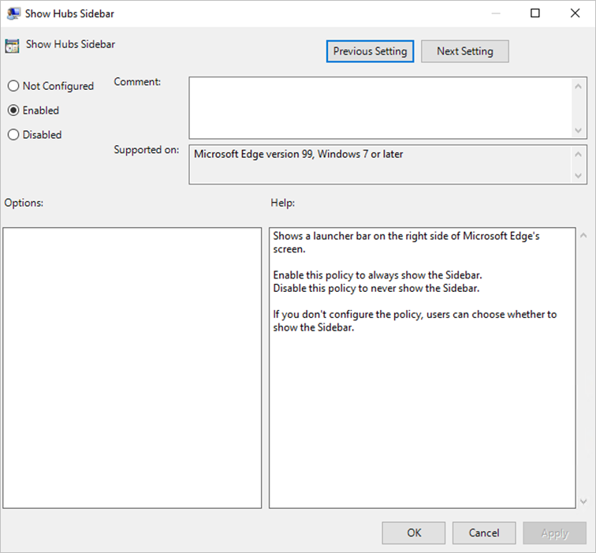
<!-- ====================================================================== -->
## Open website or app in the sidebar

 You can use the [EdgeOpenInSidebarEnabled](/deployedge/microsoft-edge-policies#edgeopeninsidebarenabled) policy to open a website or app in the sidebar. If this policy is enabled a user can select **Open in sidebar** in **Settings and more**.

<!--- screenshot showing icon in sidebar ---->
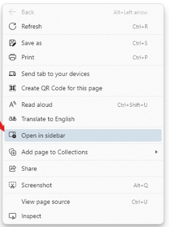

Use the following steps as a guide to configuring this policy.

1. Open the group policy editor and go to **Administrative Templates** > **Microsoft Edge** and then select **Enable open in sidebar**.
2. This policy is disabled by default. Select **Enabled** to let websites and apps open in the sidebar. The new setting will take affect after you restart the browser.

<!--- group policy screenshot  ---->
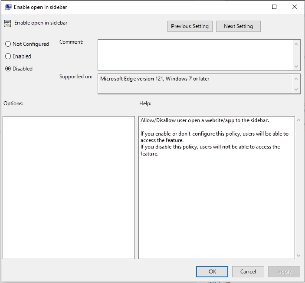
<!-- ====================================================================== -->
## Customize sidebar

You can use the [EdgeSidebarCustomizeEnabled](/deployedge/microsoft-edge-policies#edgesidebarcustomizeenabled) policy to let users customize the sidebar by adding or deleting an app. If this policy is enabled, a user can mouseover the plus (**+**) sign, and then click **Customize**.

<!--- screenshot showing icon in sidebar ---->
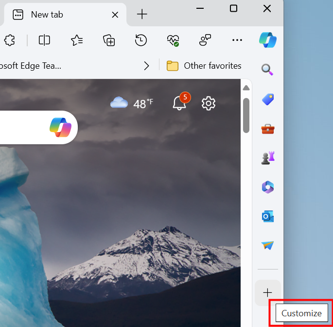

Use the following steps as a guide to configuring this policy.

1. Open the group policy editor and go to **Administrative Templates** > **Microsoft Edge** and then select **Enable sidebar customize**.
2. This policy is disabled by default. Select **Enabled** to let users customize the sidebar. The new setting will take affect after you restart the browser.
<!--- group policy screenshot  ---->
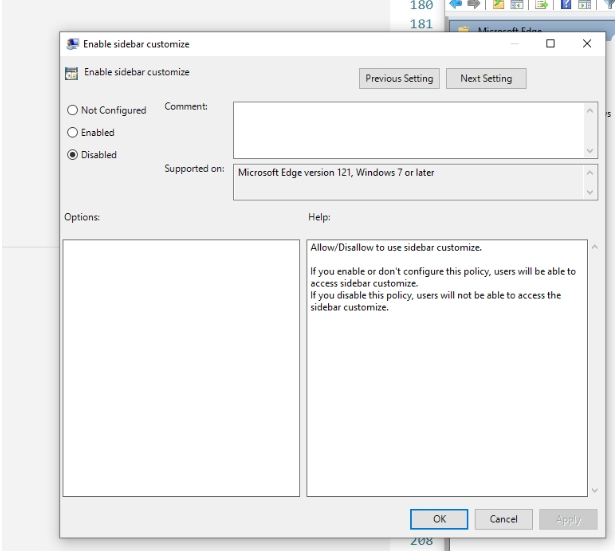

<!-- =========================================== -->
## Block specific sidebar apps

You can use the [ExtensionInstallBlockList](/deployedge/microsoft-edge-policies#extensioninstallblocklist) policy to control which sidebar apps are blocked.

Use the following steps as a guide to block a sidebar app.

1. Open the group policy management editor and go to **Administrative Templates** > **Microsoft Edge** > **Extensions** and then select **Control which extensions cannot be installed**.
2. Select **Enabled**.
3. Click **Show**.
4. Enter the extension ID of the sidebar app that you want to block.
   -  You can find Extension IDs for sidebar apps by going `edge://sidebar-internals`.
   - The Sidebar Internals JSON file includes a manifest for all sidebar apps, including an `extension_id` parameter for each app. You can use these values to configure the policy.
   - When adding multiple IDs, use a separate row for each ID.
5. To block all sidebar apps, refer to [Allow or block the sidebar in group - policy](#allow-or-block-the-sidebar-in-group-policy). Disabling the HubsSidebarEnabled policy blocks all sidebar apps by default.

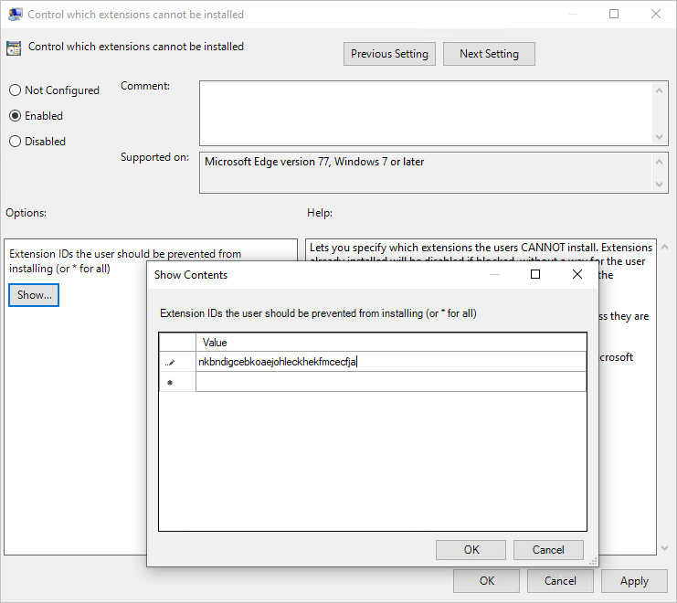

<!-- =========================================== -->
## Block sidebar apps except Search using URLS

You can use the [EdgeSidebarAppUrlHostBlockList]( /deployedge/microsoft-edge-policies#edgesidebarappurlhostblocklist) policy to control which sidebar apps are blocked, except the Search app. To block the Search app, see [Block the Search app](#block-the-search-app).

### URLs for apps

Built-in Edge apps include Copilot, Shopping, Tools, Games, Microsoft Office, Outlook, Drop, Eco tree, Image Creator, OneNote, Designer, and so on.

You can find these URLs at `edge://sidebar-internals`. The side-bar internals JSON file includes a manifest for built-in sidebar apps, including an **"target": {"url": "xyz"}** parameter for each app. You can use these values to configure the policy.  

> [!NOTE]
> For external web sites (for example, google.com, youtube.com, and tiktok.com), enter the site URL.

Use the following steps as a guide to configuring which apps can't be opened in the sidebar.
  
1. Open the group policy management editor and go to **Administrative Templates** > **Microsoft Edge** and then select **Control which apps cannot be opened in Microsoft Edge sidebar**.
2. Select **Enabled**.
3. Click **Show**.
4. Enter the URLs or URL patterns of the sidebar app that you want to block. For more information about valid URL patterns, see [Filter format for URL list-based policies](https://go.microsoft.com/fwlink/?linkid=2095322).
5. Click **OK** when you're finished entering URLs.

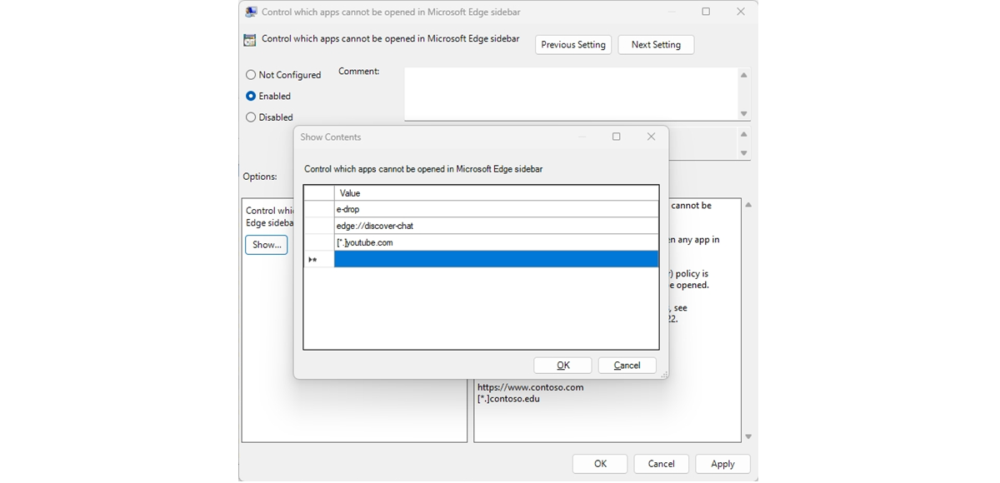

## Block the Search app

The  Search app doesn't have a URL. You can only use the [ExtensionInstallBlockList](/deployedge/microsoft-edge-policies#extensioninstallblocklist) policy to control the Search app.

Use the following steps as a guide to block the Search app.

1. Open the group policy management editor and go to **Administrative Templates** > **Microsoft Edge** > **Extensions**.
2. Select **Control which extensions cannot be installed**.
3. Select **Enabled**.
4. Click **Show**.
5. Enter the **extension ID** of the Search app to block and then click **OK**.
   - The Search app **extension_id**, shown in the next screenshot is **jbleckejnaboogigodiafflhkajdmpcl**.
   - You can also find Extension ID for Search app by going to `edge://sidebar-internals`.
   - The Sidebar internals JSON file includes a manifest for all sidebar apps, including an **extension_id** parameter for each app. You can use these values to configure the policy.

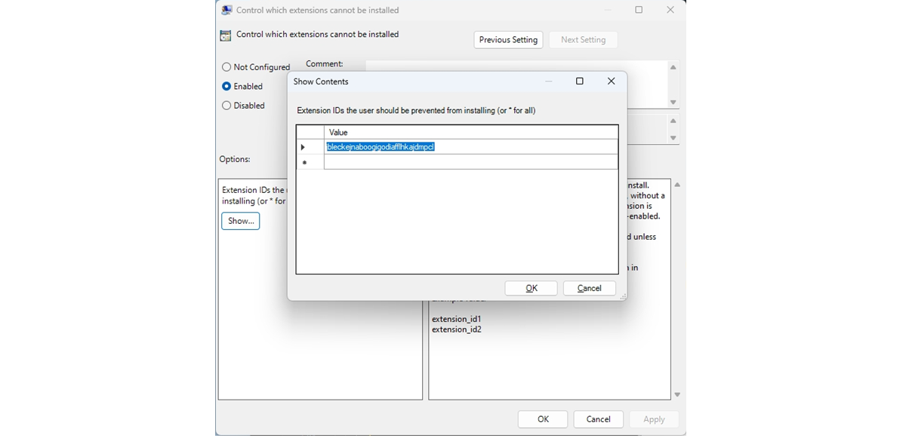

<!-- =========================================== -->
## Block all sidebar apps

There are two options for blocking all sidebar apps.

The first option is to disable the [HubsSidebarEnabled](/deployedge/microsoft-edge-policies#hubssidebarenabled) policy to block all sidebar apps by default. For more information, see [Allow or block the sidebar in group policy](#allow-or-block-the-sidebar-in-group-policy).

The second option is to set the [EdgeSidebarAppUrlHostBlockList](/deployedge/microsoft-edge-policies#edgesidebarappurlhostblocklist) policy as **\*** to block all sidebar apps except Search. Use the following steps as a guide to configure this policy.

1. Open the group policy management editor and go to **Administrative Templates** > **Microsoft Edge** and then select **Control which apps cannot be opened in Microsoft Edge sidebar**.
2. Select **Enabled**.
3. Click **Show**.
4. Enter **\*** to block all sidebar apps except Search and then click **OK**.

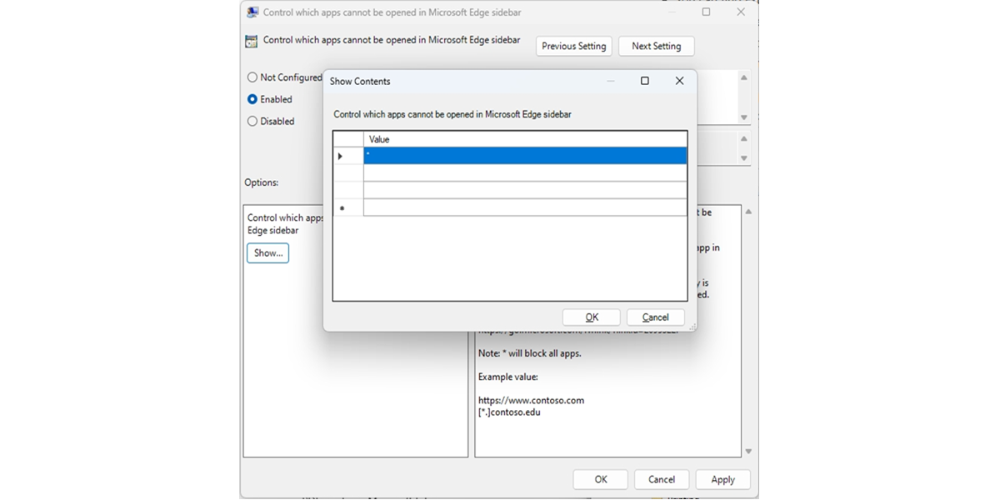

<!-- =========================================== -->
## Allow specific sidebar apps

You can use the [ExtensionInstallBlocklist](/deployedge/microsoft-edge-policies#extensioninstallblocklist) and [ExtensionInstallAllowlist](/deployedge/microsoft-edge-policies#extensioninstallallowlist) policies to allow specific sidebar apps while blocking the rest of the sidebar apps. Use the following steps as a guide to exempt a specific sidebar app from the blocklist.

1. Open the group policy management editor and go to **Administrative Templates** > **Microsoft Edge** > **Extensions** and then select "Control which extensions cannot be enabled".
2. Select **Enabled**.
3. Click **Show**.
4. Enter **\***.

   Use group policy to see what extensions can't be enabled:

   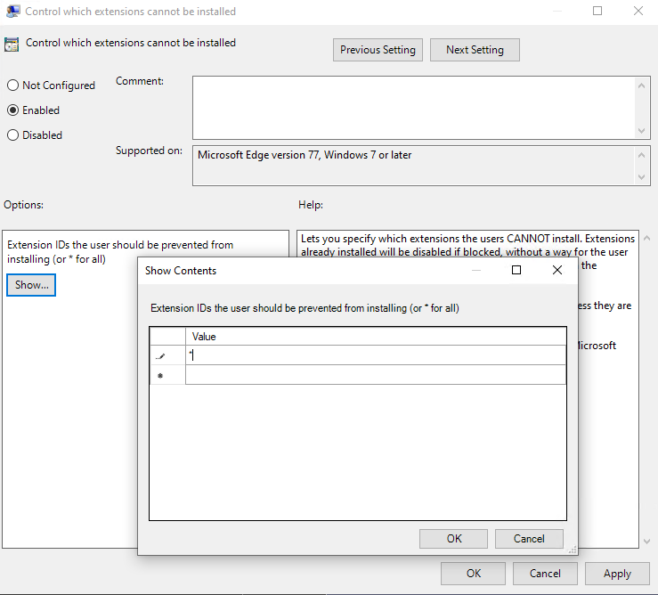

5. In the group policy management editor, go to **Administrative Templates** > **Microsoft Edge** > **Extensions** and then select "Allow specific extensions to be installed".
6. Enter the **Extension ID** of the sidebar app that you want to allow.
   1. You can find Extension IDs for sidebar apps by going to `edge://sidebar-internals` from the omnibox in Microsoft Edge.
   1. The resulting manifest (which can be exported to JSON file) lists all the  sidebar apps including an `extension_id` parameter for each app. You can use these values to configure the policy.
   1. When adding multiple IDs, use a separate row for each ID.
7. The user can then choose to enable/disable the allowed sidebar app. To force enable a sidebar app, refer to the next section, which has information about the [ExtensionInstallForcelist](/deployedge/microsoft-edge-policies#extensioninstallforcelist) policy.

   Use group policy to allow the installation of specific extensions:

   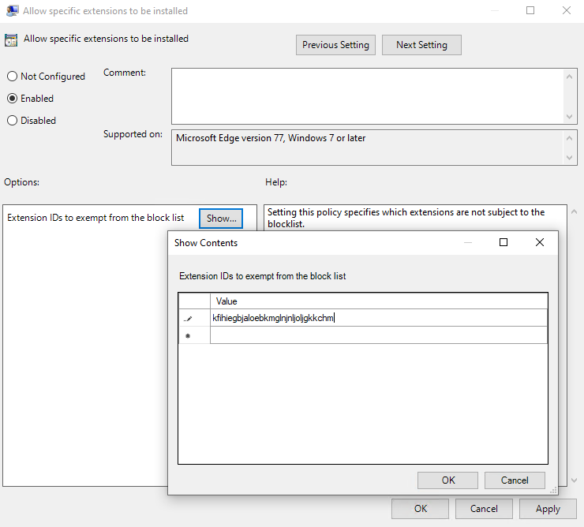

## Force enable specific sidebar apps

Use the [ExtensionInstallForceList](/deployedge/microsoft-edge-policies#extensioninstallforcelist) policy to enable specific sidebar apps that users in your organization can't disable. Use the following steps as a guide to force enable a sidebar app.

1. In the Group Policy Editor, go to **Administrative Templates** > **Microsoft Edge** > **Extensions** and then select **Control which extensions are installed silently**.
2. Select **Enabled**.
3. Click **Show**.
4. Enter the extension ID(s) for the sidebar apps you want to force enable.

The sidebar app is enabled silently without needing any user interaction. The user won't be able to remove this app from the sidebar. This setting overwrites any blocklist policy that's enabled.

## See also

- [Microsoft Edge Enterprise landing page](https://aka.ms/EdgeEnterprise)