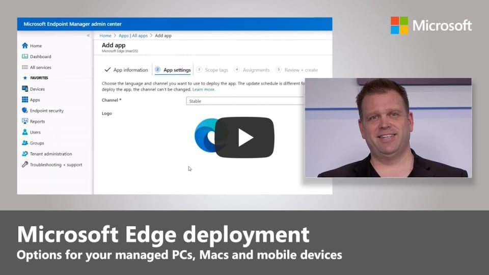

# Video: Deploy Microsoft Edge to hundreds or thousands of devices

This video shows the steps to deploy Microsoft Edge to all your managed devices. Click the next screenshot to watch the video by Jeremy Chapman, Director Microsoft 365.

## About the video

See a hands-on tour of how to deploy Microsoft Edge to your devices. Learn about Microsoft Edge package options for automated installation, how to deploy Microsoft Edge to Windows PCs using Microsoft Endpoint Configuration Manager, and steps to ensure all managed devices, including your phones and Macs, are provisioned with Microsoft Edge.

## See also

- [Microsoft Edge Enterprise landing page](https://aka.ms/EdgeEnterprise)
- [Microsoft Edge YouTube playlist](https://www.youtube.com/playlist?list=PLXtHYVsvn_b-uXh1tMeYpT-0iD8tD3tFy)
