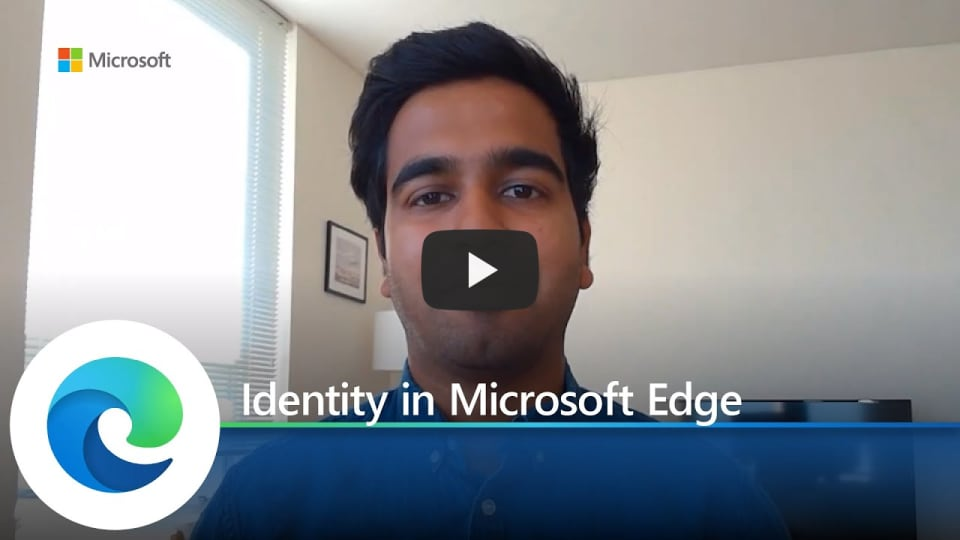

# Video: Microsoft Edge and Identity

This video shows how Microsoft Edge enables and supports identity for enterprise users. Click the next screenshot to watch the video by Avi Vaid, Program Manager 2.

## About the video

Configure an authenticated and personalized experience for your users with Microsoft Edge. This talk will dive into configuring sign in, single sign on, and multiple profiles to help you get the best out of Microsoft Edge.

## See also

- [Microsoft Edge Enterprise landing page](https://aka.ms/EdgeEnterprise)
- [Microsoft Edge YouTube playlist](https://www.youtube.com/playlist?list=PLXtHYVsvn_b-uXh1tMeYpT-0iD8tD3tFy)
