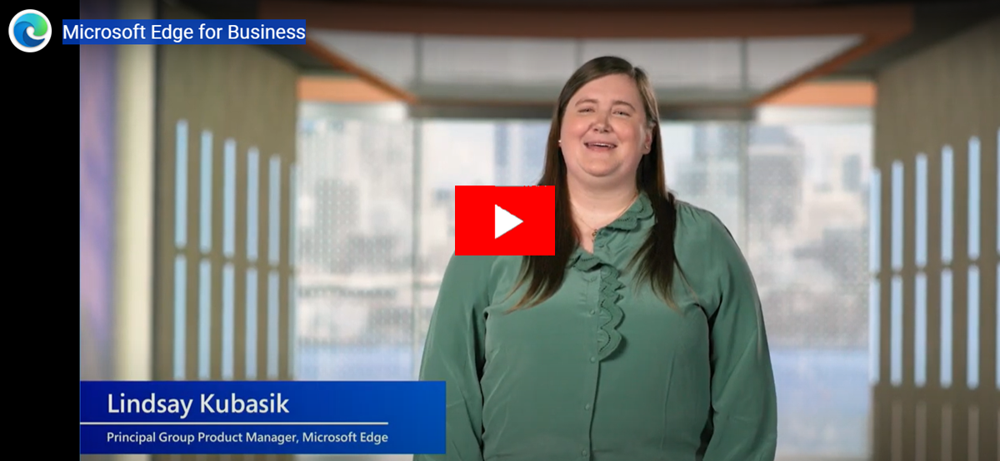

# Video: Microsoft Edge for Business

This video gives an overview of the key features of Microsoft Edge for Business.

Click the next screenshot to watch the video by Lindsay Kubasik, Principal Group Product Manager.

## About the video

It's been an exciting year for Microsoft Edge! We've continued our mission for Microsoft Edge to be the best browser for business. Come learn about Microsoft Edge for Business, a new, dedicated Microsoft Edge experience built for work that enables admins in organizations to give their users a productive and secure work browser across managed and unmanaged devices. We've been listening and learning from you and we'll share how all of that feedback fits into Microsoft Edge.

## See also

- [Microsoft Edge Enterprise landing page](https://aka.ms/EdgeEnterprise)
- [Microsoft Edge YouTube playlist](https://www.youtube.com/playlist?list=PLXtHYVsvn_b-uXh1tMeYpT-0iD8tD3tFy)