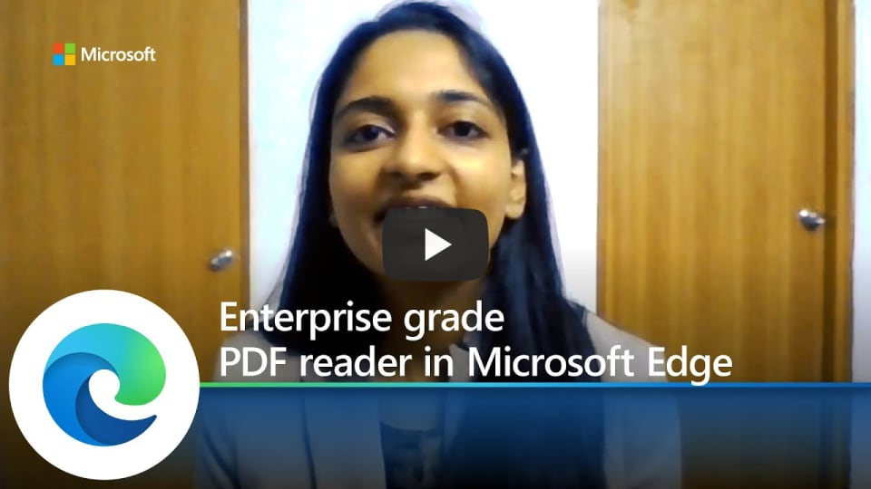

# Video: Microsoft Edge enterprise grade PDF reader

This video shows Microsoft Edge's enterprise grade PDF reader. Click the next screenshot to watch the video by Aditi Gangwar, Program Manager 2.

## About the video

This video highlights the features in  Microsoft Edge's built-in PDF reader. See how users can ink and highlight PDFs, open protected documents, and view and validate certificate-based Digital Signatures.

## See also

- [Microsoft Edge Enterprise landing page](https://aka.ms/EdgeEnterprise)
- [PDF reader in Microsoft Edge](microsoft-edge-pdf.md)
- [Microsoft Edge YouTube playlist](https://www.youtube.com/playlist?list=PLXtHYVsvn_b-uXh1tMeYpT-0iD8tD3tFy)
