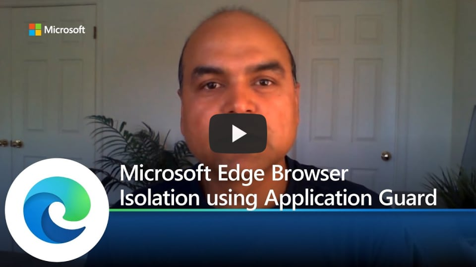

# Video: Microsoft Edge browser isolation using Application Guard

This video shows how Microsoft Edge supports browser isolation using Application Guard. Click the next screenshot to watch the video by Arunesh Chandra, Senior Program Manager, Microsoft Edge Security.

## About the video

With Microsoft Edge, help reduce your enterprise's exposure to web-based attacks. Learn how Microsoft Edge supports Microsoft Defender Application Guard to use browser isolation against external threats.

## See also

- [Microsoft Edge Enterprise landing page](https://aka.ms/EdgeEnterprise)
- [Microsoft Edge support for Microsoft Defender Application Guard](microsoft-edge-security-windows-defender-application-guard.md)
- [Microsoft Edge YouTube playlist](https://www.youtube.com/playlist?list=PLXtHYVsvn_b-uXh1tMeYpT-0iD8tD3tFy)