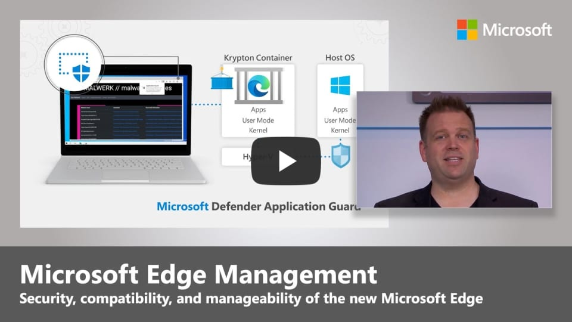

# Video: Microsoft Edge security, compatibility, and manageability

This video shows how Microsoft Edge takes security, compatibility, and manageability to the next level. Click the next screenshot to watch the video by Jeremy Chapman, Director of Microsoft 365.

## About the video

Take a hands-on tour to experience the security, compatibility, and manageability of the new Microsoft Edge. Microsoft Edge is based on Chromium and designed to be the best browser for business. Our host, Jeremy Chapman, shows you what sets it apart from other browsers. This deep dive includes:

- Security. Microsoft Edge helps protect your network and devices from malicious attacks and prevents unauthorized access and leaks of corporate data.
- Compatibility. Microsoft Edge is compatible with both the modern and legacy web.
- Manageability. Consider your update management or servicing options for Microsoft Edge.

## See also

- [Microsoft Edge Enterprise landing page](https://aka.ms/EdgeEnterprise)
- [Microsoft Edge security for your business](ms-edge-security-for-business.md)
- [Microsoft Edge YouTube playlist](https://www.youtube.com/playlist?list=PLXtHYVsvn_b-uXh1tMeYpT-0iD8tD3tFy)