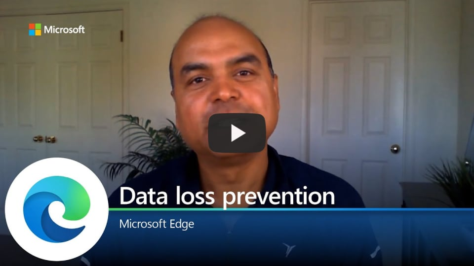

# Video: Microsoft Edge and Data loss prevention (DLP)

This video shows how Microsoft Edge supports data loss prevention. Click the next screenshot to watch the video by Arunesh Chandra, Senior Program Manager, Microsoft Edge Security.

## About the video

Data Loss Prevention (DLP) has never been more important than now with remote work. Learn about the native DLP capabilities in Microsoft Edge and how DLP helps you keep your data under corporate control and remain compliant.

## See also

- [Microsoft Edge Enterprise landing page](https://aka.ms/EdgeEnterprise)
- [Data Loss Prevention (DLP) in Microsoft Edge](microsoft-edge-security-dlp.md)
- [Microsoft Edge YouTube playlist](https://www.youtube.com/playlist?list=PLXtHYVsvn_b-uXh1tMeYpT-0iD8tD3tFy)
