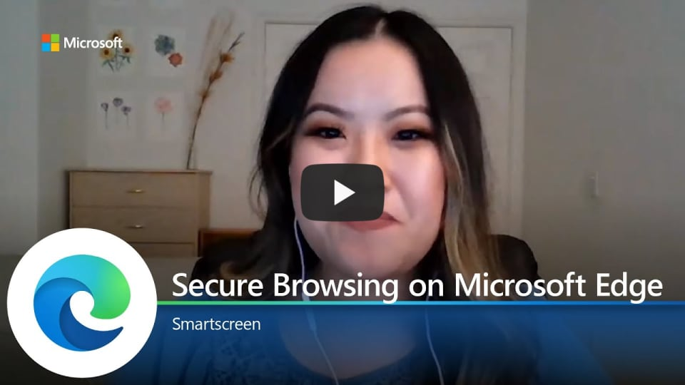

# Video: Secure browsing on Microsoft Edge

This video shows how Microsoft Edge supports secure browsing using Microsoft Defender SmartScreen. Click the next screenshot to watch the video by Eva Chen, Program Manager.

## About the video

Microsoft Edge uses Microsoft Defender SmartScreen to help keep you safe while you browse. Come learn about the recent phishing and malware protection results from NSS Labs, and more about how Microsoft Defender SmartScreen brings premium enterprise security integration to Microsoft Edge.

> [!TIP]
> Turn on the setting for protection from potentially unwanted apps in *edge://settings*.

## See also

- [Microsoft Edge Enterprise landing page](https://aka.ms/EdgeEnterprise)
- [Microsoft Edge support for Microsoft Defender SmartScreen](microsoft-edge-security-smartscreen.md)
- [Microsoft Edge YouTube playlist](https://www.youtube.com/playlist?list=PLXtHYVsvn_b-uXh1tMeYpT-0iD8tD3tFy)
