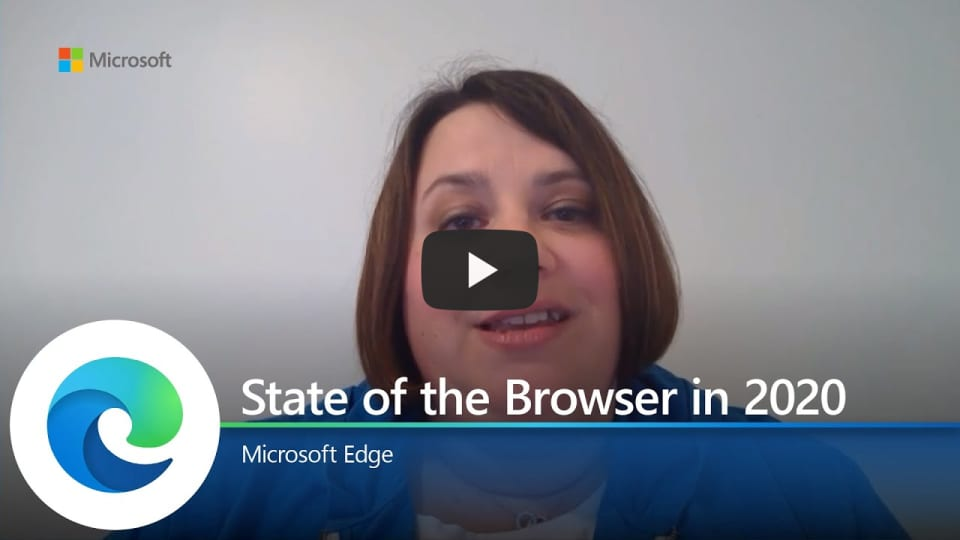

# Video: Microsoft Edge: State of the browser 2020

This video gives an overview of the key features of Microsoft Edge.

Click the next screenshot to watch the video by Colleen Williams, Senior Program Manager.

## About the video

It's been an exciting year for Microsoft Edge! We've continued our mission for Microsoft Edge to be the best browser for business. Come learn about new security and productivity features and our continued integration with M365. We've been listening and learning from you and we'll share how all of that feedback fits into Microsoft Edge.

## See also

- [Microsoft Edge Enterprise landing page](https://aka.ms/EdgeEnterprise)
- [Microsoft Edge YouTube playlist](https://www.youtube.com/playlist?list=PLXtHYVsvn_b-uXh1tMeYpT-0iD8tD3tFy)