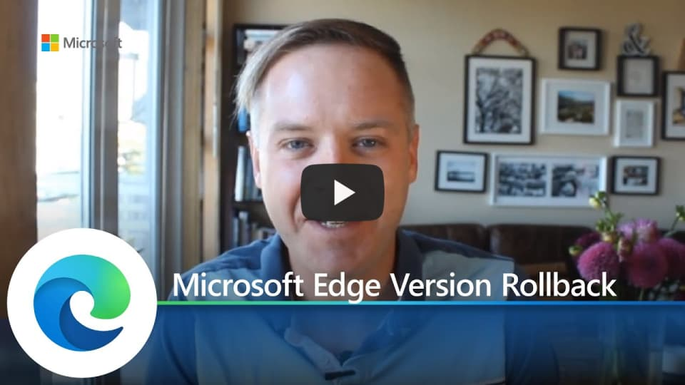

# Video: Microsoft Edge version rollback

This video shows how Microsoft Edge supports version rollback. Click the next screenshot to watch the video by Andy Zeigler, Principal Program Manager.

## About the video

Version rollback lets you replace your Microsoft Edge browser version with an earlier one. Come learn how rollback in Microsoft Edge can provide your enterprise with a safety net to help reduce potential impact as you troubleshoot any issues in Microsoft Edge.

## See also

- [Microsoft Edge Enterprise landing page](https://aka.ms/EdgeEnterprise)
- [Microsoft Edge YouTube playlist](https://www.youtube.com/playlist?list=PLXtHYVsvn_b-uXh1tMeYpT-0iD8tD3tFy)
