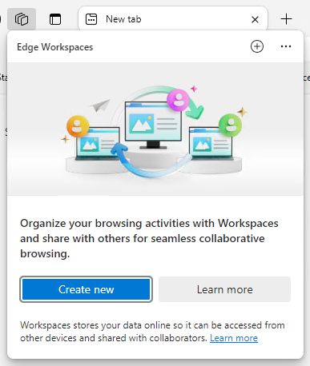
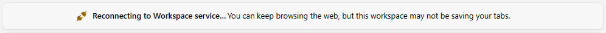
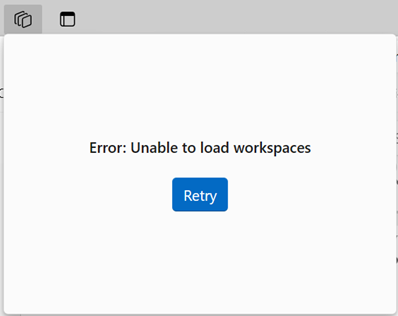

# Microsoft Edge Workspaces

This article describes the productivity benefits Edge Workspaces will bring to your users and how you can enable this feature and its functions in your organization.

> [!NOTE]
> Edge Workspaces for personal use is now available in Edge stable version 120. To learn more, visit [Workspaces Features & Tips](https://www.microsoft.com/en-us/edge/features/workspaces?form=MA13FJ).

## Overview

Edge Workspaces provides an incredible way for customers to organize their browsing tasks into dedicated windows. Each Edge Workspace contains its own sets of tabs and favorites, all created and curated by the user and their collaborators. Edge Workspaces are automatically saved and kept up to date. Workspaces are accessible anywhere customers use Microsoft Edge with their Microsoft Entra accounts.

[Microsoft Edge Workspaces: Stay on the same page with shared browser tabs](https://www.youtube.com/embed/bNRY9Zm1QY8)

### Edge Workspace scenarios

The following are key scenarios for using Edge Workspaces in your organization:

- Onboarding individuals to a project or working on projects with multiple teams can be difficult. With so many websites and files emailed back and forth, it's hard to track everything. Instead of sharing links back and forth, you can create a workspace with a shared set of open websites and working files and then send one link to quickly onboard a new individual or to make sure your team is on the same page.
- If an individual is working on multiple projects, they can create a workspace to organize the open tabs they have for each project. Whenever they want to work on that project, they can easily open its Edge Workspace and have everything they need in one place.

## Prerequisites

- Users must have a Microsoft Entra tenant and Microsoft Edge version 114 or later installed.
- To manage via group policy, Admins must have Microsoft Edge version 114 or later installed and version 114 of the policy files.
- Users must have access to a OneDrive for Business license to create an Edge Workspace.  

> [!IMPORTANT]
> Remember that each user in a shared Edge Workspace brings their own identity, authentication, and cookies to the open websites. A user might have access to a specific workspace but might not have access to all the websites loaded in the workspace.

## Manage workspaces for users

Edge Workspaces is enabled for users signed in with a Microsoft Entra account on Edge version 114 or later. You can manage Edge Workspaces for your users by using the [EdgeWorkspacesEnabled](/DeployEdge/microsoft-edge-policies#edgeworkspacesenabled) policy.

## The Edge Workspaces user experience

Edge Workspaces lets users share a set of browser tabs so that working groups can view the same websites and latest working files in one place and stay on the same page.

Imagine a scenario where a team member is being onboarded to a new project or is being added to a project in progress. Instead of sending multiple links back and forth over email, it's more productive and convenient to share all the links as open tabs in a workspace. Additionally, the user will be able to see which tab each group member is on and, if tabs are updated, will see those updates happen in real time.

To learn more about how to get your users started with Edge Workspaces, visit [Discover your edge at work](https://aka.ms/LearnAboutEdgeWorkspaces).

### Workspaces sharing

A workspace shares the following information:

- The workspace's browser tabs, favorites, and history with your team in real time  
- The active tab for each group member that has the workspace open

A workspace doesn't share the following information:

- A user's logins, passwords, downloads, collections, extensions, and cookies.  
- Personal browser settings such as appearance or search engine.
- Any tabs or data from outside the workspace.
- Website content that only the user can access. For example, if the user logs in to their email in a shared Edge Workspace, only the user will see their email content.
- A user's device screen. Users sharing a workspace won't see how other users interact with an open website or website content that they don't have access to.

## Configure navigation settings policy

You can configure Workspaces navigation using the **WorkspacesNavigationSettings** policy.

The following general rules apply to Workspaces navigation:

- Only top-level navigations are shared among users. IFrame or subframe navigations aren't shared.
- Only user-initiated navigations are shared. Page-initiated navigations that don't have a corresponding user gesture are not shared.
- POST requests aren't shared.

These basic rules produce consistent behavior for users sharing tabs in a workspace. However, sometimes additional customization can further optimize the shared navigation experience of Workspaces users.

### Specifying matching patterns

To define customized Workspaces navigation behavior, you must first describe the set of URL patterns to which the behavior will apply. You can list these patterns using either the `url_patterns` property, the `url_regex_patterns` property, or both properties.

- `url_patterns`: The format used for the `url_patterns` property is described in [Filter format for URL list-based policies](/DeployEdge/edge-learnmmore-url-list-filter%20format).
- `url_regex_patterns`: When using the `url_patterns` property isn't expressive enough, you can use general regular expressions in the `url_regex_patterns` property. Rules for using regular expressions are given in [Regular Expression 2 (re2.h) syntax](/DeployEdge/edge-learnmore-regex).

### Navigation options

You can associate any or all of the following options with a set of URL patterns:

- **do_not_send_from** – If a navigation otherwise qualifies to be shared with all Workspace users, this option will prevent the navigation from being shared if the referrer URL matches one of your patterns. For a same-document navigation, the referrer is considered the URL of the document itself, not the original referrer of the page.
- **do_not_send_to**  – If a navigation otherwise qualifies to be shared with all Workspace users, this option will prevent the navigation from being shared if the destination URL matches one of your patterns.
-  **prefer_initial_url** – If a navigation qualifies to be shared with all Workspace users and there were server-side redirects during the navigation, by default the URL that is shared is the final URL. Using the prefer_initial_url option will cause the initial URL to be shared, so long as it isn't a POST request.
- **remove_all_query_parameters** - If a navigation qualifies to be shared with all Workspace users, using this option removes the query string before the navigation is shared.
- **query_parameters_to_be_removed** - If a navigation qualifies to be shared with all Workspace users, using this option removes only the specified named query string arguments from the query string before the navigation is shared. 

## Providing feedback

Your feedback while using Edge Workspaces is valuable to help us improve the product!

You can leave feedback by clicking the **Like** or **Dislike** button at the bottom of the Edge Workspace menu. These buttons are next to the question "Are you satisfied with Workspaces?".

## Frequently Asked Questions

### My users got the following message when they opened Edge Workspaces for the first time. What does this message mean and what should they do?

This message is shown the first time a user selects the Workspaces menu in the browser. They have the option to get more information or click **Create new** to create a workspace.

### I see the "Reconnecting to Workspace service" message. Why do I see this message and what should I expect?

This message is due to a temporary connectivity issue because Microsoft Edge can't connect to the service that provides and supports Edge Workspaces.

### I see the "Update Microsoft Edge" message. Why do I see this message and what should I expect?

The Edge Workspaces software was updated and you need to update Microsoft Edge to keep using your workspaces.

### My user got the following error. What should they do?

The Edge Workspaces software was updated and you need to update Microsoft Edge to keep using your workspaces.

### My user got the "Error: Unable to load workspaces" message. What should they do?

Try to sign out and sign back into Microsoft Edge. Go to `edge://settings/profiles` and click  **Sign out**, then click **Sign in to sync data**.

If this issue continues even after signing out and signing back in, you can submit feedback to the Edge team by clicking the **Like** or **Dislike** button at the bottom of the Edge Workspace menu. These buttons are next to the question "Are you satisfied with Workspaces?".

### Can I lock down an Edge workspace after I share it (Read-only) so that I'm the only one who can close, open, or move tabs?

Yes. You can use Locked Tabs. This feature lets you keep tabs where you put them in an Edge workspace. A locked tab can't be closed, dragged, or otherwise moved out of a workspace window. To lock a tab, right-click the tab and choose **Lock Tab** from the shortcut menu. Click the lock icon on a tab to unlock it. Only the workspace creator and the user who locked the tab are permitted to unlock the tab.

> [!NOTE]
> The Locked Tabs feature is available starting with Edge stable version 116.

### If I close a tab in a workspace, does that close it for everyone in the workspace?

Yes. Tabs in Edge Workspaces are shared in real time for everyone. If someone closes a tab, it closes that tab for everyone who's using the workspace.

### Where is my workspace data stored and how is it protected?

Workspace data is stored in your personal OneDrive for business and carries the same protections as all the other content stored in OneDrive.

### Can you share an Edge Workspace with people outside of your organization?

No, Edge Workspaces can only be shared within the same Microsoft Entra tenant.

### Are there limitations to where and how I can use Edge Workspaces?

Edge Workspaces created within a Microsoft Entra tenant are only available to users in that same tenant when they're logged into Microsoft Edge with their matching Microsoft Entra account.

## See also

- [Microsoft Edge Enterprise landing page](https://aka.ms/EdgeEnterprise)
