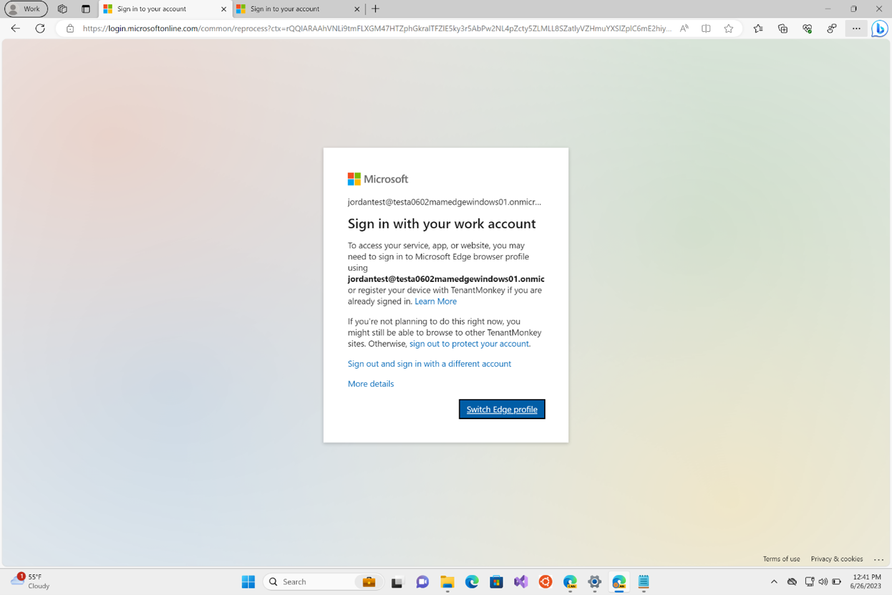

# Microsoft Edge and Conditional Access
  
This article describes how Microsoft Edge supports Conditional Access, and how to access resources protected by Conditional Access.

> [!NOTE]
> This article applies to Microsoft Edge version 77 or later.

A key aspect of cloud security is identity and access when it comes to managing your cloud resources. In a mobile-first, cloud-first world, users can access your organization's resources using a variety of devices and apps from anywhere. As a result of this, just focusing on who can access a resource is not sufficient. You also need to factor in how a resource is accessed. Azure Active Directory (Azure AD) Conditional Access helps you master the balance between security and productivity.

## Accessing Conditional Access protected resources in Microsoft Edge

Microsoft Edge natively supports Azure AD Conditional Access. There's no need to install a separate extension. When you're signed into a Microsoft Edge profile with enterprise Azure AD credentials, Microsoft Edge allows seamless access to enterprise cloud resources protected using Conditional Access.

On a compliant device, the identity accessing the resource should match the identity on the profile.  If it doesn't, you'll see a message like the one in the next screenshot. In the screenshot example, "testadmin@evostsoneboxtest.com" is the sign-in account needed to access the resource.

To continue, you have to switch to the required profile (if you have one) or create a profile with matching identity.

To sign in and work with your profile, click the account picture in the top right corner of the browser. You can use the dropdown menu to:

- Select another profile. Click the profile name.
- Create a profile. Click **Add a profile**.
- Manage your profiles. Click **Manage profile settings**.

This support is available across all platforms, including all supported versions of Windows and macOS.

### How to deploy Conditional Access in Azure Active Directory

[Deploy Conditional Access](https://docs.microsoft.com/azure/active-directory/conditional-access/plan-conditional-access) provides a detailed guide to help deploy Conditional Access in Azure Active Directory.

## See also

- [Microsoft Edge Enterprise landing page](https://aka.ms/EdgeEnterprise)
- [Video: Security, compatibility, and manageability](/microsoft-edge-video-security-compatibility-manageability.md)
