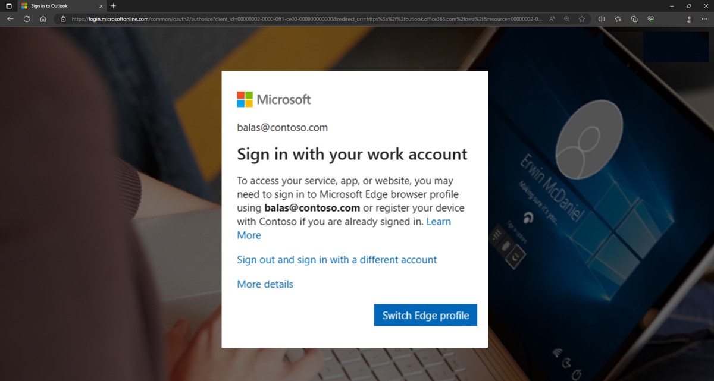

# Microsoft Edge and Conditional Access

> [!NOTE]
> Microsoft Edge for Business, the new, dedicated work experience for Microsoft Edge, is in preview today! [Try Microsoft Edge for Business](/deployedge/microsoft-edge-for-business), including the switching between work and personal browsing, and let us know what you think.
  
This article describes how Microsoft Edge supports Conditional Access (CA) and how you can access resources protected by CA.

> [!NOTE]
> If a device isn't managed by enrolled with Intune mobile device management (MDM) and the user doesn't want the device to be enrolled, see [Microsoft Intune MAM for bring your own devices](#microsoft-intune-mam-for-bring-your-own-devices)

A key aspect of cloud security is identity and access when it comes to managing your cloud resources. In a hybrid computing world, users can access your organization's resources using various devices and apps from anywhere. As a result of this, just focusing on who can access a resource isn't sufficient. You also need to factor in how a resource is accessed. Microsoft Entra Conditional Access (*formerly Azure Active Directory (Azure AD) Conditional Access*) helps you master the balance between security and productivity. For more information, see [Plan a Conditional Access deployment](/azure/active-directory/conditional-access/plan-conditional-access), a detailed guide to help plan and deploy Conditional Access (CA) in Microsoft Entra ID (*Azure AD*).

## Accessing Conditional Access protected resources with Microsoft Edge

Microsoft Edge natively supports Microsoft Entra (*Azure AD*) Conditional Access. There's no need to install a separate extension, Edge's native support provides stable and high quality access. When you're signed into an Edge profile with enterprise Microsoft Entra ID (*Azure AD*) credentials, Microsoft Edge allows seamless access to enterprise cloud resources protected using CA. This support is available across all platforms, including all supported versions of Windows and macOS.

The respective Microsoft Entra (*Azure AD*) account needs to be connected to Windows, so a [Primary Refresh Token](/azure/active-directory/devices/concept-primary-refresh-token) is sent along with the request for evaluation in the Conditional Access policy. To add a work or school account to Windows, follow these steps to [Add or remove accounts on your PC](https://support.microsoft.com/windows/add-or-remove-accounts-on-your-pc-104dc19f-6430-4b49-6a2b-e4dbd1dcdf32#WindowsVersion=Windows_10). Note that there are limits to the number of work or school accounts connected to Windows, which is documented in this [device management FAQ](/azure/active-directory/devices/faq#i-can-t-add-more-than-3-azure-ad-user-accounts-under-the-same-user-session-on-a-windows-10-11-device--why).

On a compliant device, the identity accessing the resource should match the identity on the profile. If it doesn't, access is blocked and you'll see a message like the one in the following screenshot. In this example, `balas@contos.com` is the sign-in account needed to access the resource.

If access is blocked, you have to switch to the required profile or create a profile with a matching identity. Select **Switch Edge profile** and Microsoft Edge will guide you through the sign-in process. For more information, see [Require an app protection policy on Windows devices (preview)](/azure/active-directory/conditional-access/how-to-app-protection-policy-windows).

You can also work with profile settings by selecting the account picture in the browser and using the dropdown menu for the following tasks:

- Manage your profiles - Click the gear icon (**Manage profile settings**) to open Edge Settings.
- Pick an existing profile - Select the profile name.
- Create a personal profile - Select **Set up a new personal profile**.
- Create a new work profile - Select **Other profiles** and then select **Set up a new work profile**. The "Other profiles" option also lets you **Browse as guest** or **Browse in Kids Mode**.

## Microsoft Intune MAM for bring your own devices

Mobile Application Management (MAM) for unenrolled devices is commonly used for personal or bring your own devices (BYOD). MAM is an option for users who don't enroll their personal devices, but still need access to their organization's email, Teams meetings, and more.  For more specific information on MAM, see [What is Microsoft Intune app management?](/mem/intune/apps/app-management).

### Access issues

If there's a pre-existing, unregistered account, like `user@contoso.com` in Microsoft Edge, or if a user signs in without registering the account, then the account isn't properly enrolled in MAM.

Follow these steps for a temporary workaround:

1. Sign in by entering the email address using different upper/lower case combinations. For example, if `RenataHall@contoso.com` was previously used to sign in, use `renatahall@contoso.com` to sign in. The user is shown the next prompt.
2. Clear the **Allow my organization to manage my device** box and then select **OK**. This action registers the device with your account and you'll be able to access your resources.

Conditional access might also be blocked because there's an account issue. For more information, see [Troubleshooting common issues](/azure/active-directory/conditional-access/how-to-app-protection-policy-windows#troubleshooting).

## See also

- [Microsoft Edge Enterprise landing page](https://aka.ms/EdgeEnterprise)
- [Video: Security, compatibility, and manageability](/deployedge/microsoft-edge-video-security-compatibility-manageability)
